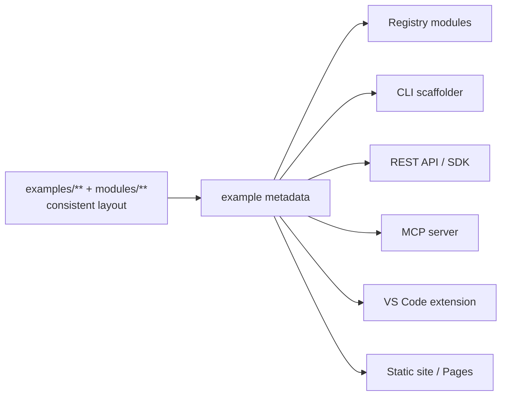

# Roadmap

This project starts as the most comprehensive open collection of production
Terraform **examples and modules** for OpenStack, and grows toward a full
example **platform**. Everything is structured so future tooling can read the
same example/module layout and metadata.

## Now — v1.x (example & module library)

- [x] 100+ production-quality examples across 20+ categories
- [x] Reusable modules with `mock_provider` native tests
- [x] Provider/auth, remote state, importing, and upgrade documentation
- [x] Mermaid architecture and workflow diagrams
- [x] Helper scripts (fmt/validate/plan/apply/destroy/import/state/backend)
- [x] CI: fmt, validate, `terraform test`, markdown lint, spell + link check

## Next — v2.x (packaging & reuse)

- [ ] Publish the modules to the **Terraform Registry**
      (`registry.terraform.io/modules/devopsaitoolkit/.../openstack`)
- [ ] A **composite GitHub Action** to validate OpenStack Terraform in CI
- [ ] **Example metadata** (`metadata.yaml` per example) to power search/indexing
- [ ] Optional **OpenTofu** compatibility matrix in CI

## Later — v3.x (surfaces & intelligence)

- [ ] **CLI tool** to scaffold an example/module from a template
- [ ] **Python SDK** over the example metadata
- [ ] **REST API** and **static documentation site** (GitHub Pages)
- [ ] **VS Code extension** — insert an example by name
- [ ] **MCP server** so AI agents can pull a known-good example during design
- [ ] **AI example generator** that assembles a stack from a prompt

## Design that enables this

Want to drive one of these? Open a
[Discussion](https://github.com/devopsaitoolkit/terraform-openstack-examples/discussions).
