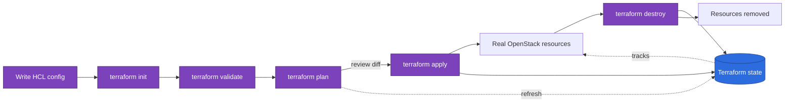
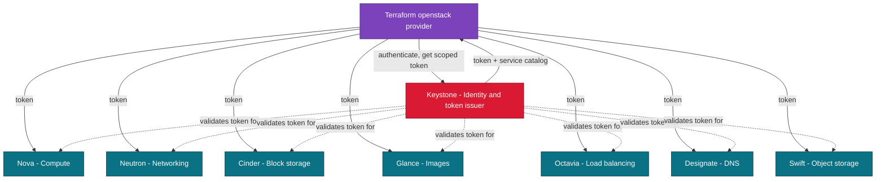
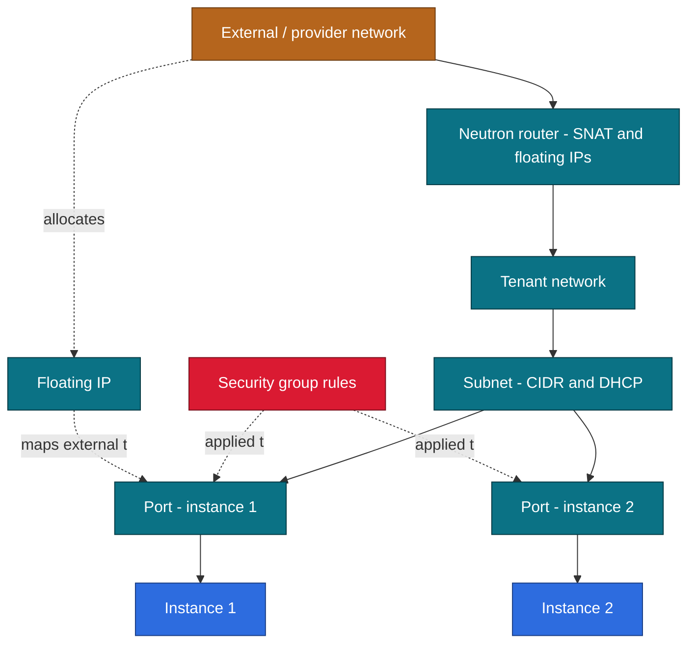
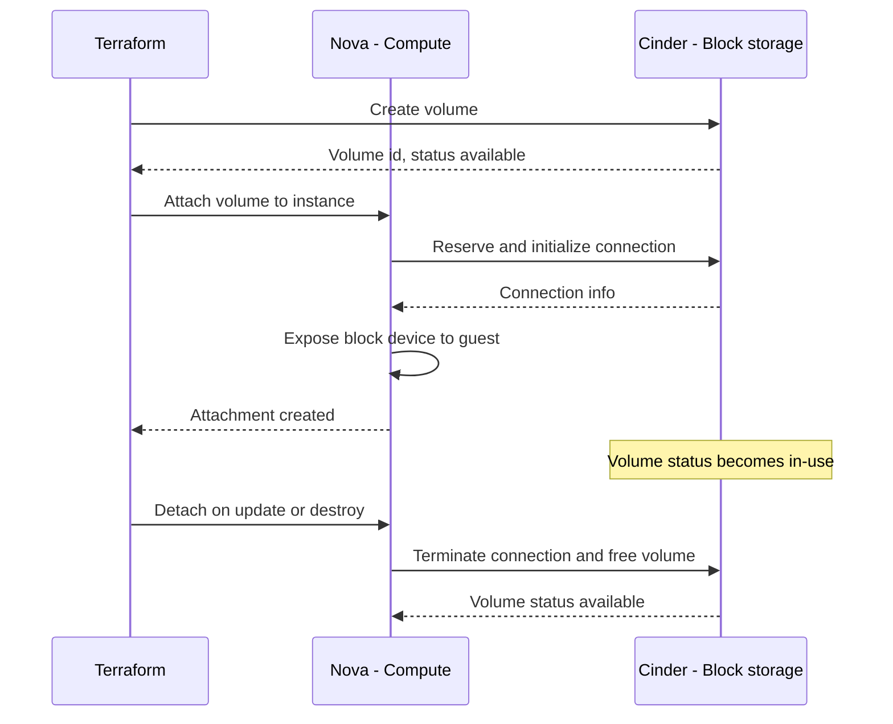
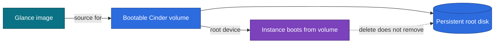
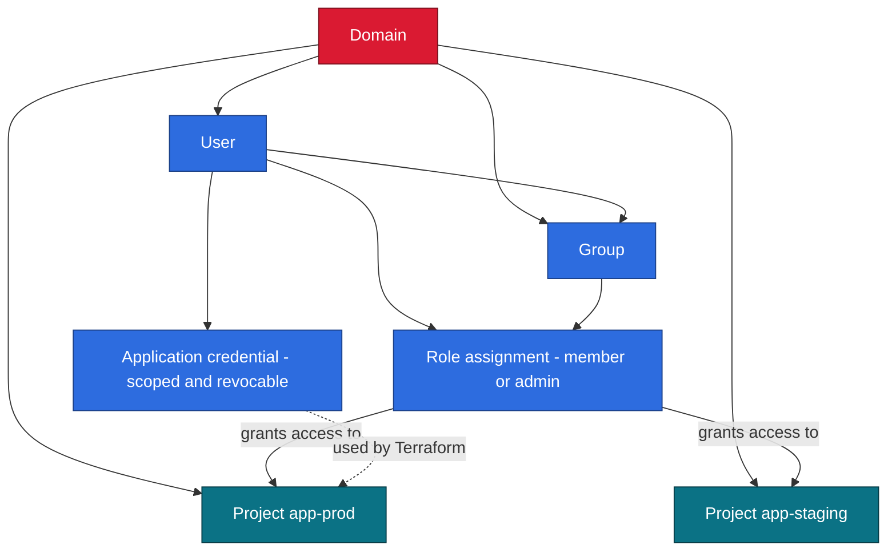
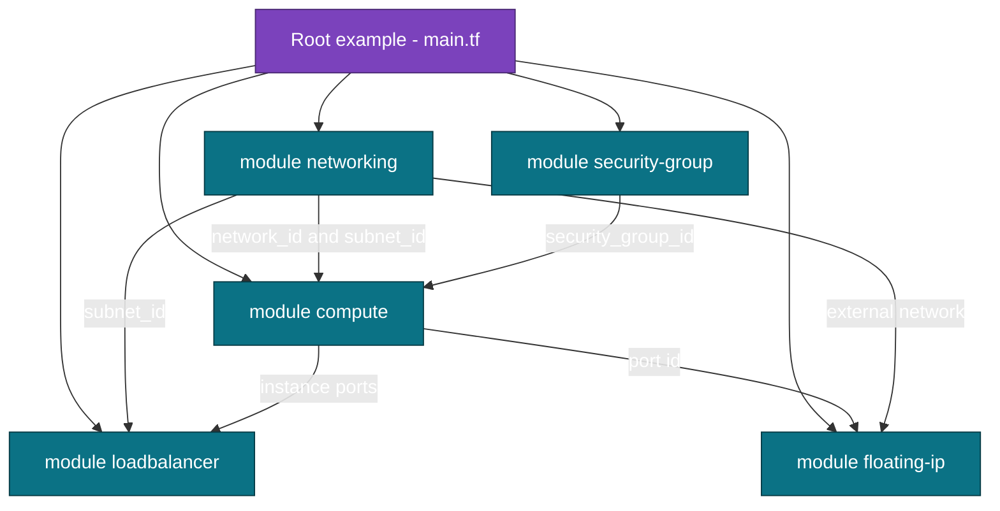
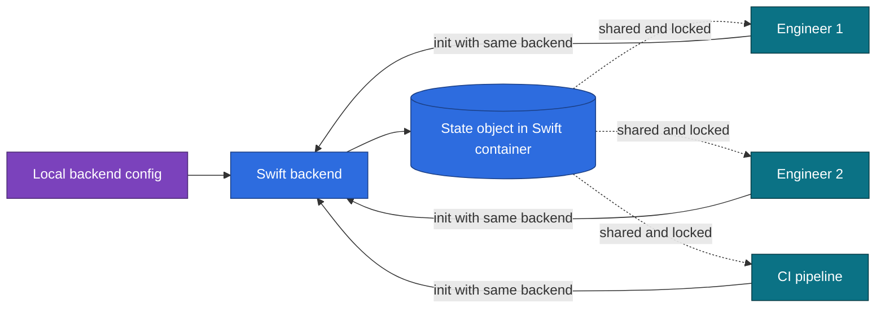
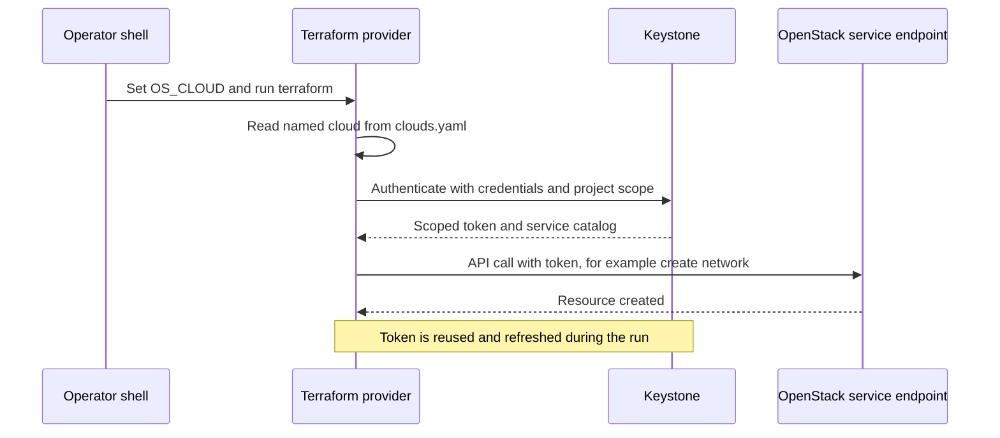

# Architecture & Workflow Diagrams

This document collects GitHub-renderable [Mermaid](https://mermaid.js.org/)
diagrams that explain how the Terraform examples and modules in this repository
map onto OpenStack. They cover the Terraform lifecycle, the OpenStack services
Terraform drives through Keystone, the networking model, storage and boot flows,
identity layout, how the reusable modules wire together, and how teams share
remote state. Each diagram is paired with a short explanation so you can use the
section as a learning reference or as onboarding material for a private cloud
platform team.

All labels avoid unescaped parentheses and pipe characters so the blocks render
correctly on GitHub.

## 1. Terraform workflow

The core loop for any example in this repo: you author HCL, initialize the
working directory to download the OpenStack provider and configure the backend,
validate syntax, generate a plan, then apply it to converge real OpenStack
resources. Terraform records what it created in state, and `terraform destroy`
tears everything back down using that state. The helper scripts under
`scripts/` wrap each step with safety checks.

## 2. OpenStack core services architecture

Terraform never talks to a service directly without first authenticating to
Keystone, the identity service. Keystone issues a scoped token and a service
catalog; Terraform then uses that token to call each service endpoint. The
`openstack` provider maps onto these services, which is why one set of
credentials drives compute, networking, storage, images, load balancing, DNS,
and object storage.

## 3. Networking topology

A typical tenant deployment connects to the outside world through a provider or
external network. A Neutron router attaches to that external network for SNAT
and floating IP allocation, and connects internally to one or more tenant
networks. Each tenant network carries a subnet, instances attach via ports, and
security groups filter traffic on those ports. Floating IPs are bound to ports
to expose selected instances publicly.

## 4. Volume attachment

Attaching a Cinder volume to a running instance is a two-service operation.
Terraform asks Cinder to create the volume, then issues an attach which Nova
coordinates with Cinder. Nova exposes the block device to the hypervisor and the
guest, while Cinder flips the volume to the `in-use` state. The reverse order
applies on destroy.

## 5. Boot-from-volume

Boot-from-volume decouples the instance root disk from the ephemeral hypervisor
disk. A Glance image is used as the source for a new bootable Cinder volume, and
the instance boots from that persistent volume instead of local storage. This
lets the root disk survive instance deletion and supports larger or replaceable
root disks.

## 6. Project and identity layout

OpenStack identity is hierarchical. A domain contains projects and the users and
groups that act within them. Roles are granted through role assignments that bind
a user or a group to a project, which is what gives Terraform permission to act.
For automation, application credentials derived from a user provide scoped,
revocable secrets that avoid embedding a password in `clouds.yaml`.

## 7. Module relationships

The reusable modules under `modules/` are designed to compose. A root example
creates a network with the networking module, defines a security group, launches
instances with the compute module while passing in the network and security
group, allocates and associates a floating IP, and fronts the instances with an
Octavia load balancer. The arrows show how each module consumes another module's
outputs.

## 8. Remote state

By default Terraform stores state on local disk, which does not work for teams.
This repo documents an OpenStack-native backend that keeps state as an object in
a Swift container. Each team member configures the same backend, so Terraform
reads and writes one shared state object and uses state locking to prevent
concurrent conflicting applies.

## 9. Provider authentication

Authentication starts from a named cloud in `clouds.yaml` selected by the
`OS_CLOUD` environment variable. The provider sends those credentials to
Keystone, which returns a scoped token and a service catalog listing endpoints.
Terraform then makes API calls to each service endpoint carrying that token,
refreshing it as needed for the duration of the run.

## Further reading

- [Advanced OpenStack and Terraform guides](https://devopsaitoolkit.com/blog/)
