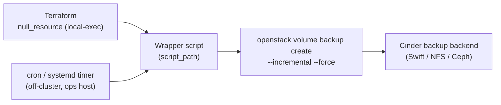

# Scheduled Cinder Backup Pattern

> **Primary search phrase:** Terraform OpenStack scheduled volume backup example

**OpenStack has no built-in backup scheduler**, and the Terraform provider has
no native cinder-backup resource. The durable pattern is to **generate a wrapper
script** and schedule it **off-cluster** — with cron or a systemd timer on a
management/ops host, or as a CI cron job. This example uses a `null_resource` to
write the wrapper script; you then wire it to cron or a systemd timer yourself.
Terraform manages **only the script file**, not the backups it produces.

## Architecture



## Usage

```bash
export OS_CLOUD=openstack
cp terraform.tfvars.example terraform.tfvars
# edit terraform.tfvars: set volume_id and script_path

terraform init
terraform plan
terraform apply
```

`terraform apply` writes (and makes executable) the wrapper script at
`script_path`. It does **not** schedule anything — install the cron entry or
systemd timer shown below. The wrapper appends a timestamp to each backup name
and uses `--incremental --force`, so the first run for a volume must be preceded
by a full backup (or the backend must accept the first incremental as full).

## Inputs

| Name               | Description                                                                          | Type   | Default                        |
| ------------------ | ----------------------------------------------------------------------------------- | ------ | ------------------------------ |
| cloud              | Name of the cloud entry in clouds.yaml (via OS_CLOUD/`cloud`).                       | string | "openstack"                    |
| volume_id          | UUID of the volume the generated wrapper script will back up.                       | string | (required)                     |
| script_path        | Absolute path where the backup wrapper script will be written.                      | string | "/usr/local/bin/cinder-backup.sh" |
| backup_name_prefix | Prefix for generated backup names; a timestamp is appended at run time.             | string | "scheduled-backup"             |
| schedule           | Cron expression documenting the intended schedule (documentation only).             | string | "0 2 ** *"                    |

## Outputs

| Name        | Description                                                       |
| ----------- | ---------------------------------------------------------------- |
| script_path | Absolute path of the generated backup wrapper script.            |
| cron_line   | Suggested crontab line wiring the schedule to the script.        |

## Best practices

Schedule the generated script **off-cluster** on a trusted ops host. Two common
options:

**Cron** — add a crontab entry (matches the `cron_line` output):

```cron
0 2 * * * /usr/local/bin/cinder-backup.sh
```

**systemd timer** — create a oneshot service plus a timer:

```ini
# /etc/systemd/system/cinder-backup.service
[Unit]
Description=Cinder volume backup wrapper

[Service]
Type=oneshot
ExecStart=/usr/local/bin/cinder-backup.sh
```

```ini
# /etc/systemd/system/cinder-backup.timer
[Unit]
Description=Run cinder-backup daily at 02:00

[Timer]
OnCalendar=*-*-* 02:00:00
Persistent=true

[Install]
WantedBy=timers.target
```

Then enable it:

```bash
sudo systemctl daemon-reload
sudo systemctl enable --now cinder-backup.timer
```

Additional practices:

- **Rotate/prune old backups** on a retention policy (e.g. keep N dailies); the
  script only creates backups, it does not delete them, so they will accumulate.
- **Alert on failures** — capture the script's exit code and pipe failures to
  your alerting (the script uses `set -euo pipefail` so it exits non-zero on
  error; wire that to cron MAILTO or a systemd `OnFailure=` unit).
- Run on a host with reliable, monitored connectivity to the OpenStack API.

## Security considerations

- The wrapper exports `OS_CLOUD` and relies on `clouds.yaml` on the scheduling
  host — protect that file (mode 0600, dedicated service account) and keep it
  out of version control.
- Write the script to a root-owned path (e.g. `/usr/local/bin`) so unprivileged
  users cannot tamper with the command it runs.
- Scope the OpenStack credentials to the minimum role needed to create backups.
- Backups are full data copies in the backend — secure the backend and enable
  encryption at rest where available.

## Troubleshooting

| Symptom                            | Likely cause                                                | Fix                                                                            |
| ---------------------------------- | ----------------------------------------------------------- | ------------------------------------------------------------------------------ |
| Script not created / permission    | Terraform host cannot write `script_path`.                  | Run with sufficient privileges or choose a writable `script_path`.            |
| Cron/timer never fires             | Schedule not installed or timer not enabled.                | Install the crontab line or `systemctl enable --now cinder-backup.timer`.      |
| Backup fails: no backup service    | cinder-backup service down or no backend configured.        | Start `cinder-backup` and configure a Swift/NFS/Ceph backend.                  |
| Volume attachment failed           | Volume busy/attaching when the backup ran.                  | The script uses `--force`; otherwise wait for `available`/`in-use` and retry.  |
| Quota exceeded                     | Project backup count or gigabyte quota reached.             | `openstack quota show`; prune old backups or raise the quota.                  |

## Cleanup

```bash
terraform destroy
```

`terraform destroy` removes the `null_resource` from state but does **NOT**
delete the wrapper script, the installed cron/timer, or any backups that have
already been created. Clean those up manually:

```bash
# Remove the schedule
sudo systemctl disable --now cinder-backup.timer   # if using systemd
# (or remove the crontab line)

# Remove the script
sudo rm -f /usr/local/bin/cinder-backup.sh

# Delete backups it created (repeat per backup)
openstack volume backup delete scheduled-backup-<timestamp>
```

## Further reading

- [DevOps AI Toolkit blog](https://devopsaitoolkit.com/blog/)
- [null_resource registry docs](https://registry.terraform.io/providers/hashicorp/null/latest/docs/resources/resource)
