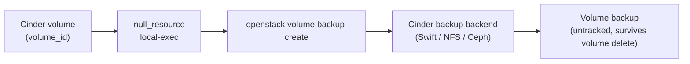

# Cinder Volume Backup via OpenStack CLI

> **Primary search phrase:** Terraform OpenStack volume backup example

**The OpenStack Terraform provider has NO native cinder-backup resource.** This
example orchestrates `openstack volume backup create` through a `null_resource`.
Unlike snapshots, **backups** are full or incremental copies written to the
Cinder backup backend (Swift object storage by default, or NFS/Ceph) and they
**survive deletion of the source volume**. Snapshots, by contrast, live with the
volume and disappear with it. Terraform does **not** track the backup.

## Architecture



## Usage

```bash
export OS_CLOUD=openstack
cp terraform.tfvars.example terraform.tfvars
# edit terraform.tfvars: set volume_id and backup_name

terraform init
terraform plan
terraform apply
```

The `cinder-backup` service must be running and a backup backend configured, or
the create call will fail. The OpenStack CLI must be installed and on PATH.

## Inputs

| Name               | Description                                                                  | Type   | Default                        |
| ------------------ | --------------------------------------------------------------------------- | ------ | ------------------------------ |
| cloud              | Name of the cloud entry in clouds.yaml (via OS_CLOUD/`cloud`).               | string | "openstack"                    |
| volume_id          | UUID of the volume to back up.                                              | string | (required)                     |
| backup_name        | Name to assign to the created backup.                                      | string | "tf-backup"                    |
| backup_description | Description applied to the created backup.                                 | string | "Created by Terraform via CLI" |
| incremental        | Create an incremental backup. Requires a prior full backup.                | bool   | false                          |
| force              | Allow backing up an in-use (attached) volume.                              | bool   | true                           |

## Outputs

| Name        | Description                                                       |
| ----------- | ---------------------------------------------------------------- |
| backup_name | Name of the backup created via the CLI.                          |
| note        | Reminder that the backup is untracked, with delete/restore commands. |

## Best practices

- Ensure the **cinder-backup service is running** and a backend is configured
  (Swift by default, or NFS/Ceph). Without it, backups cannot be created.
- Take a **full backup first**; `incremental = true` requires a prior full
  backup of the same volume to chain from.
- Use `force = true` to back up **attached/in-use** volumes; for application
  consistency, quiesce the filesystem or stop the app before backing up.
- Because backups survive volume deletion, use them for **disaster recovery and
  retention**; use snapshots for fast same-cloud rollback.
- Rotate and prune old backups out-of-band, since Terraform does not manage them.

## Security considerations

- Backups in Swift/NFS/Ceph are full data copies — secure the backend bucket or
  share and enable encryption at rest where available.
- Restrict who can restore backups; a restore yields a full copy of the data.
- Keep `clouds.yaml` out of version control and scope credentials to the minimum
  role needed to create backups.

## Troubleshooting

| Symptom                                  | Likely cause                                              | Fix                                                                              |
| ---------------------------------------- | -------------------------------------------------------- | ------------------------------------------------------------------------------- |
| `openstack: command not found`           | OpenStack CLI not installed on the Terraform host.       | Install `python-openstackclient` and ensure it is on PATH.                       |
| "No backup service" / backend not found  | cinder-backup service down or no backend configured.     | Start `cinder-backup` and configure a Swift/NFS/Ceph backend, then retry.        |
| Incremental backup rejected              | No prior full backup exists for the volume.              | Run once with `incremental = false`, then enable incrementals.                   |
| Volume attachment failed                 | Volume busy/attaching during the backup.                 | Use `force = true`, or wait for `available`/`in-use`, then re-run.               |
| Quota exceeded                           | Project backup count or gigabyte quota reached.          | `openstack quota show`; delete old backups or raise the quota.                   |

## Cleanup

```bash
terraform destroy
```

`terraform destroy` removes the `null_resource` from state but does **NOT**
delete the backup it created. Manage the backup manually:

```bash
# Delete the backup
openstack volume backup delete tf-backup

# Restore the backup into a target volume
openstack volume backup restore tf-backup <target-volume>
```

## Further reading

- [DevOps AI Toolkit blog](https://devopsaitoolkit.com/blog/)
- [null_resource registry docs](https://registry.terraform.io/providers/hashicorp/null/latest/docs/resources/resource)
