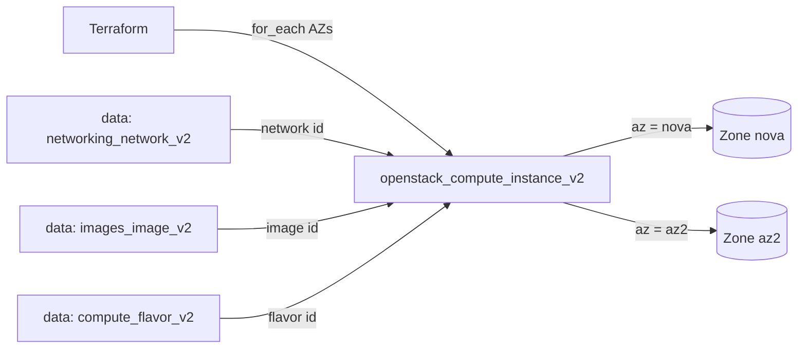

# Instances Across Availability Zones

Spread OpenStack compute instances (Nova) across a list of availability zones,
one instance per zone, using `for_each`. This is the foundation of a
fault-tolerant tier: if a zone goes down, the instances in the others keep
serving.

> **Primary search phrase:** Terraform OpenStack availability zones

## Architecture



`for_each = toset(var.availability_zones)` creates one instance per zone, keyed by
the zone name. Each instance sets `availability_zone = each.value` and is named
`<prefix>-<az>`, so the resources have stable addresses — adding or removing a
zone never disturbs the others.

## Usage

```bash
export OS_CLOUD=openstack          # or set `cloud` in terraform.tfvars
cp terraform.tfvars.example terraform.tfvars
terraform init
terraform plan
terraform apply
```

List the zones available to you with `openstack availability zone list`.

## Inputs

| Name | Description | Type | Default |
|------|-------------|------|---------|
| `cloud` | clouds.yaml entry to use | `string` | `"openstack"` |
| `availability_zones` | Zones to spread instances across (one per zone) | `list(string)` | `["nova", "az2"]` |
| `instance_name_prefix` | Prefix for instance names | `string` | `"web"` |
| `flavor_name` | Flavor (size) | `string` | `"m1.small"` |
| `image_name` | Glance image to boot | `string` | `"ubuntu-22.04"` |
| `network_name` | Tenant network to attach | `string` | `"private"` |
| `key_pair_name` | Existing key pair for SSH (optional) | `string` | `""` |
| `security_group_names` | Security groups | `list(string)` | `["default"]` |
| `tags` | Instance tags | `list(string)` | see `variables.tf` |

## Outputs

| Name | Description |
|------|-------------|
| `instance_ids_by_az` | Map of availability zone => instance UUID |
| `access_ips_by_az` | Map of availability zone => first IPv4 address |
| `network_id` | Network the instances are attached to |

## Best practices

- **Why this approach:** `for_each` over a set of zone names gives each instance a
  stable, human-readable key. Removing one zone from the list destroys only that
  instance and leaves the rest untouched — the key behaviour you want for HA, and
  exactly where `count` falls short.
- **Common mistakes:** Using `count` for per-AZ placement (reordering the list
  renumbers and replaces instances); assuming the default `nova` zone exists on
  every cloud (it may not — always check `openstack availability zone list`);
  expecting cross-AZ scheduling to also spread *anti-affinity* — for that, add a
  server group via `scheduler_hints`.
- **Scaling considerations:** This creates exactly one instance per zone. For
  multiple instances per zone, combine with a server group or nest counts; mind
  per-zone capacity and project quotas.
- **Performance considerations:** Keep latency-sensitive components together but
  zone-redundant; instances in different AZs may have slightly different network
  paths. Match the flavor to the workload.
- **Cost considerations:** Each zone runs its own billable instance. Tag
  everything (done here) for per-zone cost attribution and destroy idle stacks.

## Security considerations

- All instances share `security_group_names`; define least-privilege groups
  explicitly rather than relying on `default` — see
  [`security/security-group`](../../security/security-group-basic/).
- Inject SSH access via a managed key pair, never passwords, and keep secrets out
  of user-data; use application credentials or a secrets manager.
- Spreading across zones increases availability but also the surface area — keep
  images patched uniformly across zones.

## Troubleshooting

| Symptom | Likely cause | Fix |
|---------|--------------|-----|
| `No valid host was found` | A listed AZ has no capacity for the flavor | Pick a different AZ/flavor; check `openstack hypervisor stats show` |
| `Quota exceeded` | Project instance/cores/RAM quota hit across zones | Raise quota or shorten `availability_zones` ([quotas examples](../../quotas/)) |
| `The requested availability zone is not available` | Zone name typo or zone not exposed to your project | `openstack availability zone list`; fix the list |
| `Image <name> not found` | Wrong `image_name` or image not visible to the project | `openstack image list`; check image visibility |
| `Network <name> not found` | Wrong `network_name` or no access | `openstack network list` |
| Provider auth errors | Bad/missing `clouds.yaml` or `OS_CLOUD` | See [provider configuration](../../../docs/provider-configuration.md) |

## Cleanup

```bash
terraform destroy
```

## Further reading

- [Provider configuration & clouds.yaml](../../../docs/provider-configuration.md)
- [OpenStack provider — compute instance docs](https://registry.terraform.io/providers/terraform-provider-openstack/openstack/latest/docs/resources/compute_instance_v2)
- [Terraform `for_each` meta-argument](https://developer.hashicorp.com/terraform/language/meta-arguments/for_each)
- [Host aggregates & availability zones (Nova docs)](https://docs.openstack.org/nova/latest/admin/availability-zones.html)
