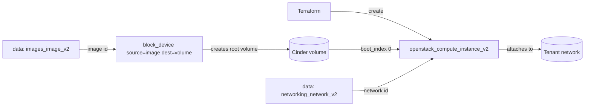

# Boot From Volume

Boot an OpenStack compute instance (Nova) from a persistent Cinder volume rather
than the ephemeral local disk. Nova creates a new bootable volume from a Glance
image and uses it as the root disk, giving you a resizable, snapshot-able,
storage-backed root that survives instance rebuilds.

> **Primary search phrase:** Terraform OpenStack boot from volume

## Architecture



The `block_device` block (`source_type = "image"`, `destination_type = "volume"`,
`boot_index = 0`) tells Nova to provision a Cinder volume from the named image and
boot the instance off it. The instance has no `image_name` of its own — the boot
disk is defined entirely by the block device.

## Usage

```bash
export OS_CLOUD=openstack          # or set `cloud` in terraform.tfvars
cp terraform.tfvars.example terraform.tfvars
terraform init
terraform plan
terraform apply
```

## Inputs

| Name | Description | Type | Default |
|------|-------------|------|---------|
| `cloud` | clouds.yaml entry to use | `string` | `"openstack"` |
| `instance_name` | Name of the instance | `string` | `"example-boot-from-volume"` |
| `flavor_name` | Flavor (size) | `string` | `"m1.small"` |
| `image_name` | Glance image to build the root volume from | `string` | `"ubuntu-22.04"` |
| `volume_size` | Root volume size in GB | `number` | `20` |
| `volume_type` | Cinder volume type (optional) | `string` | `""` |
| `network_name` | Tenant network to attach | `string` | `"private"` |
| `key_pair_name` | Existing key pair for SSH (optional) | `string` | `""` |
| `security_group_names` | Security groups | `list(string)` | `["default"]` |
| `tags` | Instance tags | `list(string)` | see `variables.tf` |

## Outputs

| Name | Description |
|------|-------------|
| `instance_id` | UUID of the instance |
| `instance_name` | Name of the instance |
| `access_ip_v4` | First IPv4 address |
| `volume_size` | Size of the bootable root volume (GB) |
| `network_id` | Network the instance is attached to |

## Best practices

- **Why this approach:** A volume-backed root decouples the OS disk from the
  hypervisor's local storage — you can size it freely, snapshot it, and the disk
  survives a host failure or instance rebuild. This is the right default for any
  instance whose root disk holds state you care about.
- **Common mistakes:** Setting `image_name` on the instance *and* an image-sourced
  `block_device` (conflicting boot sources — only the block device is used here);
  forgetting `boot_index = 0` so Nova can't find a root disk; leaving
  `delete_on_termination = false` and accumulating orphaned volumes after destroys.
- **Scaling considerations:** Each instance consumes Cinder volume *and* gigabyte
  quota on top of compute quota — watch both. For many volume-backed nodes,
  combine this pattern with [`multiple-instances`](../multiple-instances/).
- **Performance considerations:** Pick a `volume_type` matched to the workload
  (e.g. an SSD/NVMe type for databases). Volume-backed boot adds a volume-create
  step, so first boot is slightly slower than ephemeral disk.
- **Cost considerations:** Volumes bill for their full provisioned size whether or
  not the instance is running — a stopped instance still pays for its root volume.
  Size `volume_size` realistically and destroy unused stacks.

## Security considerations

- A persistent root volume retains data after the instance stops; snapshot and
  encrypt it (via an encrypted `volume_type`) when it may hold sensitive data.
- Define least-privilege security groups explicitly instead of relying on
  `default` — see [`security/security-group`](../../security/security-group/).
- Inject SSH access via a managed key pair, never passwords, and keep secrets out
  of user-data; use application credentials or a secrets manager.

## Troubleshooting

| Symptom | Likely cause | Fix |
|---------|--------------|-----|
| `No valid host was found` | No host has capacity for the flavor / AZ | Try a smaller flavor or another AZ; check `openstack hypervisor stats show` |
| `Quota exceeded` | Compute **or** Cinder volume/gigabyte quota hit | Raise quota or destroy unused stacks ([quotas examples](../../quotas/)) |
| `Block Device Mapping is Invalid` | Missing `boot_index = 0` or conflicting `image_name` on the instance | Keep the image only in `block_device`; set `boot_index = 0` |
| `Volume <id> did not finish being created` | Slow/unhealthy Cinder backend | Check Cinder service health; retry or increase timeouts |
| Orphaned volumes after destroy | `delete_on_termination = false` | Set it to `true`, or clean up with `openstack volume delete` |
| Provider auth errors | Bad/missing `clouds.yaml` or `OS_CLOUD` | See [provider configuration](../../../docs/provider-configuration.md) |

## Cleanup

```bash
terraform destroy
```

## Further reading

- [Provider configuration & clouds.yaml](../../../docs/provider-configuration.md)
- [OpenStack provider — compute instance docs](https://registry.terraform.io/providers/terraform-provider-openstack/openstack/latest/docs/resources/compute_instance_v2)
- [Block device mapping (Nova docs)](https://docs.openstack.org/nova/latest/user/block-device-mapping.html)
- [Single instance example](../single-instance/)
