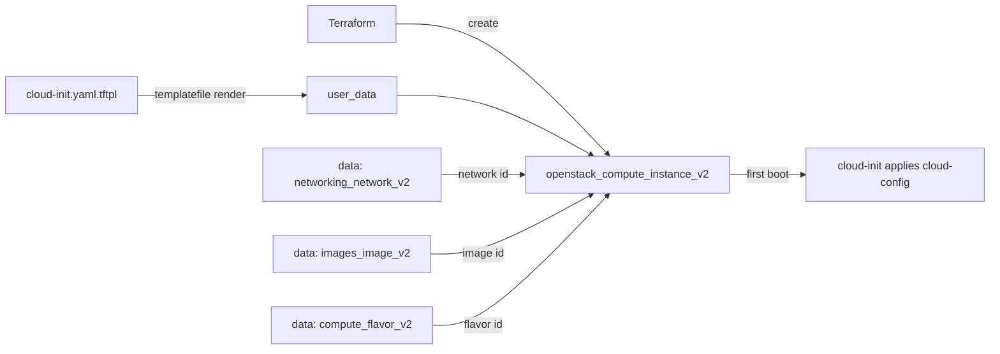

# Configure an Instance with cloud-init (cloud-config)

Boot an OpenStack compute instance whose `user_data` is a declarative
`#cloud-config` document rendered with Terraform's `templatefile()`. The template
(`cloud-init.yaml.tftpl`) installs packages, writes files, creates a sudo user
with your SSH key, and runs first-boot commands — all driven by Terraform
variables.

> **Primary search phrase:** Terraform OpenStack cloud-init cloud-config example

## Architecture



The network, image, and flavor are resolved by name through data sources, so no
cloud-specific UUIDs are hard-coded. `templatefile()` injects the SSH public key
and the package list into the cloud-config before it is passed to Nova.

## Usage

```bash
export OS_CLOUD=openstack          # or set `cloud` in terraform.tfvars
cp terraform.tfvars.example terraform.tfvars
terraform init
terraform plan
terraform apply
```

## Inputs

| Name | Description | Type | Default |
|------|-------------|------|---------|
| `cloud` | clouds.yaml entry to use | `string` | `"openstack"` |
| `instance_name` | Name of the instance | `string` | `"example-cloud-init"` |
| `flavor_name` | Flavor (size) | `string` | `"m1.small"` |
| `image_name` | Glance image to boot | `string` | `"ubuntu-22.04"` |
| `network_name` | Tenant network to attach | `string` | `"private"` |
| `key_pair_name` | Existing key pair for SSH (optional) | `string` | `""` |
| `security_group_names` | Security groups | `list(string)` | `["default"]` |
| `ssh_authorized_key` | Public SSH key added to the cloud-init user | `string` | _(required)_ |
| `packages` | Packages installed on first boot | `list(string)` | `["htop","curl"]` |
| `tags` | Instance tags | `list(string)` | see `variables.tf` |

## Outputs

| Name | Description |
|------|-------------|
| `instance_id` | UUID of the instance |
| `instance_name` | Name of the instance |
| `access_ip_v4` | First IPv4 address |
| `rendered_cloud_config` | The #cloud-config as rendered from the template |

## Best practices

- **Why this approach:** cloud-init's declarative `#cloud-config` is idempotent
  and portable across distros, and `templatefile()` lets Terraform parameterize
  it. Prefer this over imperative shell scripts for package/user/file setup.
- **Common mistakes:** Omitting the `#cloud-config` first line (the file is then
  ignored); bad YAML indentation from a template loop; forgetting `ssh_authorized_key`
  is required; assuming `package_upgrade` is on by default (it is off here).
- **Scaling considerations:** Reuse the template across a `count`/`for_each`
  fleet. For heavy or fast-changing config, move to a config-management tool and
  keep cloud-init to the minimum needed to enroll the node.
- **Performance considerations:** Package installs add minutes to first boot.
  Bake common packages into the image and keep `packages` short.
- **Cost considerations:** Instances bill while `ACTIVE`. Tag everything (done
  here) and `terraform destroy` idle environments.

## Security considerations

- Never place secrets in `user_data` — cloud-config is readable through the
  metadata service by anything on the instance. Use application credentials or a
  secrets manager.
- The example user is created with `lock_passwd: true` and key-only login; keep
  it that way and avoid `ssh_pwauth: true`.
- Pair with least-privilege security groups — see
  [`security/security-group`](../../security/security-group/).

## Troubleshooting

| Symptom | Likely cause | Fix |
|---------|--------------|-----|
| `No valid host was found` | No host has capacity for the flavor / AZ | Try a smaller flavor or another AZ; check `openstack hypervisor stats show` |
| `Quota exceeded` | Project instance/cores/RAM quota hit | Raise quota or destroy unused instances ([quotas examples](../../quotas/)) |
| cloud-config ignored | Missing `#cloud-config` header or invalid YAML | Validate with `cloud-init schema --config-file`; check `/var/log/cloud-init.log` |
| SSH key not present | Wrong/empty `ssh_authorized_key` | Confirm the public key value; inspect `/home/appuser/.ssh/authorized_keys` |
| `Image <name> not found` | Wrong `image_name` or not visible | `openstack image list`; check visibility |
| Provider auth errors | Bad/missing `clouds.yaml` or `OS_CLOUD` | See [provider configuration](../../../docs/provider-configuration.md) |

## Cleanup

```bash
terraform destroy
```

## Further reading

- [Provider configuration & clouds.yaml](../../../docs/provider-configuration.md)
- [cloud-init cloud-config examples](https://cloudinit.readthedocs.io/en/latest/reference/examples.html)
- [OpenStack provider — compute instance docs](https://registry.terraform.io/providers/terraform-provider-openstack/openstack/latest/docs/resources/compute_instance_v2)
