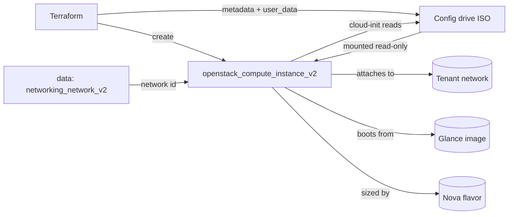

# Config-Drive Instance

Boot an OpenStack compute instance (Nova) that receives its metadata and
cloud-init user-data through a **config drive** instead of the network metadata
service. This is the reliable bootstrap pattern for isolated tenant networks
where `http://169.254.169.254` is not reachable.

> **Primary search phrase:** Terraform OpenStack config drive cloud-init

## Architecture



Setting `config_drive = true` makes Nova attach a small read-only ISO9660/vfat
volume containing the instance metadata and user-data. cloud-init mounts it at
first boot, so provisioning works even with no metadata service on the network.

## Why a config drive?

The default OpenStack metadata service is an HTTP endpoint at `169.254.169.254`
that the guest reaches over the network (usually via a router or DHCP route). On
isolated, router-less, or tightly firewalled networks that endpoint is simply
unreachable, so cloud-init cannot fetch metadata or user-data and the instance
boots un-configured. A config drive sidesteps that entirely: the data ships as a
local virtual disk, so bootstrap is deterministic and network-independent.

## Usage

```bash
export OS_CLOUD=openstack          # or set `cloud` in terraform.tfvars
cp terraform.tfvars.example terraform.tfvars
terraform init
terraform plan
terraform apply
```

## Inputs

| Name | Description | Type | Default |
|------|-------------|------|---------|
| `cloud` | clouds.yaml entry to use | `string` | `"openstack"` |
| `instance_name` | Name of the instance | `string` | `"example-config-drive-instance"` |
| `flavor_name` | Flavor (size) | `string` | `"m1.small"` |
| `image_name` | Glance image to boot | `string` | `"ubuntu-22.04"` |
| `network_name` | Tenant network to attach | `string` | `"private"` |
| `key_pair_name` | Existing key pair for SSH (optional) | `string` | `""` |
| `metadata` | Key/value metadata on the config drive | `map(string)` | see `variables.tf` |
| `user_data` | cloud-init user-data | `string` | short cloud-config |
| `security_group_names` | Security groups | `list(string)` | `["default"]` |
| `tags` | Instance tags | `list(string)` | see `variables.tf` |

## Outputs

| Name | Description |
|------|-------------|
| `instance_id` | UUID of the instance |
| `access_ip_v4` | First IPv4 address |
| `config_drive_enabled` | Whether the config drive is attached |

## Best practices

- **Why this approach:** A config drive removes the network dependency from
  bootstrap, so cloud-init runs the same way on routed and isolated networks.
  Keeping metadata and user-data as Terraform variables makes the bootstrap
  reviewable and reproducible.
- **Common mistakes:** Putting secrets in `metadata`/`user_data` (it lands on a
  readable local disk — use a secrets manager instead); expecting changes to
  `user_data` to re-run on a live VM (cloud-init runs once at first boot, and
  changing it forces instance replacement); using an image without cloud-init,
  which cannot consume the drive.
- **Scaling considerations:** Drive a fleet from the [`compute`
  module](../../../modules/compute/) with `for_each`, passing per-instance
  `metadata`. The config drive itself adds negligible overhead per VM.
- **Performance considerations:** The drive is tiny and read once at boot, so
  runtime impact is nil; flavor choice drives performance.
- **Cost considerations:** No extra charge for the config drive. The instance
  bills while `ACTIVE`; tag everything (done here) and `terraform destroy` dev
  environments.

## Security considerations

- The config drive is readable by anything with access to the instance disk.
  Treat it as **non-secret**: never put passwords, tokens, or keys in `metadata`
  or `user_data`. Use application credentials or a secrets manager instead.
- Inject SSH access via a managed key pair, not passwords.
- The `default` security group rarely permits external SSH; define a
  least-privilege group — see [`security/security-group`](../../security/security-group/).

## Troubleshooting

| Symptom | Likely cause | Fix |
|---------|--------------|-----|
| `No valid host was found` | No host has capacity for the flavor / AZ | Try a smaller flavor or another AZ; check `openstack hypervisor stats show` |
| `Quota exceeded` | Project instance/cores/RAM quota hit | Raise quota or destroy unused instances ([quotas examples](../../quotas/)) |
| cloud-init did not run | Image lacks cloud-init, or config drive disabled | Use a cloud image; confirm `config_drive = true`; check `/var/log/cloud-init.log` |
| Metadata missing in guest | Datasource order excludes ConfigDrive | Ensure cloud-init datasource list includes `ConfigDrive` |
| `Network <name> not found` | Wrong `network_name` or no access | `openstack network list` |
| Provider auth errors | Bad/missing `clouds.yaml` or `OS_CLOUD` | See [provider configuration](../../../docs/provider-configuration.md) |

## Cleanup

```bash
terraform destroy
```

## Further reading

- [Provider configuration & clouds.yaml](../../../docs/provider-configuration.md)
- [OpenStack provider — compute instance docs](https://registry.terraform.io/providers/terraform-provider-openstack/openstack/latest/docs/resources/compute_instance_v2)
- [cloud-init documentation](https://cloudinit.readthedocs.io/)
