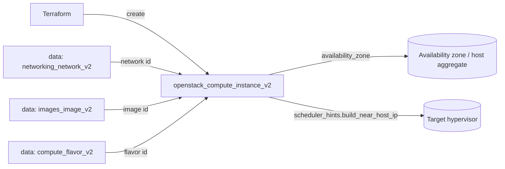

# Instance Pinned to an Availability Zone

Boot a single OpenStack compute instance (Nova) onto a **specific availability
zone**, with optional scheduler hints for finer placement control. Availability
zones map to host aggregates, so this is how you steer workloads onto dedicated,
licensed, or otherwise segregated capacity.

> **Primary search phrase:** Terraform OpenStack instance availability zone scheduler hints

## Architecture



The instance resolves its network, image, and flavor by name with data sources
(no hard-coded UUIDs), pins itself to `var.availability_zone`, and optionally
adds a `build_near_host_ip` scheduler hint when that variable is set.

## Usage

```bash
export OS_CLOUD=openstack          # or set `cloud` in terraform.tfvars
cp terraform.tfvars.example terraform.tfvars
terraform init
terraform plan
terraform apply
```

## Inputs

| Name | Description | Type | Default |
|------|-------------|------|---------|
| `cloud` | clouds.yaml entry to use | `string` | `"openstack"` |
| `instance_name` | Name of the instance | `string` | `"example-dedicated-az-instance"` |
| `availability_zone` | Nova AZ to pin the instance to | `string` | `"nova"` |
| `build_near_host_ip` | Optional scheduler hint: build near this host IP | `string` | `""` |
| `flavor_name` | Flavor (size) | `string` | `"m1.small"` |
| `image_name` | Glance image to boot | `string` | `"ubuntu-22.04"` |
| `network_name` | Tenant network to attach | `string` | `"private"` |
| `key_pair_name` | Existing key pair for SSH (optional) | `string` | `""` |
| `security_group_names` | Security groups | `list(string)` | `["default"]` |
| `tags` | Instance tags | `list(string)` | see `variables.tf` |

## Outputs

| Name | Description |
|------|-------------|
| `instance_id` | UUID of the instance |
| `instance_availability_zone` | AZ the instance was placed in |
| `instance_name` | Name of the instance |
| `access_ip_v4` | First IPv4 address |

## Best practices

- **Why this approach:** Pinning to an availability zone is the supported,
  portable way to control placement — AZs are exposed to tenants, whereas raw
  host names usually are not. The optional `build_near_host_ip` hint stays empty
  by default, so the scheduler keeps full freedom unless you deliberately
  constrain it.
- **Common mistakes:** Referencing an AZ that does not exist (`openstack
  availability zone list`); assuming `build_near_host_ip` works on every cloud —
  it requires the `SameHostFilter`/affinity hints to be enabled in Nova; mixing
  AZ pinning with server groups and getting conflicting constraints.
- **Scaling considerations:** Spread replicas across multiple AZs for HA rather
  than packing them all into one. For anti-affinity across hosts, prefer a
  server group (`policies = ["anti-affinity"]`) over manual host hints.
- **Performance considerations:** Co-locating chatty instances near each other
  (or near a storage host) can cut latency, but over-constraining placement
  causes `No valid host was found` when that host is full.
- **Cost considerations:** Dedicated AZs/aggregates often carry premium or
  reserved pricing. Tag instances (done here) so AZ-specific spend is
  attributable, and `terraform destroy` idle workloads.

## Security considerations

- The `default` security group is often permissive **inside** the project but
  blocks external ingress. Define least-privilege groups explicitly — see
  [`security/security-group`](../../security/security-group-basic/).
- Never bake secrets into user-data; use application credentials and a metadata
  service or a secrets manager.
- Always inject SSH access via a managed key pair rather than passwords.

## Troubleshooting

| Symptom | Likely cause | Fix |
|---------|--------------|-----|
| `No valid host was found` | The chosen AZ/host has no capacity for the flavor | Use a smaller flavor, another AZ, or clear `build_near_host_ip`; check `openstack hypervisor stats show` |
| `Quota exceeded` | Project instance/cores/RAM quota hit | Raise quota or destroy unused instances ([quotas examples](../../quotas/)) |
| `The requested availability zone is not available` | AZ name typo or AZ disabled | `openstack availability zone list` |
| `Image <name> not found` | Wrong `image_name` or image not visible | `openstack image list`; check visibility |
| `Network <name> not found` | Wrong `network_name` or no access | `openstack network list` |
| Provider auth errors | Bad/missing `clouds.yaml` or `OS_CLOUD` | See [provider configuration](../../../docs/provider-configuration.md) |

## Cleanup

```bash
terraform destroy
```

## Further reading

- [Provider configuration & clouds.yaml](../../../docs/provider-configuration.md)
- [OpenStack provider — compute instance docs](https://registry.terraform.io/providers/terraform-provider-openstack/openstack/latest/docs/resources/compute_instance_v2)
- [OpenStack provider — flavor data source](https://registry.terraform.io/providers/terraform-provider-openstack/openstack/latest/docs/data-sources/compute_flavor_v2)
