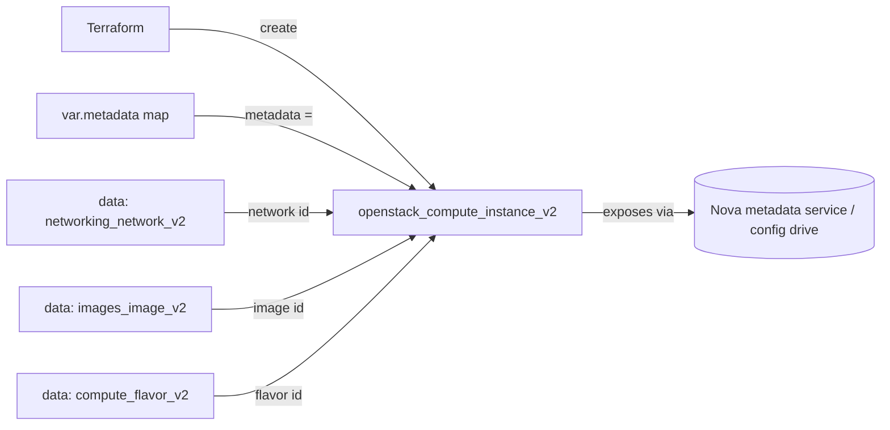

# Instance Metadata

Attach a rich key/value metadata map to an OpenStack compute instance (Nova).
Unlike tags (a flat list), metadata is structured data exposed through the Nova
metadata service and config drive, so guest software, cloud-init and
config-management tooling can read role, environment, owner and other facts at
runtime.

> **Primary search phrase:** Terraform OpenStack instance metadata

## Architecture



The `metadata` map is passed straight to the instance and surfaced inside the
guest at `http://169.254.169.254/openstack/` (and via config drive when enabled),
where automation can read it without any out-of-band lookup.

## Usage

```bash
export OS_CLOUD=openstack          # or set `cloud` in terraform.tfvars
cp terraform.tfvars.example terraform.tfvars
terraform init
terraform plan
terraform apply
```

## Inputs

| Name | Description | Type | Default |
|------|-------------|------|---------|
| `cloud` | clouds.yaml entry to use | `string` | `"openstack"` |
| `instance_name` | Name of the instance | `string` | `"example-instance-metadata"` |
| `flavor_name` | Flavor (size) | `string` | `"m1.small"` |
| `image_name` | Glance image to boot | `string` | `"ubuntu-22.04"` |
| `network_name` | Tenant network to attach | `string` | `"private"` |
| `key_pair_name` | Existing key pair for SSH (optional) | `string` | `""` |
| `security_group_names` | Security groups | `list(string)` | `["default"]` |
| `metadata` | Key/value metadata map | `map(string)` | see `variables.tf` |
| `tags` | Instance tags | `list(string)` | see `variables.tf` |

## Outputs

| Name | Description |
|------|-------------|
| `instance_id` | UUID of the instance |
| `instance_name` | Name of the instance |
| `access_ip_v4` | First IPv4 address |
| `metadata` | The metadata map attached to the instance |
| `network_id` | Network the instance is attached to |

## Best practices

- **Why this approach:** Metadata travels *with* the instance and is readable from
  inside the guest, making it the right place for facts cloud-init or Ansible need
  at boot (role, environment, backup policy). Keep a consistent key schema across
  all instances so tooling can rely on it.
- **Common mistakes:** Confusing `metadata` (structured `map(string)`, readable in
  guest) with `tags` (flat list, for inventory/filtering only); storing secrets in
  metadata (it is readable by anything in the guest and by project users — don't);
  exceeding the project `metadata_items` quota with oversized maps.
- **Scaling considerations:** Drive metadata from a single source of truth (a
  `locals` block or shared variable) so a fleet stays consistent. The
  `metadata_items` quota caps how many keys each instance may carry.
- **Performance considerations:** Metadata is negligible at create time. For large
  payloads (scripts, certs) use `user_data`/config drive instead of stuffing them
  into metadata keys.
- **Cost considerations:** Metadata itself is free; the value is operational —
  good `cost-center`/`owner` keys make chargeback and cleanup far easier.

## Security considerations

- **Never** put secrets (passwords, tokens, keys) in metadata: it is readable by
  any process in the guest and by project users via the API. Use application
  credentials or a secrets manager instead.
- Define least-privilege security groups explicitly rather than relying on
  `default` — see [`security/security-group`](../../security/security-group-basic/).
- Inject SSH access via a managed key pair, never passwords.

## Troubleshooting

| Symptom | Likely cause | Fix |
|---------|--------------|-----|
| `No valid host was found` | No host has capacity for the flavor / AZ | Try a smaller flavor or another AZ; check `openstack hypervisor stats show` |
| `Quota exceeded` | Project instance quota **or** `metadata_items` quota hit | Raise quota or trim the metadata map ([quotas examples](../../quotas/)) |
| Metadata not visible in guest | Metadata service unreachable or config drive disabled | Confirm the 169.254.169.254 route, or set `config_drive = true` |
| `Image <name> not found` | Wrong `image_name` or image not visible to the project | `openstack image list`; check image visibility |
| `Network <name> not found` | Wrong `network_name` or no access | `openstack network list` |
| Provider auth errors | Bad/missing `clouds.yaml` or `OS_CLOUD` | See [provider configuration](../../../docs/provider-configuration.md) |

## Cleanup

```bash
terraform destroy
```

## Further reading

- [Provider configuration & clouds.yaml](../../../docs/provider-configuration.md)
- [OpenStack provider — compute instance docs](https://registry.terraform.io/providers/terraform-provider-openstack/openstack/latest/docs/resources/compute_instance_v2)
- [Nova metadata service (OpenStack docs)](https://docs.openstack.org/nova/latest/user/metadata.html)
- [Single instance example](../single-instance/)
