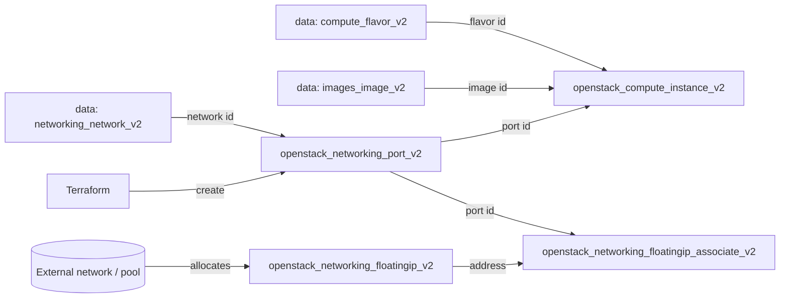

# Instance with a Floating IP

Boot a single OpenStack compute instance (Nova) and make it reachable from
outside the cloud via a **floating IP**. This uses an explicit Neutron port so
the floating IP binds to a stable resource and security groups are managed at
the network layer.

> **Primary search phrase:** Terraform OpenStack instance floating IP example

## Architecture



Terraform creates an explicit port on the tenant network, attaches the instance
to that port, allocates a floating IP from the external pool, then associates
the floating IP with the port.

## Usage

```bash
export OS_CLOUD=openstack          # or set `cloud` in terraform.tfvars
cp terraform.tfvars.example terraform.tfvars
terraform init
terraform plan
terraform apply
```

## Inputs

| Name | Description | Type | Default |
|------|-------------|------|---------|
| `cloud` | clouds.yaml entry to use | `string` | `"openstack"` |
| `instance_name` | Name of the instance | `string` | `"example-instance-with-floating-ip"` |
| `flavor_name` | Flavor (size) | `string` | `"m1.small"` |
| `image_name` | Glance image to boot | `string` | `"ubuntu-22.04"` |
| `network_name` | Tenant network to attach | `string` | `"private"` |
| `floating_ip_pool` | External network to allocate the floating IP from | `string` | `"public"` |
| `security_group_ids` | Security group IDs applied to the port | `list(string)` | `[]` |
| `key_pair_name` | Existing key pair for SSH (optional) | `string` | `""` |
| `tags` | Tags for instance/port/floating IP | `list(string)` | see `variables.tf` |

## Outputs

| Name | Description |
|------|-------------|
| `floating_ip_address` | Public floating IP address |
| `port_id` | UUID of the port the floating IP is bound to |
| `instance_id` | UUID of the instance |
| `instance_name` | Name of the instance |

## Best practices

- **Why this approach:** Creating an explicit port and binding the floating IP
  to it (via `openstack_networking_floatingip_associate_v2`) is the modern,
  Neutron-native pattern. It survives instance rebuilds better than the legacy
  compute association and keeps security groups on the port.
- **Common mistakes:** Allocating the floating IP from a tenant network instead
  of an external one (the `pool` must be an external network); putting security
  groups on the instance *and* the port (with an explicit port, the port wins —
  set them only on the port); forgetting a router exists between the tenant
  network and the external network.
- **Scaling considerations:** Floating IPs are a scarce, quota-limited resource.
  For many public endpoints front instances with a load balancer
  ([`networking/loadbalancer`](../../networking/loadbalancer/)) and a single
  floating IP instead of one per instance.
- **Performance considerations:** Floating IP traffic is SNAT/DNAT'd through the
  network node(s); for very high throughput consider provider networks or
  distributed virtual routing (DVR).
- **Cost considerations:** Many clouds bill per allocated floating IP whether or
  not it is attached. Tag them (done here), release unused ones, and
  `terraform destroy` dev environments.

## Security considerations

- A floating IP exposes the instance to the internet — attach a least-privilege
  security group to the port and open only the ports you need. See
  [`security/security-group`](../../security/security-group/).
- Never bake secrets into user-data; use application credentials and a metadata
  service or a secrets manager.
- Always inject SSH access via a managed key pair rather than passwords, and
  restrict SSH ingress to known CIDRs.

## Troubleshooting

| Symptom | Likely cause | Fix |
|---------|--------------|-----|
| `No valid host was found` | No host has capacity for the flavor / AZ | Try a smaller flavor or another AZ; check `openstack hypervisor stats show` |
| `Quota exceeded` | Project floating-IP/instance quota hit | Release unused floating IPs or raise quota ([quotas examples](../../quotas/)) |
| `External network <pool> not found` | `floating_ip_pool` is not an external network | `openstack network list --external` |
| Floating IP allocated but unreachable | No router between tenant and external network, or security group blocks ingress | Check the router/interface and the port's security groups |
| `Network <name> not found` | Wrong `network_name` or no access | `openstack network list` |
| Provider auth errors | Bad/missing `clouds.yaml` or `OS_CLOUD` | See [provider configuration](../../../docs/provider-configuration.md) |

## Cleanup

```bash
terraform destroy
```

## Further reading

- [Provider configuration & clouds.yaml](../../../docs/provider-configuration.md)
- [OpenStack provider — floating IP associate docs](https://registry.terraform.io/providers/terraform-provider-openstack/openstack/latest/docs/resources/networking_floatingip_associate_v2)
- [OpenStack provider — networking port docs](https://registry.terraform.io/providers/terraform-provider-openstack/openstack/latest/docs/resources/networking_port_v2)
