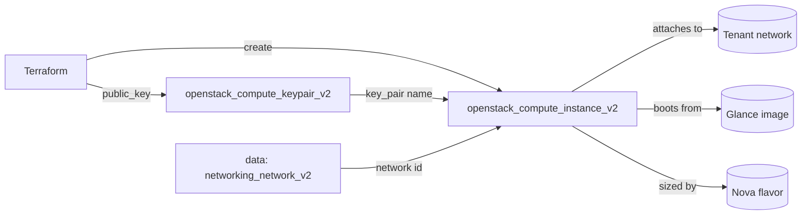

# Managed Key Pair + Instance

Create an OpenStack key pair (Nova) from an SSH public key you already own, then
boot an instance that uses it for SSH access. Managing the key pair in Terraform
keeps SSH access reproducible and reviewable instead of relying on a key someone
created by hand in Horizon.

> **Primary search phrase:** Terraform OpenStack keypair example

## Architecture



You supply only the **public** key (`var.public_key`). Terraform registers it as
a named key pair and wires that name into the instance's `key_pair` argument, so
the instance and the credential that unlocks it are managed together.

## Usage

```bash
export OS_CLOUD=openstack          # or set `cloud` in terraform.tfvars
cp terraform.tfvars.example terraform.tfvars
terraform init
terraform plan
terraform apply
```

## Inputs

| Name | Description | Type | Default |
|------|-------------|------|---------|
| `cloud` | clouds.yaml entry to use | `string` | `"openstack"` |
| `keypair_name` | Name for the managed key pair | `string` | `"example-managed-keypair"` |
| `public_key` | SSH public key contents (required) | `string` | n/a |
| `instance_name` | Name of the instance | `string` | `"example-managed-keypair-instance"` |
| `flavor_name` | Flavor (size) | `string` | `"m1.small"` |
| `image_name` | Glance image to boot | `string` | `"ubuntu-22.04"` |
| `network_name` | Tenant network to attach | `string` | `"private"` |
| `security_group_names` | Security groups | `list(string)` | `["default"]` |
| `tags` | Instance tags | `list(string)` | see `variables.tf` |

## Outputs

| Name | Description |
|------|-------------|
| `instance_id` | UUID of the instance |
| `access_ip_v4` | First IPv4 address |
| `keypair_name` | Name of the managed key pair |
| `keypair_fingerprint` | Fingerprint of the managed key pair |

## Best practices

- **Why this approach:** Passing the public key in and letting Terraform create
  the key pair means SSH access is version-controlled and identical across
  rebuilds. Referencing `openstack_compute_keypair_v2.this.name` from the
  instance creates an explicit dependency, so the key always exists first.
- **Common mistakes:** Pasting a **private** key (only ever provide the public
  half); committing the key into `terraform.tfvars` (it is gitignored, but
  prefer `file("~/.ssh/id_ed25519.pub")`); reusing a key pair name that already
  exists in the project, which collides on create.
- **Scaling considerations:** One managed key pair can be referenced by any
  number of instances. For per-team or per-environment keys, parameterise
  `keypair_name`/`public_key` and instantiate the example more than once.
- **Performance considerations:** Key-pair creation is a control-plane no-op with
  no runtime cost; the instance flavor drives performance — size it to the
  workload.
- **Cost considerations:** Key pairs are free. The instance bills while
  `ACTIVE`; tag everything (done here) and `terraform destroy` dev environments.

## Security considerations

- Only the public key is sent to OpenStack; keep the matching private key secure
  and never commit it.
- Prefer modern key types (`ed25519`) and rotate keys by registering a new key
  pair and rebuilding/cycling instances rather than editing a key in place.
- The `default` security group rarely permits external SSH. Define a
  least-privilege group that allows port 22 only from trusted CIDRs — see
  [`security/security-group`](../../security/security-group-basic/).

## Troubleshooting

| Symptom | Likely cause | Fix |
|---------|--------------|-----|
| `No valid host was found` | No host has capacity for the flavor / AZ | Try a smaller flavor or another AZ; check `openstack hypervisor stats show` |
| `Quota exceeded` | Project key-pair or instance/cores/RAM quota hit | Raise quota or destroy unused resources ([quotas examples](../../quotas/)) |
| `Key pair '<name>' already exists` | Name collides with an existing key pair | Choose a unique `keypair_name` or import the existing one |
| `Permission denied (publickey)` on SSH | Wrong private key, or security group blocks port 22 | Use the matching private key; open SSH in the security group |
| Invalid `public_key` value | Pasted a private key or malformed text | Provide the full one-line contents of the `.pub` file |
| Provider auth errors | Bad/missing `clouds.yaml` or `OS_CLOUD` | See [provider configuration](../../../docs/provider-configuration.md) |

## Cleanup

```bash
terraform destroy
```

## Further reading

- [Provider configuration & clouds.yaml](../../../docs/provider-configuration.md)
- [OpenStack provider — compute keypair docs](https://registry.terraform.io/providers/terraform-provider-openstack/openstack/latest/docs/resources/compute_keypair_v2)
- [OpenStack provider — compute instance docs](https://registry.terraform.io/providers/terraform-provider-openstack/openstack/latest/docs/resources/compute_instance_v2)
