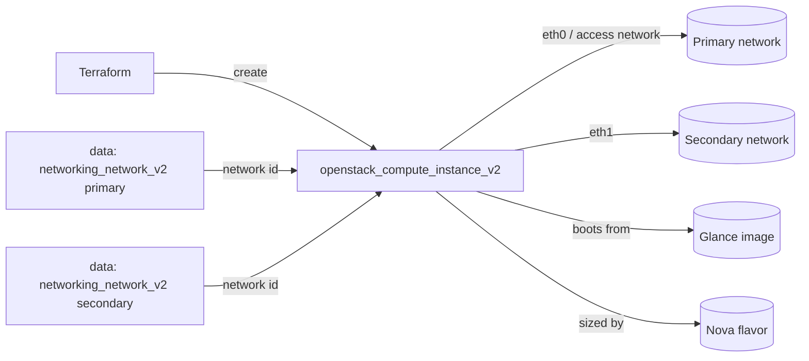

# Multi-NIC Compute Instance

Boot a single OpenStack compute instance (Nova) with **two** network interfaces,
each attached to a different tenant network. This is the pattern for separating
traffic planes — for example a front-end/management network and a back-end data
or storage network — without standing up routers between them.

> **Primary search phrase:** Terraform OpenStack instance multiple networks

## Architecture



Each network is resolved by name with its own data source (so no cloud-specific
UUIDs are hard-coded). The instance declares two `network {}` blocks; the first
is the primary NIC and is marked `access_network = true`, which makes its address
the one reported in `access_ip_v4`.

## Usage

```bash
export OS_CLOUD=openstack          # or set `cloud` in terraform.tfvars
cp terraform.tfvars.example terraform.tfvars
terraform init
terraform plan
terraform apply
```

## Inputs

| Name | Description | Type | Default |
|------|-------------|------|---------|
| `cloud` | clouds.yaml entry to use | `string` | `"openstack"` |
| `instance_name` | Name of the instance | `string` | `"example-multi-nic-instance"` |
| `flavor_name` | Flavor (size) | `string` | `"m1.small"` |
| `image_name` | Glance image to boot | `string` | `"ubuntu-22.04"` |
| `network_name_primary` | Primary network (becomes the access network) | `string` | `"private"` |
| `network_name_secondary` | Secondary network (additional NIC) | `string` | `"private-data"` |
| `key_pair_name` | Existing key pair for SSH (optional) | `string` | `""` |
| `security_group_names` | Security groups | `list(string)` | `["default"]` |
| `tags` | Instance tags | `list(string)` | see `variables.tf` |

## Outputs

| Name | Description |
|------|-------------|
| `instance_id` | UUID of the instance |
| `access_ip_v4` | IPv4 address on the primary/access network |
| `network_id_primary` | ID of the primary network |
| `network_id_secondary` | ID of the secondary network |

## Best practices

- **Why this approach:** Two `network {}` blocks attach two NICs in a defined
  order. Marking the first `access_network = true` makes the primary address
  deterministic instead of relying on Nova's ordering, which keeps `access_ip_v4`
  (and anything that consumes it, like SSH provisioners) stable.
- **Common mistakes:** Assuming NIC order is random — it follows block order, so
  put the management/front-end network first. Forgetting that the guest OS still
  needs to bring up `eth1` (most cloud images only DHCP `eth0` by default; use
  cloud-init/netplan to configure the second interface). Attaching both NICs to
  the same network (use [single-instance](../single-instance/) for that).
- **Scaling considerations:** For fleets that all need the same dual-homing,
  wrap this in the [`compute` module](../../../modules/compute/) and drive it
  with `for_each`. For more than two planes, add more `network {}` blocks.
- **Performance considerations:** Keep east-west/storage traffic on the
  secondary network so it doesn't contend with management traffic; match the
  flavor's vNIC count and bandwidth to the workload.
- **Cost considerations:** Extra NICs are usually free, but each may consume a
  port and (if you later add floating IPs) a public address that bills. Tag
  everything and `terraform destroy` dev environments.

## Security considerations

- Each NIC is a separate trust boundary. Apply least-privilege security groups
  per plane — see [`security/security-group`](../../security/security-group-basic/) —
  rather than one permissive `default` group on both.
- A dual-homed instance can bridge networks. Disable IP forwarding in the guest
  unless routing between the two networks is an explicit, reviewed requirement.
- Never bake secrets into user-data; use application credentials or a secrets
  manager.

## Troubleshooting

| Symptom | Likely cause | Fix |
|---------|--------------|-----|
| `No valid host was found` | No host has capacity for the flavor / AZ | Try a smaller flavor or another AZ; check `openstack hypervisor stats show` |
| `Quota exceeded` | Project instance/cores/RAM or port quota hit | Raise quota or destroy unused resources ([quotas examples](../../quotas/)) |
| Second NIC has no IP in the guest | Cloud image only configures `eth0` | Configure `eth1` via cloud-init/netplan; verify with `ip addr` |
| `access_ip_v4` is the wrong network | Access NIC ordering | Ensure the intended network is the first block with `access_network = true` |
| `Network <name> not found` | Wrong network name or no access | `openstack network list` |
| Provider auth errors | Bad/missing `clouds.yaml` or `OS_CLOUD` | See [provider configuration](../../../docs/provider-configuration.md) |

## Cleanup

```bash
terraform destroy
```

## Further reading

- [Provider configuration & clouds.yaml](../../../docs/provider-configuration.md)
- [OpenStack provider — compute instance docs](https://registry.terraform.io/providers/terraform-provider-openstack/openstack/latest/docs/resources/compute_instance_v2)
- [OpenStack provider — networking network data source](https://registry.terraform.io/providers/terraform-provider-openstack/openstack/latest/docs/data-sources/networking_network_v2)
