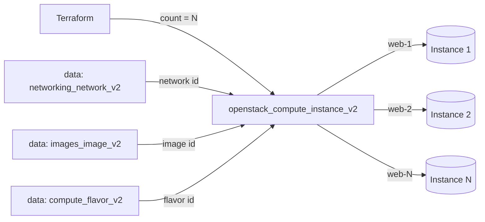

# Multiple Compute Instances

Boot a fleet of identical OpenStack compute instances (Nova) with a single
`count`, naming them from a shared prefix and a 1-based index. This is the
go-to pattern for stateless tiers — web front-ends, workers, batch nodes — where
you want N copies of the same machine on one tenant network.

> **Primary search phrase:** Terraform OpenStack multiple instances count

## Architecture



Network, image and flavor are each resolved once by name with a data source, then
shared across every instance the `count` meta-argument creates. Outputs use splat
expressions so you get lists of IDs and IPs back in creation order.

## Usage

```bash
export OS_CLOUD=openstack          # or set `cloud` in terraform.tfvars
cp terraform.tfvars.example terraform.tfvars
terraform init
terraform plan
terraform apply
```

## Inputs

| Name | Description | Type | Default |
|------|-------------|------|---------|
| `cloud` | clouds.yaml entry to use | `string` | `"openstack"` |
| `instance_count` | Number of instances to create | `number` | `3` |
| `instance_name_prefix` | Prefix for instance names | `string` | `"web"` |
| `flavor_name` | Flavor (size) | `string` | `"m1.small"` |
| `image_name` | Glance image to boot | `string` | `"ubuntu-22.04"` |
| `network_name` | Tenant network to attach | `string` | `"private"` |
| `key_pair_name` | Existing key pair for SSH (optional) | `string` | `""` |
| `security_group_names` | Security groups | `list(string)` | `["default"]` |
| `tags` | Instance tags | `list(string)` | see `variables.tf` |

## Outputs

| Name | Description |
|------|-------------|
| `instance_ids` | UUIDs of all instances |
| `instance_names` | Names of all instances |
| `access_ips` | First IPv4 address of each instance |
| `network_id` | Network the instances are attached to |

## Best practices

- **Why this approach:** `count` is the simplest way to stamp out N identical,
  interchangeable instances. Data-source lookups by name keep the example portable
  (no UUIDs in code), and splat outputs give you tidy lists to feed into a load
  balancer or DNS record set.
- **Common mistakes:** Using `count` when instances are *not* interchangeable —
  reordering or removing a middle element renumbers everything after it and forces
  replacements. If each instance differs (per-AZ, per-name), prefer `for_each`
  (see [availability-zones](../availability-zones/)). Also avoid hard-coding the
  index into anything stateful (volumes, floating IPs) under `count`.
- **Scaling considerations:** Raise `instance_count` to scale out; mind project
  quotas (instances, cores, RAM). For large fleets put this behind the
  [`compute` module](../../../modules/compute/) and front it with a load balancer.
- **Performance considerations:** All instances schedule in parallel, so a big
  jump in `instance_count` can briefly stress the scheduler and image cache. Match
  the flavor to the workload rather than over-provisioning every node.
- **Cost considerations:** N instances bill N times while `ACTIVE`. Tag everything
  (done here) for cost attribution and `terraform destroy` dev fleets when idle.

## Security considerations

- Every instance shares `security_group_names`; define least-privilege groups
  explicitly rather than relying on `default` — see
  [`security/security-group`](../../security/security-group/).
- Inject SSH access via a managed key pair, never passwords, and never bake
  secrets into user-data; use application credentials or a secrets manager.
- A larger fleet is a larger attack surface — keep images patched and rebuild
  rather than long-lived in-place upgrades.

## Troubleshooting

| Symptom | Likely cause | Fix |
|---------|--------------|-----|
| `No valid host was found` | No host has capacity for the flavor across the fleet | Lower `instance_count`, try a smaller flavor or another AZ; check `openstack hypervisor stats show` |
| `Quota exceeded` | Project instance/cores/RAM quota hit by the fleet size | Raise quota or lower `instance_count` ([quotas examples](../../quotas/)) |
| Replacing instances on every apply | `count` index shifted after removing a middle element | Append/remove from the end, or move to `for_each` keyed by name |
| `Image <name> not found` | Wrong `image_name` or image not visible to the project | `openstack image list`; check image visibility |
| `Network <name> not found` | Wrong `network_name` or no access | `openstack network list` |
| Provider auth errors | Bad/missing `clouds.yaml` or `OS_CLOUD` | See [provider configuration](../../../docs/provider-configuration.md) |

## Cleanup

```bash
terraform destroy
```

## Further reading

- [Provider configuration & clouds.yaml](../../../docs/provider-configuration.md)
- [OpenStack provider — compute instance docs](https://registry.terraform.io/providers/terraform-provider-openstack/openstack/latest/docs/resources/compute_instance_v2)
- [Terraform `count` meta-argument](https://developer.hashicorp.com/terraform/language/meta-arguments/count)
- [Single instance example](../single-instance/)
