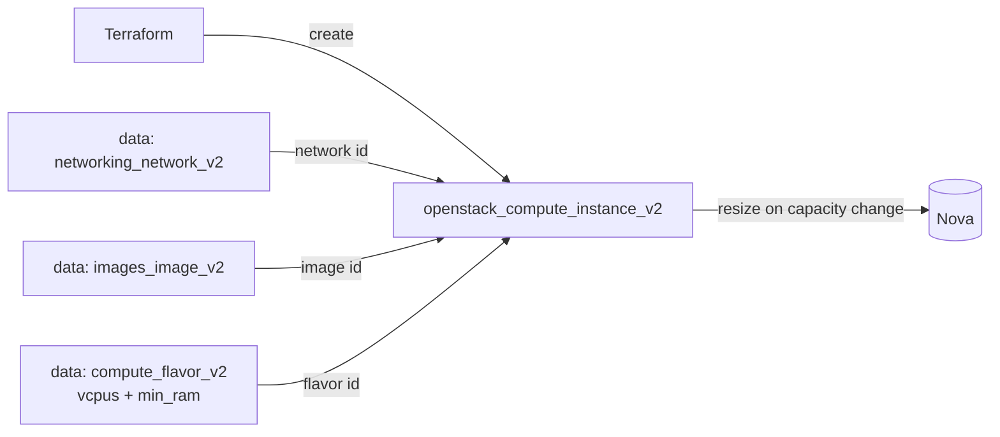

# Instance with a Capacity-Resolved Flavor

Boot a single OpenStack compute instance (Nova) whose flavor is selected by
**capacity (vCPUs + RAM)** instead of a hard-coded flavor name. Changing the
requested capacity and re-applying triggers a Nova resize, making this the
template for vertically scaling an instance through Terraform.

> **Primary search phrase:** Terraform OpenStack resize instance flavor vcpus ram

## Architecture



The flavor data source resolves the smallest flavor that satisfies
`vcpus = var.flavor_vcpus` and `min_ram = var.flavor_ram`. The instance uses that
resolved `flavor_id`, so editing the variables re-resolves the flavor and Nova
resizes the running server.

## Usage

```bash
export OS_CLOUD=openstack          # or set `cloud` in terraform.tfvars
cp terraform.tfvars.example terraform.tfvars
terraform init
terraform plan
terraform apply
```

To resize, raise `flavor_vcpus` and/or `flavor_ram` in `terraform.tfvars` and
re-apply:

```bash
# e.g. change flavor_vcpus = 2 -> 4 and flavor_ram = 4096 -> 8192
terraform apply
```

Terraform plans a new `flavor_id` and issues a Nova resize. On most clouds the
resize must be confirmed; the provider confirms it automatically, but the
instance reboots, so schedule a maintenance window.

## Inputs

| Name | Description | Type | Default |
|------|-------------|------|---------|
| `cloud` | clouds.yaml entry to use | `string` | `"openstack"` |
| `instance_name` | Name of the instance | `string` | `"example-resized-flavor-instance"` |
| `flavor_vcpus` | vCPUs to match when resolving the flavor | `number` | `2` |
| `flavor_ram` | RAM (MB) to match when resolving the flavor | `number` | `4096` |
| `image_name` | Glance image to boot | `string` | `"ubuntu-22.04"` |
| `network_name` | Tenant network to attach | `string` | `"private"` |
| `key_pair_name` | Existing key pair for SSH (optional) | `string` | `""` |
| `security_group_names` | Security groups | `list(string)` | `["default"]` |
| `tags` | Instance tags | `list(string)` | see `variables.tf` |

## Outputs

| Name | Description |
|------|-------------|
| `flavor_id` | UUID of the resolved flavor |
| `flavor_name` | Name of the resolved flavor |
| `flavor_vcpus` | vCPUs in the resolved flavor |
| `flavor_ram` | RAM (MB) in the resolved flavor |
| `instance_id` | UUID of the instance |

## Best practices

- **Why this approach:** Selecting a flavor by capacity keeps configs portable —
  flavor *names* differ wildly between clouds, but "2 vCPU / 4 GB" is universal.
  The data source returns the smallest matching flavor, avoiding accidental
  over-provisioning.
- **Common mistakes:** Requesting a `vcpus`/`min_ram` combination that no flavor
  satisfies (the data source errors); expecting a resize to be free of downtime
  (Nova reboots the instance); forgetting that a smaller target flavor with a
  smaller root disk can fail to resize down.
- **Scaling considerations:** Vertical resize has limits — beyond a point scale
  horizontally with [`multiple-instances`](../multiple-instances/) behind a load
  balancer instead of growing one box.
- **Performance considerations:** Resizes may move the instance to another host
  (cold migration); pin with an AZ ([`dedicated-az-instance`](../dedicated-az-instance/))
  if locality matters. Match flavor families (CPU vs memory optimized) to the
  workload.
- **Cost considerations:** Larger flavors cost more per hour. Right-size from
  real metrics, tag instances (done here) for attribution, and `terraform
  destroy` idle environments.

## Security considerations

- The `default` security group is often permissive **inside** the project but
  blocks external ingress. Define least-privilege groups explicitly — see
  [`security/security-group`](../../security/security-group-basic/).
- Never bake secrets into user-data; use application credentials and a metadata
  service or a secrets manager.
- Always inject SSH access via a managed key pair rather than passwords.

## Troubleshooting

| Symptom | Likely cause | Fix |
|---------|--------------|-----|
| `No valid host was found` | No host has capacity for the target flavor / AZ | Try a smaller flavor or another AZ; check `openstack hypervisor stats show` |
| `Quota exceeded` | The larger flavor exceeds the project cores/RAM quota | Raise quota or free capacity ([quotas examples](../../quotas/)) |
| `Error: no flavor found` | No flavor matches the requested `vcpus`/`flavor_ram` | List options with `openstack flavor list`; adjust the variables |
| Resize stuck in `VERIFY_RESIZE` | Auto-confirm disabled on the cloud | `openstack server resize confirm <id>`; check provider resize settings |
| Resize down fails on disk | Target root disk smaller than current usage | Choose a flavor with an equal/larger disk |
| Provider auth errors | Bad/missing `clouds.yaml` or `OS_CLOUD` | See [provider configuration](../../../docs/provider-configuration.md) |

## Cleanup

```bash
terraform destroy
```

## Further reading

- [Provider configuration & clouds.yaml](../../../docs/provider-configuration.md)
- [OpenStack provider — flavor data source](https://registry.terraform.io/providers/terraform-provider-openstack/openstack/latest/docs/data-sources/compute_flavor_v2)
- [OpenStack provider — compute instance docs](https://registry.terraform.io/providers/terraform-provider-openstack/openstack/latest/docs/resources/compute_instance_v2)
