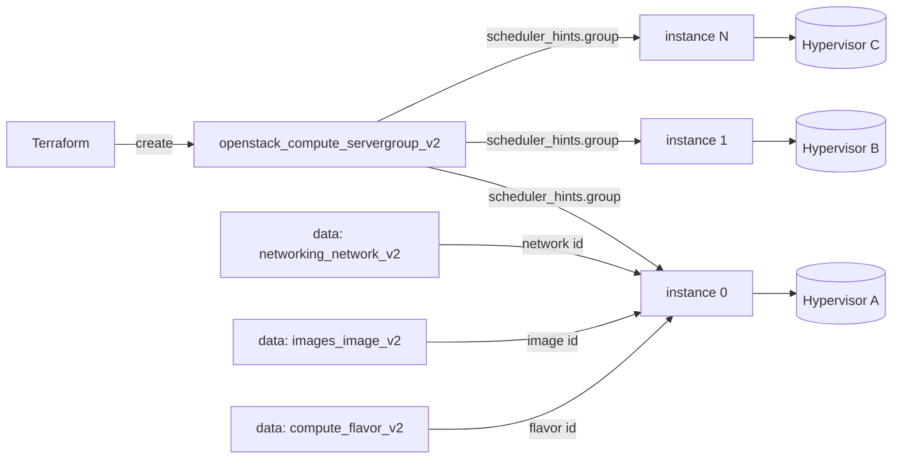

# Anti-Affinity Server Group

Spread N compute instances across distinct hypervisors using a Nova server group
with the `anti-affinity` policy. This is the building block for highly-available
tiers — a single host failure cannot take down every replica.

> **Primary search phrase:** Terraform OpenStack anti-affinity server group

## Architecture



The server group is created first; each instance (rendered with `count`) passes
the group id through `scheduler_hints.group`, so Nova places members on
different hosts. Network, image, and flavor are resolved by name via data
sources — no hard-coded UUIDs.

## Usage

```bash
export OS_CLOUD=openstack          # or set `cloud` in terraform.tfvars
cp terraform.tfvars.example terraform.tfvars
terraform init
terraform plan
terraform apply
```

## Inputs

| Name | Description | Type | Default |
|------|-------------|------|---------|
| `cloud` | clouds.yaml entry to use | `string` | `"openstack"` |
| `name_prefix` | Prefix for group and instance names | `string` | `"example-aa"` |
| `instance_count` | Number of instances to spread | `number` | `2` |
| `flavor_name` | Flavor (size) | `string` | `"m1.small"` |
| `image_name` | Glance image to boot | `string` | `"ubuntu-22.04"` |
| `network_name` | Tenant network to attach | `string` | `"private"` |
| `key_pair_name` | Existing key pair for SSH (optional) | `string` | `""` |
| `security_group_names` | Security groups | `list(string)` | `["default"]` |
| `tags` | Instance tags | `list(string)` | see `variables.tf` |

## Outputs

| Name | Description |
|------|-------------|
| `server_group_id` | UUID of the anti-affinity server group |
| `instance_ids` | UUIDs of the instances in the group |
| `instance_names` | Names of the instances in the group |
| `access_ips_v4` | First IPv4 address of each instance |

## Best practices

- **Why this approach:** `anti-affinity` spreads replicas across hosts so a
  single hypervisor failure degrades rather than destroys the service. Driving
  member count with `count` keeps the group and its instances in one config.
- **Common mistakes:** Requesting more instances than available hosts with the
  strict `anti-affinity` policy (placement fails — use `soft-anti-affinity` if
  best-effort is acceptable); editing `policies` in place (it forces a new server
  group); assuming anti-affinity also balances networks or storage (it does not).
- **Scaling considerations:** Nova limits members per server group
  (`server_group_members` quota). For large fleets, shard across multiple groups
  or combine with multiple AZs.
- **Performance considerations:** Anti-affinity constrains the scheduler, so very
  large groups can slow or fail placement on busy clouds. Keep groups modest.
- **Cost considerations:** Each instance bills while `ACTIVE`. Tag everything
  (done here) and right-size `instance_count` to your real HA target.

## Security considerations

- Anti-affinity is an availability control, not a security boundary; isolate
  tenants/workloads with projects and security groups instead.
- Pair members with least-privilege security groups — see
  [`security/security-group`](../../security/security-group/).
- Inject SSH access via a managed key pair rather than passwords, and never bake
  secrets into user-data.

## Troubleshooting

| Symptom | Likely cause | Fix |
|---------|--------------|-----|
| `No valid host was found` | Fewer eligible hosts than members under strict anti-affinity | Reduce `instance_count`, add hosts, or use `soft-anti-affinity` |
| `Quota exceeded` | `server_group_members`, instance, or cores quota hit | Raise quota or reduce `instance_count` ([quotas examples](../../quotas/)) |
| Instances land on same host | Cloud uses `soft-anti-affinity` or the affinity filter is disabled | Confirm `ServerGroupAntiAffinityFilter` is enabled in Nova scheduler |
| Group change forces replacement | `policies`/`name` are immutable | Expect re-create; drain traffic first |
| `Image <name> not found` | Wrong `image_name` or not visible | `openstack image list`; check visibility |
| Provider auth errors | Bad/missing `clouds.yaml` or `OS_CLOUD` | See [provider configuration](../../../docs/provider-configuration.md) |

## Cleanup

```bash
terraform destroy
```

## Further reading

- [Provider configuration & clouds.yaml](../../../docs/provider-configuration.md)
- [OpenStack provider — server group docs](https://registry.terraform.io/providers/terraform-provider-openstack/openstack/latest/docs/resources/compute_servergroup_v2)
- [OpenStack provider — compute instance docs](https://registry.terraform.io/providers/terraform-provider-openstack/openstack/latest/docs/resources/compute_instance_v2)
