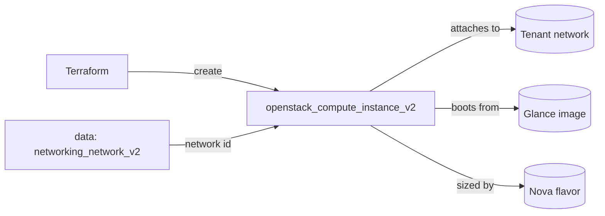

# Single Compute Instance

Boot a single OpenStack compute instance (Nova) on an existing tenant network,
using a Glance image and a Nova flavor. This is the "hello world" of the
OpenStack Terraform provider and the template every other compute example
builds on.

> **Primary search phrase:** Terraform OpenStack instance example

## Architecture



The instance looks up its network by name with a data source (so no cloud-specific
UUIDs are hard-coded), then boots from the named image with the named flavor.

## Usage

```bash
export OS_CLOUD=openstack          # or set `cloud` in terraform.tfvars
cp terraform.tfvars.example terraform.tfvars
terraform init
terraform plan
terraform apply
```

## Inputs

| Name | Description | Type | Default |
|------|-------------|------|---------|
| `cloud` | clouds.yaml entry to use | `string` | `"openstack"` |
| `instance_name` | Name of the instance | `string` | `"example-single-instance"` |
| `flavor_name` | Flavor (size) | `string` | `"m1.small"` |
| `image_name` | Glance image to boot | `string` | `"ubuntu-22.04"` |
| `network_name` | Tenant network to attach | `string` | `"private"` |
| `key_pair_name` | Existing key pair for SSH (optional) | `string` | `""` |
| `security_group_names` | Security groups | `list(string)` | `["default"]` |
| `tags` | Instance tags | `list(string)` | see `variables.tf` |

## Outputs

| Name | Description |
|------|-------------|
| `instance_id` | UUID of the instance |
| `instance_name` | Name of the instance |
| `access_ip_v4` | First IPv4 address |
| `network_id` | Network the instance is attached to |

## Best practices

- **Why this approach:** Looking up the network by name with a data source keeps
  the example portable across clouds — no UUIDs in code. Naming flavors/images by
  string rather than ID keeps configs readable and reviewable.
- **Common mistakes:** Hard-coding network/image UUIDs; forgetting that
  `image_name` is resolved to an `image_id` at create time (handled here with
  `ignore_changes`); attaching to the `default` security group and assuming SSH
  is open (it usually is not — see the [security examples](../../security/)).
- **Scaling considerations:** For more than a couple of instances use
  [`multiple-instances`](../multiple-instances/) with `count`/`for_each`, or the
  [`compute` module](../../../modules/compute/).
- **Performance considerations:** Pick a flavor matched to the workload; for
  IO-heavy workloads prefer [boot-from-volume](../boot-from-volume/) over the
  ephemeral root disk.
- **Cost considerations:** Instances bill while `ACTIVE`. Tag everything (done
  here) so you can attribute spend, and `terraform destroy` dev environments.

## Security considerations

- The `default` security group is often permissive **inside** the project but
  blocks ingress from outside. Define least-privilege groups explicitly — see
  [`security/security-group`](../../security/security-group-basic/).
- Never bake secrets into user-data; use application credentials and a metadata
  service or a secrets manager.
- Always inject SSH access via a managed key pair rather than passwords.

## Troubleshooting

| Symptom | Likely cause | Fix |
|---------|--------------|-----|
| `No valid host was found` | No host has capacity for the flavor / AZ | Try a smaller flavor or another AZ; check `openstack hypervisor stats show` |
| `Quota exceeded` | Project instance/cores/RAM quota hit | Raise quota or destroy unused instances ([quotas examples](../../quotas/)) |
| `Image <name> not found` | Wrong `image_name` or image not visible to the project | `openstack image list`; check image visibility |
| `Network <name> not found` | Wrong `network_name` or no access | `openstack network list` |
| Provider auth errors | Bad/missing `clouds.yaml` or `OS_CLOUD` | See [provider configuration](../../../docs/provider-configuration.md) |
| Apply timeout building | Slow scheduler/image copy | Increase timeouts; check Nova/Glance health |

## Cleanup

```bash
terraform destroy
```

## Further reading

- [Provider configuration & clouds.yaml](../../../docs/provider-configuration.md)
- [OpenStack provider — compute instance docs](https://registry.terraform.io/providers/terraform-provider-openstack/openstack/latest/docs/resources/compute_instance_v2)
- [Advanced OpenStack guides on DevOps AI ToolKit](https://devopsaitoolkit.com/blog/)
