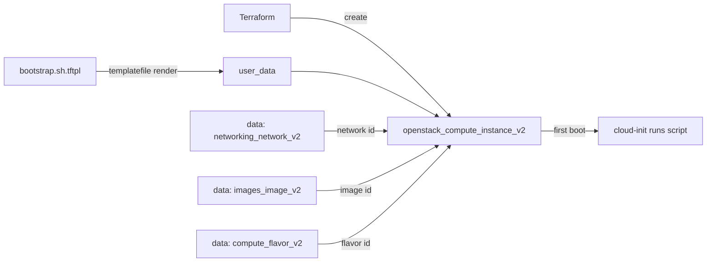

# Bootstrap an Instance with a Templated user-data Script

Boot an OpenStack compute instance whose `user_data` is a bash bootstrap script
rendered with Terraform's `templatefile()`. The template (`bootstrap.sh.tftpl`)
sets the hostname, refreshes packages, installs nginx, writes an MOTD, and drops
a completion marker — with values injected from Terraform variables.

> **Primary search phrase:** Terraform OpenStack user_data bootstrap script

## Architecture



The network, image, and flavor are resolved by name through data sources, so no
cloud-specific UUIDs are hard-coded. `templatefile()` substitutes `hostname` and
`motd` into the script before it is passed to Nova as `user_data`.

## Usage

```bash
export OS_CLOUD=openstack          # or set `cloud` in terraform.tfvars
cp terraform.tfvars.example terraform.tfvars
terraform init
terraform plan
terraform apply
```

## Inputs

| Name | Description | Type | Default |
|------|-------------|------|---------|
| `cloud` | clouds.yaml entry to use | `string` | `"openstack"` |
| `instance_name` | Name of the instance (also the templated hostname) | `string` | `"example-bootstrap"` |
| `flavor_name` | Flavor (size) | `string` | `"m1.small"` |
| `image_name` | Glance image to boot | `string` | `"ubuntu-22.04"` |
| `network_name` | Tenant network to attach | `string` | `"private"` |
| `key_pair_name` | Existing key pair for SSH (optional) | `string` | `""` |
| `security_group_names` | Security groups | `list(string)` | `["default"]` |
| `motd` | Message-of-the-day rendered into the script | `string` | see `variables.tf` |
| `tags` | Instance tags | `list(string)` | see `variables.tf` |

## Outputs

| Name | Description |
|------|-------------|
| `instance_id` | UUID of the instance |
| `instance_name` | Name of the instance |
| `access_ip_v4` | First IPv4 address |
| `rendered_user_data` | The bootstrap script as rendered from the template |

## Best practices

- **Why this approach:** `templatefile()` keeps the bootstrap logic in a real
  `.sh` file (lintable, reviewable, syntax-highlighted) while Terraform injects
  per-environment values. This is cleaner than embedding a heredoc in HCL.
- **Common mistakes:** Forgetting that `${var}` in a `.tftpl` is a *Terraform*
  interpolation — escape literal shell `${VAR}` as `$${VAR}` if you need it left
  untouched; not making the script idempotent (it reruns on rebuild); exceeding
  the Nova user-data size limit (~64 KB) with large payloads.
- **Scaling considerations:** For fleets, render the same template across a
  `count`/`for_each` and pass an index-derived hostname. Heavy provisioning
  belongs in a baked image (Packer) or a config-management tool, not user-data.
- **Performance considerations:** `apt-get update`/install adds minutes to first
  boot. Pre-bake common packages into the image to shorten boot time.
- **Cost considerations:** Instances bill while `ACTIVE`. Tag everything (done
  here) and `terraform destroy` dev environments when idle.

## Security considerations

- Never bake secrets into `user_data` — it is readable via the metadata service
  (`http://169.254.169.254`) by anything on the instance. Use application
  credentials or a secrets manager instead.
- Keep the script idempotent and minimal; large bootstrap logic widens the
  attack surface and is harder to audit.
- Inject SSH access via a managed key pair, not passwords, and define
  least-privilege security groups — see [`security/security-group`](../../security/security-group/).

## Troubleshooting

| Symptom | Likely cause | Fix |
|---------|--------------|-----|
| `No valid host was found` | No host has capacity for the flavor / AZ | Try a smaller flavor or another AZ; check `openstack hypervisor stats show` |
| `Quota exceeded` | Project instance/cores/RAM quota hit | Raise quota or destroy unused instances ([quotas examples](../../quotas/)) |
| Script did not run | user-data only runs on first boot | Check `/var/log/cloud-init-output.log`; rebuild the instance to rerun |
| `Invalid template interpolation` | Literal shell `${VAR}` parsed by Terraform | Escape as `$${VAR}` in the `.tftpl` |
| `Image <name> not found` | Wrong `image_name` or not visible | `openstack image list`; check visibility |
| Provider auth errors | Bad/missing `clouds.yaml` or `OS_CLOUD` | See [provider configuration](../../../docs/provider-configuration.md) |

## Cleanup

```bash
terraform destroy
```

## Further reading

- [Provider configuration & clouds.yaml](../../../docs/provider-configuration.md)
- [Terraform `templatefile` function](https://developer.hashicorp.com/terraform/language/functions/templatefile)
- [OpenStack provider — compute instance docs](https://registry.terraform.io/providers/terraform-provider-openstack/openstack/latest/docs/resources/compute_instance_v2)
