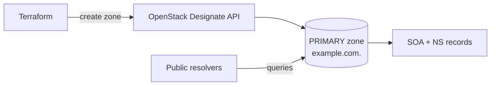

# Designate Primary DNS Zone

> **Primary search phrase:** Terraform OpenStack Designate DNS zone

Create an authoritative (PRIMARY) DNS zone in OpenStack's Designate DNS service
with Terraform. This is the building block every other DNS example reuses.

> Designate (the OpenStack DNS service) must be enabled and reachable on your
> cloud. If the DNS endpoint is missing from the catalog, every plan/apply will
> fail before any resource is created.

## Architecture



## Usage

```bash
export OS_CLOUD=openstack
cp terraform.tfvars.example terraform.tfvars
# edit terraform.tfvars to match your domain

terraform init
terraform plan
terraform apply
```

## Inputs

| Name        | Description                                              | Type     | Default                                  |
| ----------- | -------------------------------------------------------- | -------- | ---------------------------------------- |
| cloud       | Name of the cloud entry in clouds.yaml (via OS_CLOUD).   | `string` | `"openstack"`                            |
| zone_name   | Fully qualified zone name; must end with a dot.          | `string` | `"example.com."`                         |
| email       | Zone administrator email (stored in the SOA record).     | `string` | `"hostmaster@example.com"`               |
| ttl         | Default TTL in seconds for the zone's SOA/NS records.    | `number` | `3600`                                   |
| description | Human-friendly description of the zone.                  | `string` | `"Primary DNS zone managed by Terraform"`|

## Outputs

| Name        | Description                                                  |
| ----------- | ----------------------------------------------------------- |
| zone_id     | Designate identifier (UUID) of the created zone.            |
| zone_name   | Fully qualified name of the created zone.                   |
| zone_serial | Current SOA serial number (increments on each change).      |

## Best practices

- Always terminate `name` with a trailing dot (`example.com.`) — Designate
  treats names without it as relative and will reject or mangle them.
- Keep the administrator `email` as a real mailbox; it surfaces in the SOA
  record and is used for abuse/operational contact.
- Choose a TTL that balances propagation speed against resolver load. Lower it
  before a migration, then raise it once records are stable.
- Manage zone and records in the same configuration (see the `dns-recordsets`
  example) so the SOA serial advances atomically.

## Security considerations

- DNS data is public once the zone is delegated; never encode secrets in record
  names, descriptions, or TXT values.
- Restrict who can modify the zone via Keystone roles/project scoping rather
  than sharing cloud credentials.
- Validate ownership of the parent domain before delegating NS records to the
  Designate name servers to avoid subdomain takeover.

## Troubleshooting

| Symptom                                   | Likely cause                                        | Fix                                                                 |
| ----------------------------------------- | --------------------------------------------------- | ------------------------------------------------------------------ |
| `No suitable endpoint could be found`     | Designate not enabled in the service catalog.       | Confirm the DNS service is deployed; check `openstack catalog list`.|
| `Invalid name ... must be FQDN`           | `zone_name` missing the trailing dot.               | Ensure the value ends with `.` (e.g. `example.com.`).               |
| Apply hangs on zone status               | Zone stuck in `PENDING` on the backend.             | Wait for status to reach `ACTIVE`, or set `disable_status_check`.   |
| Quota exceeded                            | Project at its Designate zone/record limit.         | Delete unused zones or request a quota increase from your operator. |

## Cleanup

```bash
terraform destroy
```

## Further reading

- [Managing DNS on OpenStack with Terraform](https://devopsaitoolkit.com/blog/)
- [openstack_dns_zone_v2 registry docs](https://registry.terraform.io/providers/terraform-provider-openstack/openstack/latest/docs/resources/dns_zone_v2)
- [Provider configuration](../../../docs/provider-configuration.md)
