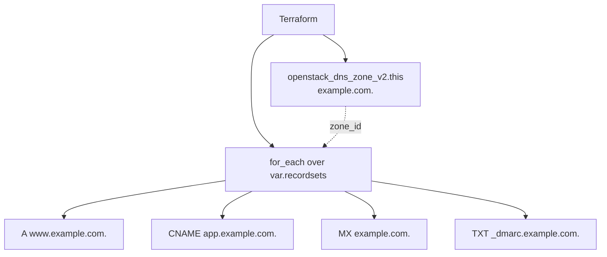

# DNS Recordsets in a Designate Zone

> **Primary search phrase:** Terraform OpenStack Designate DNS recordsets

Create a PRIMARY zone and populate it with multiple recordsets (A, CNAME, MX,
TXT, ...) using a single `for_each` map. Adding or removing a record is a
one-line change to the `recordsets` variable.

> **Record names must be fully qualified and end with a dot.** The map key is
> used verbatim as the recordset `name`, so `www.example.com.` is correct while
> `www` is not. This keeps the configuration unambiguous regardless of the zone.

## Architecture



## Usage

```bash
export OS_CLOUD=openstack
cp terraform.tfvars.example terraform.tfvars
# edit terraform.tfvars: set zone_name and the recordsets map

terraform init
terraform plan
terraform apply
```

## Inputs

| Name       | Description                                                       | Type                                                       | Default            |
| ---------- | ---------------------------------------------------------------- | ---------------------------------------------------------- | ------------------ |
| cloud      | Name of the cloud entry in clouds.yaml (via OS_CLOUD).           | `string`                                                   | `"openstack"`      |
| zone_name  | Fully qualified zone name; must end with a dot.                  | `string`                                                   | `"example.com."`   |
| email      | Zone administrator email (stored in the SOA record).            | `string`                                                   | `"hostmaster@example.com"` |
| zone_ttl   | Default TTL in seconds for the zone's SOA/NS records.           | `number`                                                   | `3600`             |
| recordsets | Map of FQDN record name to `{ type, ttl, records }`.            | `map(object({ type = string, ttl = number, records = list(string) }))` | A/CNAME/MX/TXT examples |

## Outputs

| Name            | Description                                            |
| --------------- | ----------------------------------------------------- |
| zone_id         | Designate identifier (UUID) of the zone.              |
| recordset_ids   | Map of recordset name to its Designate identifier.    |
| recordset_names | List of fully qualified recordset names created.      |

## Best practices

- Keep the map key (record name) fully qualified with a trailing dot so the
  config is portable across zones.
- Group all records for a name/type into a single recordset's `records` list;
  Designate stores one recordset per (name, type) pair.
- Use short TTLs (e.g. 300s) for records you change often and longer TTLs for
  stable infrastructure records.
- For CNAME records the target must also be an FQDN ending with a dot, and a
  CNAME cannot coexist with other record types at the same name.

## Security considerations

- TXT records (SPF/DKIM/DMARC) are public; only publish what you intend the
  world to read.
- Treat the `recordsets` map as infrastructure code: review changes, since a
  wrong A/MX value can redirect traffic or mail.
- Scope credentials to the owning project so unrelated tenants cannot alter
  these records.

## Troubleshooting

| Symptom                                    | Likely cause                                          | Fix                                                                  |
| ------------------------------------------ | ----------------------------------------------------- | ------------------------------------------------------------------- |
| `Invalid name ... must be FQDN`            | A map key (record name) is missing the trailing dot.  | End every recordset name with `.` (e.g. `www.example.com.`).         |
| `Duplicate recordset`                      | Two map entries share the same name and type.         | Merge them into one entry with multiple values in `records`.         |
| CNAME apply rejected                       | CNAME defined alongside another type at the same name.| Remove the conflicting record or use a different name.               |
| Quota exceeded                             | Project at its Designate recordset limit.             | Remove unused recordsets or request a quota increase.                |

## Cleanup

```bash
terraform destroy
```

## Further reading

- [Managing DNS recordsets on OpenStack with Terraform](https://devopsaitoolkit.com/blog/)
- [openstack_dns_recordset_v2 registry docs](https://registry.terraform.io/providers/terraform-provider-openstack/openstack/latest/docs/resources/dns_recordset_v2)
- [Provider configuration](../../../docs/provider-configuration.md)
