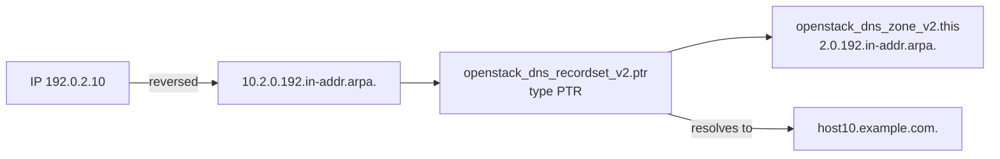

# Reverse DNS (PTR) Zone

> **Primary search phrase:** Terraform OpenStack Designate reverse PTR DNS zone

Create a reverse DNS zone under `in-addr.arpa` and a PTR recordset that maps an
IP address back to a hostname. Reverse DNS is required by many mail servers and
makes logs and traceroutes far more readable.

## What is reverse DNS / a PTR record?

Forward DNS answers "what is the IP for this hostname?" Reverse DNS answers the
opposite: "what hostname owns this IP?" It works by encoding the IP in reverse
under the special `in-addr.arpa.` domain. For example, `192.0.2.10` becomes the
PTR name `10.2.0.192.in-addr.arpa.`, and a `2.0.192.in-addr.arpa.` zone is
authoritative for the whole `192.0.2.0/24` block. Mail servers commonly reject
or downgrade messages from IPs with no matching PTR, and logging/monitoring
tools use PTR records to show friendly hostnames.

## Architecture



## Usage

```bash
export OS_CLOUD=openstack
cp terraform.tfvars.example terraform.tfvars
# edit terraform.tfvars: reverse_zone_name, ptr_name, ptr_records

terraform init
terraform plan
terraform apply
```

## Inputs

| Name              | Description                                                        | Type           | Default                       |
| ----------------- | ----------------------------------------------------------------- | -------------- | ----------------------------- |
| cloud             | Name of the cloud entry in clouds.yaml (via OS_CLOUD).            | `string`       | `"openstack"`                 |
| reverse_zone_name | Reverse zone name in in-addr.arpa form; must end with a dot.      | `string`       | `"2.0.192.in-addr.arpa."`     |
| email             | Zone administrator email (stored in the SOA record).             | `string`       | `"hostmaster@example.com"`    |
| zone_ttl          | Default TTL in seconds for the zone's SOA/NS records.            | `number`       | `3600`                        |
| ptr_name          | Fully qualified PTR record name (reversed IP); must end with a dot. | `string`    | `"10.2.0.192.in-addr.arpa."`  |
| ptr_records       | List of FQDN hostnames the IP resolves back to.                  | `list(string)` | `["host10.example.com."]`     |
| ptr_ttl           | TTL in seconds for the PTR recordset.                           | `number`       | `3600`                        |

## Outputs

| Name             | Description                                          |
| ---------------- | --------------------------------------------------- |
| zone_id          | Designate identifier (UUID) of the reverse zone.    |
| ptr_recordset_id | Designate identifier (UUID) of the PTR recordset.   |

## Best practices

- Keep forward (A) and reverse (PTR) records consistent: the PTR target should
  itself resolve forward to the same IP (matching forward/reverse).
- Use one PTR per IP. Multiple PTRs for a single address are allowed but often
  confuse mail and logging systems.
- Make sure your network operator has delegated the reverse zone to Designate's
  name servers; otherwise the records exist but are not authoritative publicly.
- Always end both `reverse_zone_name` and `ptr_name` with a trailing dot.

## Security considerations

- PTR data is public; do not encode sensitive internal naming schemes you would
  not want disclosed.
- Mismatched forward/reverse DNS can cause mail to be rejected — verify both
  directions before relying on the IP for outbound email.
- Scope credentials to the owning project so other tenants cannot repoint your
  reverse records.

## Troubleshooting

| Symptom                                  | Likely cause                                                 | Fix                                                                       |
| ---------------------------------------- | ------------------------------------------------------------ | ------------------------------------------------------------------------ |
| `Invalid name ... must be FQDN`          | `reverse_zone_name` or `ptr_name` missing the trailing dot.  | Ensure both values end with `.`.                                          |
| PTR not found by external lookups        | Reverse zone not delegated to Designate name servers.        | Ask your network/cloud operator to delegate the in-addr.arpa block.       |
| `ptr_name` not under the zone            | PTR name does not fall within the reverse zone's range.      | Confirm the reversed IP matches the zone (e.g. `10.2.0.192` in `2.0.192`).|
| Quota exceeded                           | Project at its Designate zone/recordset limit.               | Remove unused zones/records or request a quota increase.                  |

## Cleanup

```bash
terraform destroy
```

## Further reading

- [Reverse DNS and PTR records on OpenStack with Terraform](https://devopsaitoolkit.com/blog/)
- [openstack_dns_recordset_v2 registry docs](https://registry.terraform.io/providers/terraform-provider-openstack/openstack/latest/docs/resources/dns_recordset_v2)
- [Provider configuration](../../../docs/provider-configuration.md)
