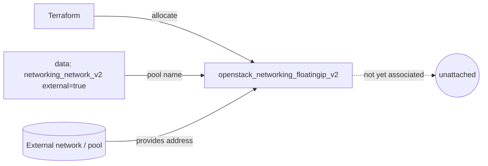

# Allocate a Floating IP from an External Pool

Allocate (reserve) a single OpenStack floating IP from an external network pool
without attaching it to anything. This is the building block for giving an
instance public connectivity: you reserve a stable public address first, then
associate it with a port whenever you are ready.

> **Primary search phrase:** Terraform OpenStack allocate floating IP

## Architecture



The external network is resolved by name with a data source (asserting
`external = true`), and its name is used as the floating IP `pool`. No port is
attached, so the address is simply held by the project.

## Usage

```bash
export OS_CLOUD=openstack          # or set `cloud` in terraform.tfvars
cp terraform.tfvars.example terraform.tfvars
terraform init
terraform plan
terraform apply
terraform output floating_ip_address
```

## Inputs

| Name | Description | Type | Default |
|------|-------------|------|---------|
| `cloud` | clouds.yaml entry to use | `string` | `"openstack"` |
| `external_network_name` | External network / pool name | `string` | `"public"` |
| `description` | Description stored on the floating IP | `string` | `"Allocated by Terraform"` |
| `tags` | Floating IP tags | `list(string)` | see `variables.tf` |

## Outputs

| Name | Description |
|------|-------------|
| `floating_ip_id` | UUID of the floating IP |
| `floating_ip_address` | The allocated public address |
| `floating_ip_pool` | Pool (external network name) used |

## Best practices

- **Why this approach:** Allocating the address separately from association gives
  you a stable public IP that survives instance rebuilds — you can detach and
  reattach it to a new port without the address changing.
- **Common mistakes:** Using a tenant network name as the `pool` (it must be the
  external network); allocating more floating IPs than your quota allows and
  leaking them (every reserved IP counts against `floatingip` quota and may bill).
- **Reuse:** Reference `floating_ip_address` from other configs or a CI pipeline
  to wire DNS before the workload exists.

## Security considerations

- A floating IP makes a port reachable from outside the cloud — it does **not**
  open any ports by itself. Pair it with least-privilege security groups (see
  [`security/security-group`](../../security/security-group/)).
- Reserved-but-unattached floating IPs are inert, but still inventory them with
  tags so abandoned public addresses are easy to reclaim.

## Troubleshooting

| Symptom | Likely cause | Fix |
|---------|--------------|-----|
| `Network <name> not found` or not external | Wrong `external_network_name` or it is a tenant network | `openstack network list --external` |
| `Quota exceeded for resources: floatingip` | Project floating IP quota hit | Release unused IPs or raise quota ([quotas examples](../../quotas/)) |
| `Floating IP association failed` | You expected this to attach to a port; it does not | Use [`associate-to-port`](../associate-to-port/) to attach it |
| Address shows as `null` | External network has no allocatable subnet/pool | Check the external network's subnet allocation pools |
| Provider auth errors | Bad/missing `clouds.yaml` or `OS_CLOUD` | See [provider configuration](../../../docs/provider-configuration.md) |

## Cleanup

```bash
terraform destroy
```

## Further reading

- [Provider configuration & clouds.yaml](../../../docs/provider-configuration.md)
- [OpenStack provider — floating IP docs](https://registry.terraform.io/providers/terraform-provider-openstack/openstack/latest/docs/resources/networking_floatingip_v2)
- [Advanced OpenStack guides on DevOps AI ToolKit](https://devopsaitoolkit.com/blog/)
