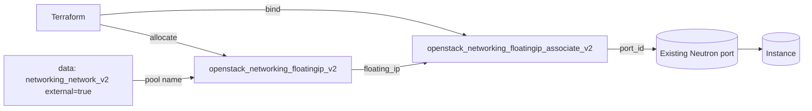

# Associate a Floating IP to an Existing Port

Allocate a floating IP from an external pool and bind it to an existing Neutron
port (for example, the port of a running instance) using an explicit
`openstack_networking_floatingip_associate_v2` resource. Splitting allocation
from association lets you move a stable public address between ports without
ever changing the IP.

> **Primary search phrase:** Terraform OpenStack associate floating IP to port

## Architecture



The floating IP is allocated with **no** `port_id`, then a separate associate
resource binds it to the port you pass in. The `fixed_ip` is only required when
the target port has more than one fixed IP.

## Usage

```bash
export OS_CLOUD=openstack          # or set `cloud` in terraform.tfvars
openstack port list                # find the port_id of your instance
cp terraform.tfvars.example terraform.tfvars
terraform init
terraform plan
terraform apply
```

## Inputs

| Name | Description | Type | Default |
|------|-------------|------|---------|
| `cloud` | clouds.yaml entry to use | `string` | `"openstack"` |
| `external_network_name` | External network / pool name | `string` | `"public"` |
| `port_id` | Existing port to associate (required) | `string` | n/a |
| `fixed_ip` | Specific fixed IP on the port (multi-IP ports only) | `string` | `""` |
| `description` | Description stored on the floating IP | `string` | `"Associated by Terraform"` |
| `tags` | Floating IP tags | `list(string)` | see `variables.tf` |

## Outputs

| Name | Description |
|------|-------------|
| `floating_ip_id` | UUID of the floating IP |
| `floating_ip_address` | Public address mapped to the port |
| `associated_port_id` | Port the floating IP is bound to |

## Best practices

- **Why the explicit associate resource:** Setting `port_id` directly on the
  floating IP also works, but the standalone associate resource decouples the
  address's lifecycle from the binding — you can detach/reattach without
  destroying and re-allocating (which would hand you a new IP).
- **Common mistakes:** Passing a port that is not on a subnet routed by a router
  with an external gateway (the association will fail to route); setting
  `fixed_ip` to an address that is not actually on the port.
- **Reuse:** Pair with [`compute/single-instance`](../../compute/single-instance/)
  — take that instance's port id and feed it here.

## Security considerations

- Associating a floating IP exposes the port to inbound traffic from outside the
  cloud. Make sure the port's security groups only allow the ports you intend
  (see [`security/security-group`](../../security/security-group/)).
- Audit floating IP associations regularly; a forgotten association can keep a
  decommissioned workload publicly reachable.

## Troubleshooting

| Symptom | Likely cause | Fix |
|---------|--------------|-----|
| `Floating IP association failed` | Port's subnet is not connected to a router with an external gateway, or no route to the external network | Attach the subnet to a router with an external gateway ([routers examples](../../routers/)) |
| `Port <id> could not be found` | Wrong `port_id` or it belongs to another project | `openstack port list`; confirm project |
| `Bad floatingip request: more than one fixed ip` | Port has multiple fixed IPs and `fixed_ip` is unset | Set `fixed_ip` to the address you want mapped |
| `Floating IP <addr> is associated with another port` | The address is already in use | Disassociate first or allocate a new floating IP |
| Provider auth errors | Bad/missing `clouds.yaml` or `OS_CLOUD` | See [provider configuration](../../../docs/provider-configuration.md) |

## Cleanup

```bash
terraform destroy
```

Destroying removes the association first, then releases the floating IP; the
underlying port and instance are not managed here and are left untouched.

## Further reading

- [Provider configuration & clouds.yaml](../../../docs/provider-configuration.md)
- [OpenStack provider — floating IP associate docs](https://registry.terraform.io/providers/terraform-provider-openstack/openstack/latest/docs/resources/networking_floatingip_associate_v2)
- [Advanced OpenStack guides on DevOps AI ToolKit](https://devopsaitoolkit.com/blog/)
