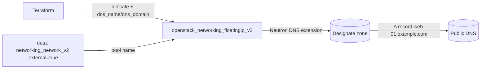

# Floating IP with DNS (Designate Integration)

Allocate a floating IP and have OpenStack automatically publish a DNS A record
for it via **Designate**, the OpenStack DNS-as-a-Service project. By setting
`dns_name` and `dns_domain` on the floating IP, Neutron's DNS integration
creates the recordset for you — no separate `openstack_dns_recordset_v2` needed.

> **Primary search phrase:** Terraform OpenStack floating IP DNS Designate

## Architecture



When `dns_name` and `dns_domain` are supplied at allocation time, Neutron hands
them to Designate, which publishes an A record pointing the FQDN
(`dns_name` + `.` + `dns_domain`) at the floating IP address.

## How the Designate integration works

- **`dns_domain`** must reference an **existing** Designate zone and **end with a
  trailing dot** (`example.com.`). Terraform does not create the zone here — manage
  zones with [`openstack_dns_zone_v2`](https://registry.terraform.io/providers/terraform-provider-openstack/openstack/latest/docs/resources/dns_zone_v2) or `openstack zone create`.
- **`dns_name`** is the host label (`web-01`); the published record is
  `web-01.example.com.`.
- The cloud must run Designate **and** have Neutron's `dns` extension enabled.
  If the extension is absent, Neutron silently ignores the fields and no record
  is created — verify with `openstack extension list --network | grep dns`.
- The record is created/removed automatically with the floating IP lifecycle, so
  `terraform destroy` cleans up the DNS entry too.

## Usage

```bash
export OS_CLOUD=openstack          # or set `cloud` in terraform.tfvars
openstack zone list                # confirm dns_domain zone exists
cp terraform.tfvars.example terraform.tfvars
terraform init
terraform plan
terraform apply
terraform output fqdn
```

## Inputs

| Name | Description | Type | Default |
|------|-------------|------|---------|
| `cloud` | clouds.yaml entry to use | `string` | `"openstack"` |
| `external_network_name` | External network / pool name | `string` | `"public"` |
| `dns_name` | Host label for the record | `string` | `"web-01"` |
| `dns_domain` | Existing Designate zone (trailing dot) | `string` | `"example.com."` |
| `description` | Description stored on the floating IP | `string` | `"Allocated by Terraform with DNS"` |
| `tags` | Floating IP tags | `list(string)` | see `variables.tf` |

## Outputs

| Name | Description |
|------|-------------|
| `floating_ip_id` | UUID of the floating IP |
| `floating_ip_address` | The allocated public address |
| `fqdn` | Fully qualified name published in Designate |

## Best practices

- **Why this approach:** Letting Neutron+Designate manage the record keeps DNS in
  lockstep with the floating IP — there is no window where the IP exists but the
  record is stale, and no orphan records after destroy.
- **Common mistakes:** Omitting the trailing dot on `dns_domain`; pointing at a
  zone that does not exist; assuming the record appears when the `dns` extension
  is not enabled.
- **Reuse:** For records that are not tied to a floating IP's lifecycle, manage
  them explicitly with `openstack_dns_recordset_v2` instead.

## Security considerations

- Publishing a public DNS name advertises the address to the world — combine with
  least-privilege security groups (see [`security/security-group`](../../security/security-group-basic/)).
- Be careful publishing internal hostnames into public zones; it can leak
  infrastructure naming. Use a dedicated zone for externally reachable services.

## Troubleshooting

| Symptom | Likely cause | Fix |
|---------|--------------|-----|
| No record created | Neutron `dns` extension disabled or Designate absent | `openstack extension list --network \| grep dns`; enable the extension |
| `Invalid input for dns_domain` | Missing trailing dot or zone does not exist | Use `example.com.`; `openstack zone list` |
| `Floating IP association failed` | Address allocated but port has no route to external net | Attach the port's subnet to a router with an external gateway ([routers](../../routers/)) |
| Record points at wrong IP | FIP re-allocated, record not refreshed | `terraform apply` again; the record tracks the FIP |
| Provider auth errors | Bad/missing `clouds.yaml` or `OS_CLOUD` | See [provider configuration](../../../docs/provider-configuration.md) |

## Cleanup

```bash
terraform destroy
```

## Further reading

- [Provider configuration & clouds.yaml](../../../docs/provider-configuration.md)
- [OpenStack provider — floating IP docs](https://registry.terraform.io/providers/terraform-provider-openstack/openstack/latest/docs/resources/networking_floatingip_v2)
- [Advanced OpenStack guides on DevOps AI ToolKit](https://devopsaitoolkit.com/blog/)
