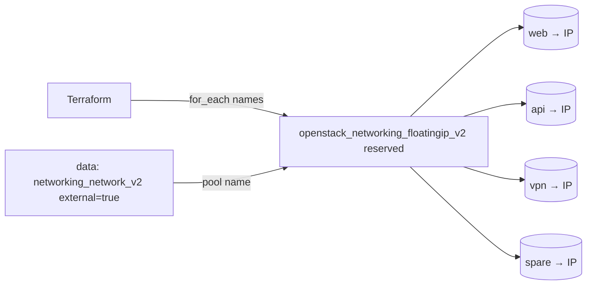

# Reserved Pool of Floating IPs

Pre-allocate a pool of N floating IPs from an external network and hold them in
reserve, one per logical name, using `for_each`. Reserving public addresses up
front guarantees you have stable IPs available — handy for DNS that must be
configured before the workloads exist, or for failover addresses kept on standby.

> **Primary search phrase:** Terraform OpenStack reserved floating IP pool

## Architecture



`for_each` is keyed by the logical name, so each address is independent in state.
Adding `"db"` allocates one new IP; removing `"spare"` releases only that one —
the rest keep their addresses.

## Usage

```bash
export OS_CLOUD=openstack          # or set `cloud` in terraform.tfvars
cp terraform.tfvars.example terraform.tfvars
terraform init
terraform plan
terraform apply
terraform output floating_ip_addresses
```

## Inputs

| Name | Description | Type | Default |
|------|-------------|------|---------|
| `cloud` | clouds.yaml entry to use | `string` | `"openstack"` |
| `external_network_name` | External network / pool name | `string` | `"public"` |
| `reserved_ip_names` | Logical names; one floating IP per name | `set(string)` | `["web","api","vpn","spare"]` |
| `tags` | Base tags applied to every reserved IP | `list(string)` | see `variables.tf` |

## Outputs

| Name | Description |
|------|-------------|
| `floating_ip_addresses` | Map of name to allocated address |
| `floating_ip_ids` | Map of name to floating IP UUID |
| `reserved_count` | Number of floating IPs reserved |

## Best practices

- **Why `for_each` over `count`:** Keying by name keeps each IP stable when the
  set changes. With `count`, removing an element in the middle would re-index and
  churn every IP after it — handing you new addresses you did not want.
- **Common mistakes:** Reserving more IPs than your `floatingip` quota allows;
  leaving large pools reserved indefinitely (they may bill even while unattached).
- **Reuse:** Feed `floating_ip_addresses["web"]` into an
  [`associate-to-port`](../associate-to-port/) config, or into DNS automation.

## Security considerations

- Reserved, unattached floating IPs are not reachable to anything, but they are
  public addresses held by your project — tag and review them so stale
  reservations are reclaimed.
- When you do associate them, enforce least-privilege security groups (see
  [`security/security-group`](../../security/security-group-basic/)).

## Troubleshooting

| Symptom | Likely cause | Fix |
|---------|--------------|-----|
| `Quota exceeded for resources: floatingip` | Pool larger than project quota | Reduce `reserved_ip_names` or raise quota ([quotas examples](../../quotas/)) |
| All IPs re-created on a small change | Accidentally switched to `count`/list indexing | Keep `for_each` over a `set(string)` of stable names |
| `Network <name> not found` or not external | Wrong `external_network_name` | `openstack network list --external` |
| `Floating IP association failed` | Reserved IPs are intentionally unattached here | Associate them with [`associate-to-port`](../associate-to-port/) |
| Provider auth errors | Bad/missing `clouds.yaml` or `OS_CLOUD` | See [provider configuration](../../../docs/provider-configuration.md) |

## Cleanup

```bash
terraform destroy
```

Releases every reserved floating IP. Remove individual names from
`reserved_ip_names` and re-apply to release them one at a time instead.

## Further reading

- [Provider configuration & clouds.yaml](../../../docs/provider-configuration.md)
- [OpenStack provider — floating IP docs](https://registry.terraform.io/providers/terraform-provider-openstack/openstack/latest/docs/resources/networking_floatingip_v2)
- [Advanced OpenStack guides on DevOps AI ToolKit](https://devopsaitoolkit.com/blog/)
