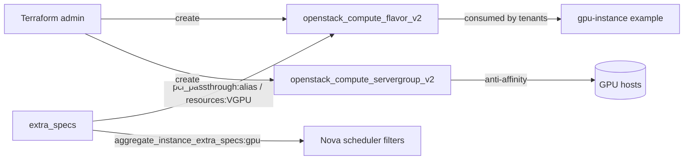

# Create an OpenStack GPU Flavor with extra_specs in Terraform (Admin)

Define an **admin-only** Nova GPU flavor whose `extra_specs` request GPU
acceleration — either whole-GPU PCI passthrough (`pci_passthrough:alias`) or a
time-sliced vGPU (`resources:VGPU`) — plus a server group for anti-affinity
placement across scarce GPU hosts.

> **Primary search phrase:** Terraform OpenStack GPU flavor extra_specs

> **Admin only:** creating flavors requires the Keystone `admin` role. Point
> `cloud` at admin credentials.

## Architecture



## extra_specs keys explained

| Key | Meaning |
|-----|---------|
| `pci_passthrough:alias = "<alias>:<count>"` | Request N whole GPUs by the PCI alias defined in `nova.conf [pci]` on controller + compute. Pairs with `PciPassthroughFilter`. |
| `resources:VGPU = "1"` | Request a vGPU via Placement (mediated device). Hosts must advertise `VGPU` inventory; requires NVIDIA vGPU drivers/licensing. |
| `aggregate_instance_extra_specs:gpu = "true"` | Steer the flavor onto hosts in a GPU host aggregate tagged `gpu=true` via `AggregateInstanceExtraSpecsFilter`. |
| `hw:cpu_policy = "dedicated"` | Pin vCPUs (CPU pinning) — common for GPU/HPC workloads to avoid noisy neighbors. |

Use **either** `pci_passthrough:alias` **or** `resources:VGPU`, not both.

## Usage

```bash
export OS_CLOUD=openstack-admin    # admin credentials
cp terraform.tfvars.example terraform.tfvars
terraform init
terraform plan
terraform apply
```

## Inputs

| Name | Description | Type | Default |
|------|-------------|------|---------|
| `cloud` | clouds.yaml entry (admin) | `string` | `"openstack"` |
| `flavor_name` | Name of the GPU flavor | `string` | `"g1.large"` |
| `vcpus` | vCPUs for the flavor | `number` | `8` |
| `ram_mb` | RAM in MB | `number` | `32768` |
| `disk_gb` | Root disk in GB | `number` | `80` |
| `is_public` | Visible to all projects | `bool` | `false` |
| `extra_specs` | GPU/scheduling extra_specs map | `map(string)` | see `variables.tf` |
| `server_group_name` | Name of the server group | `string` | `"gpu-anti-affinity"` |
| `server_group_policies` | Server group policies | `list(string)` | `["anti-affinity"]` |

## Outputs

| Name | Description |
|------|-------------|
| `flavor_id` | UUID of the GPU flavor |
| `flavor_name` | Name of the GPU flavor |
| `flavor_extra_specs` | Effective extra_specs on the flavor |
| `server_group_id` | UUID of the server group |
| `server_group_policies` | Policies applied to the server group |

## Best practices

- **Why this approach:** Encoding the GPU request in flavor extra_specs keeps the
  tenant-facing interface simple — users pick a flavor, the cloud handles
  placement. Keep flavors `is_public = false` and grant access per project.
- **Common mistakes:** Mixing passthrough and vGPU specs; referencing a PCI alias
  that isn't configured on compute nodes; forgetting the aggregate hint so GPU
  workloads scatter onto non-GPU hosts (or vice versa).
- **Scaling considerations:** Pair anti-affinity with the GPU aggregate so
  replicas spread across distinct GPU hosts for resilience.
- **Cost considerations:** GPUs are scarce and costly — restrict flavor access,
  prefer vGPU for shareable inference, reserve passthrough for training/HPC.

## Security considerations

- Flavor creation is admin-only; protect the admin `cloud` credentials and review
  flavor changes since they affect every project that can use them.
- Restrict GPU flavor access (`is_public = false` + explicit project grants) so
  general tenants cannot consume accelerators.
- Confirm host-level GPU isolation (IOMMU groups, mdev separation) before
  exposing passthrough to multiple tenants.

## Troubleshooting

| Symptom | Likely cause | Fix |
|---------|--------------|-----|
| `403 Forbidden` / `Policy doesn't allow` on apply | Not using admin credentials | Point `cloud` at an admin clouds.yaml entry |
| Flavor created but `No valid host was found` at boot | PCI alias/vGPU not configured on compute, or aggregate mismatch | Configure `[pci]`/Placement `VGPU`; verify aggregate metadata |
| `Flavor with name already exists` | Name collision | Use a unique `flavor_name` or import the existing flavor |
| `Image not found` (downstream gpu-instance) | Wrong image name/visibility | `openstack image list`; check visibility |
| `Quota exceeded` (downstream) | Project cores/RAM quota too low for the flavor | Raise quota or shrink the flavor |
| extra_specs ignored by scheduler | Required filter not enabled | Enable `PciPassthroughFilter`/`AggregateInstanceExtraSpecsFilter` in nova-scheduler |

## Cleanup

```bash
terraform destroy
```

Destroying removes the flavor and server group; existing instances already booted
on the flavor keep running but the flavor can no longer be selected.

## Further reading

- [Provider configuration & clouds.yaml](../../../docs/provider-configuration.md)
- [OpenStack provider — compute_flavor_v2 docs](https://registry.terraform.io/providers/terraform-provider-openstack/openstack/latest/docs/resources/compute_flavor_v2)
- [Advanced OpenStack guides on DevOps AI ToolKit](https://devopsaitoolkit.com/blog/)
