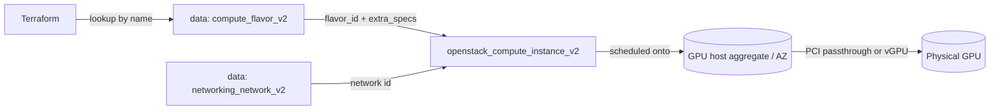

# Boot a GPU Instance on OpenStack with Terraform

Launch an OpenStack compute instance on a GPU-enabled flavor. The flavor is
looked up by name with `data.openstack_compute_flavor_v2` and consumed by
`openstack_compute_instance_v2`. Whether you get a dedicated passthrough GPU or a
time-sliced vGPU is decided by the flavor's `extra_specs` and the host aggregate.

> **Primary search phrase:** Terraform OpenStack GPU instance flavor

## Architecture



## PCI passthrough vs. vGPU

GPU flavors request acceleration through `extra_specs` on the flavor:

- **PCI passthrough** gives the guest an entire physical GPU. The flavor carries
  `pci_passthrough:alias = "<alias>:<count>"` (the alias is defined in Nova's
  `[pci]` config on controller and compute). Best raw performance; one GPU per
  instance, no oversubscription.
- **vGPU (mediated devices)** time-slices one physical GPU across several guests.
  The flavor carries a `resources:VGPU = "1"` request (Placement resource class),
  backed by NVIDIA vGPU/`mdev` on the host. Better density; requires vGPU
  licensing and driver support.

### Scheduler / host-aggregate prerequisites

- GPU compute nodes are normally grouped into a **host aggregate** (and often a
  dedicated **availability zone**) with metadata like `gpu=true`, and the GPU
  flavor sets `aggregate_instance_extra_specs:gpu = "true"` so the
  `AggregateInstanceExtraSpecsFilter` keeps GPU workloads on GPU hosts (and
  non-GPU workloads off them).
- For PCI passthrough, `PciPassthroughFilter` must be enabled and the compute
  nodes must expose the device in `[pci] device_spec`/`alias`.
- For vGPU, the compute nodes must advertise `VGPU` inventory in Placement.
- These are **cloud-admin prerequisites**: this example only *consumes* a flavor
  that already has them. See [`../gpu-flavor`](../gpu-flavor/) to define one.

## Usage

```bash
export OS_CLOUD=openstack          # or set `cloud` in terraform.tfvars
cp terraform.tfvars.example terraform.tfvars
terraform init
terraform plan
terraform apply
```

## Inputs

| Name | Description | Type | Default |
|------|-------------|------|---------|
| `cloud` | clouds.yaml entry to use | `string` | `"openstack"` |
| `instance_name` | Name of the GPU instance | `string` | `"gpu-instance-01"` |
| `gpu_flavor_name` | Existing GPU flavor to boot on | `string` | `"g1.large"` |
| `image_name` | Glance image (with GPU drivers) | `string` | `"ubuntu-22.04-cuda"` |
| `network_name` | Tenant network to attach | `string` | `"private"` |
| `key_pair_name` | Existing key pair for SSH (optional) | `string` | `""` |
| `availability_zone` | AZ to schedule into (optional) | `string` | `""` |
| `security_group_names` | Security groups | `list(string)` | `["default"]` |
| `user_data` | cloud-init user-data (optional) | `string` | `""` |
| `tags` | Instance tags | `list(string)` | see `variables.tf` |

## Outputs

| Name | Description |
|------|-------------|
| `instance_id` | UUID of the instance |
| `instance_name` | Name of the instance |
| `access_ip_v4` | First IPv4 address |
| `flavor_id` | UUID of the GPU flavor |
| `flavor_vcpus` | vCPU count of the flavor |
| `flavor_ram_mb` | RAM (MB) of the flavor |

## Best practices

- **Why this approach:** Looking up the flavor by name keeps the config portable
  and lets cloud admins evolve flavor extra_specs without code changes here.
- **Common mistakes:** Booting a GPU flavor with an image that lacks matching
  GPU drivers; expecting passthrough when the flavor actually requests vGPU (or
  vice versa); omitting the GPU AZ/aggregate so the scheduler can't place the VM.
- **Performance considerations:** Passthrough gives full GPU performance; vGPU
  trades performance for density. Match the image's CUDA/driver version to the
  host's vGPU driver branch.
- **Cost considerations:** GPU hosts are expensive and scarce — tag instances,
  prefer vGPU for shareable workloads, and `terraform destroy` idle GPU nodes
  promptly.

## Security considerations

- GPU memory is not always scrubbed between tenants on every platform/driver;
  for sensitive workloads prefer full passthrough on dedicated hosts.
- Restrict the GPU AZ/aggregate and flavor to authorized projects so general
  workloads can't consume scarce accelerators.
- Inject SSH via a managed key pair; never bake driver-license tokens into
  user-data — use a secrets manager.

## Troubleshooting

| Symptom | Likely cause | Fix |
|---------|--------------|-----|
| `No valid host was found` | No GPU host has a free GPU/vGPU, or filters exclude all hosts | Check aggregate metadata, `openstack hypervisor stats show`, free vGPU inventory |
| `Flavor <name> not found` | Wrong `gpu_flavor_name` or not visible to the project | `openstack flavor list`; check flavor `is_public`/access |
| `Image not found` | Wrong `image_name` or image not visible to the project | `openstack image list`; check image visibility |
| `Quota exceeded` | Project cores/RAM/instance quota hit | Raise quota or destroy unused instances |
| `nvidia-smi` fails inside guest | Image driver mismatch / vGPU not attached | Match driver to host; confirm flavor requests a GPU |
| Provider auth errors | Bad/missing `clouds.yaml` or `OS_CLOUD` | See [provider configuration](../../../docs/provider-configuration.md) |

## Cleanup

```bash
terraform destroy
```

## Further reading

- [Provider configuration & clouds.yaml](../../../docs/provider-configuration.md)
- [OpenStack provider — compute_instance_v2 docs](https://registry.terraform.io/providers/terraform-provider-openstack/openstack/latest/docs/resources/compute_instance_v2)
- [Advanced OpenStack guides on DevOps AI ToolKit](https://devopsaitoolkit.com/blog/)
