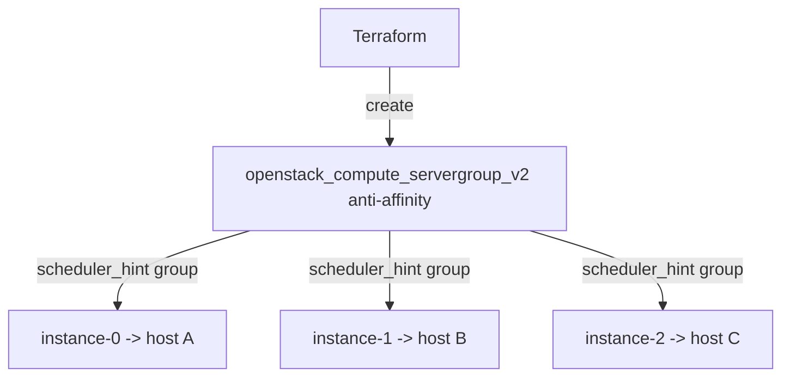

# Anti-affinity instances on OpenStack

Spread N OpenStack instances across **distinct hypervisors** using a Nova
**anti-affinity server group**, so a single host failure can only ever take down
one member of the group. This is the foundational building block for any HA tier.

> **Primary search phrase:** Terraform OpenStack anti-affinity server group example

## Architecture



Each instance is bound to the server group via `scheduler_hints { group = ... }`,
and the group's `anti-affinity` policy makes the Nova scheduler place each member
on a separate compute host.

## Usage

```bash
export OS_CLOUD=openstack          # or set `cloud` in terraform.tfvars
cp terraform.tfvars.example terraform.tfvars
terraform init
terraform plan
terraform apply
```

## Inputs

| Name | Description | Type | Default |
|------|-------------|------|---------|
| `cloud` | clouds.yaml entry to use | `string` | `"openstack"` |
| `name_prefix` | Prefix for the group and instances | `string` | `"ha-node"` |
| `instance_count` | Number of instances (>= 2) | `number` | `3` |
| `affinity_policy` | `anti-affinity` or `soft-anti-affinity` | `string` | `"anti-affinity"` |
| `flavor_name` | Flavor (size) | `string` | `"m1.small"` |
| `image_name` | Glance image to boot | `string` | `"ubuntu-22.04"` |
| `network_name` | Tenant network to attach | `string` | `"private"` |
| `key_pair_name` | Existing key pair for SSH (optional) | `string` | `""` |
| `security_group_names` | Security groups per instance | `list(string)` | `["default"]` |
| `tags` | Instance tags | `list(string)` | see `variables.tf` |

## Outputs

| Name | Description |
|------|-------------|
| `server_group_id` | UUID of the server group |
| `instance_ids` | UUIDs of the members |
| `instance_names` | Names of the members |
| `instance_ips` | First IPv4 of each member |

## Best practices

- **Why this approach:** Strict `anti-affinity` guarantees host-level fault
  isolation — ideal for the nodes behind a load balancer or a quorum-based
  cluster (etcd, ZooKeeper, databases).
- **Common mistakes:** Requesting more instances than there are compute hosts
  with strict `anti-affinity` (apply fails with `No valid host`); use
  `soft-anti-affinity` when you want best-effort spread that never blocks.
- **Scaling considerations:** A server group's policy is fixed at creation —
  changing `affinity_policy` replaces the group (and reschedules members). Size
  `instance_count` to your host count, or go soft.

## Security considerations

- Anti-affinity addresses *availability*, not *isolation* — members still share
  the same project network and security groups; apply least-privilege groups.
- Pair with [`lb-backed-web-tier`](../lb-backed-web-tier/) so traffic fails over
  automatically when one host goes down.
- Inject SSH via a managed key pair rather than passwords.

## Troubleshooting

| Symptom | Likely cause | Fix |
|---------|--------------|-----|
| `No valid host was found` | Fewer hosts than instances under strict policy | Lower `instance_count`, add hosts, or use `soft-anti-affinity` |
| Members land on same host | Using `soft-anti-affinity` (best-effort) | Expected; switch to strict if you require guarantees |
| Changing policy replaces group | Policy is immutable | Plan for re-creation; drain traffic first |
| Quota exceeded | Project instance/core quota hit | Raise quota or reduce `instance_count` |

## Cleanup

```bash
terraform destroy
```

## Further reading

- [Provider configuration & clouds.yaml](../../../docs/provider-configuration.md)
- [Nova server groups & affinity](https://docs.openstack.org/nova/latest/user/server-groups.html)
- [Designing HA on OpenStack with Terraform — DevOps AI ToolKit](https://devopsaitoolkit.com/blog/)
