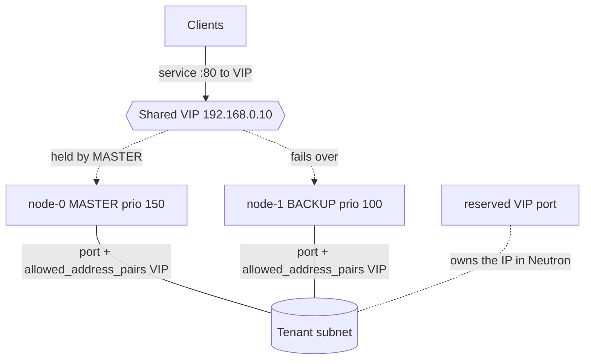

# Keepalived VIP on OpenStack (allowed_address_pairs)

Run two instances that share a floating **virtual IP (VIP)** with
**keepalived/VRRP**, and make it actually work on OpenStack by adding the VIP to
each node port's `allowed_address_pairs`. This is the classic active/passive HA
pattern for a service that needs one stable address with sub-second failover.

> **Primary search phrase:** Terraform OpenStack keepalived VIP allowed_address_pairs example

## Architecture



- A dedicated `openstack_networking_port_v2` **reserves** the VIP so Neutron IPAM
  never hands it to another port.
- Each node has its own port with its own fixed IP **and** the VIP listed in
  `allowed_address_pairs`.
- keepalived elects a MASTER, which answers ARP for the VIP and sources traffic
  from it; on failure the BACKUP takes over.

## Why `allowed_address_pairs` is required

OpenStack enables **port security (anti-spoofing)** on each port by default:
Neutron drops any packet whose source IP/MAC does not match the port's own fixed
IP/MAC. keepalived's whole job is to make a node emit gratuitous ARP for — and
serve traffic from — an address that is *not* the port's fixed IP (the VIP).
Without intervention those packets are silently dropped and the VIP never works.

`allowed_address_pairs` whitelists the extra address (the VIP) on each node port,
telling Neutron "this port is also allowed to use this IP/MAC". That is the
OpenStack-specific glue that makes keepalived, Pacemaker, or any VRRP setup
function. (The alternative — disabling port security entirely — is far less safe.)

## Usage

```bash
export OS_CLOUD=openstack          # or set `cloud` in terraform.tfvars
cp terraform.tfvars.example terraform.tfvars
# Pick a vip_address inside the subnet CIDR but OUTSIDE the DHCP pool.
terraform init
terraform plan
terraform apply

# Test failover: curl the VIP, stop keepalived on the MASTER, curl again.
```

## Inputs

| Name | Description | Type | Default |
|------|-------------|------|---------|
| `cloud` | clouds.yaml entry to use | `string` | `"openstack"` |
| `name_prefix` | Prefix for ports and instances | `string` | `"keepalived"` |
| `flavor_name` | Flavor (size) | `string` | `"m1.small"` |
| `image_name` | Glance image (Debian/Ubuntu) | `string` | `"ubuntu-22.04"` |
| `network_name` | Tenant network | `string` | `"private"` |
| `subnet_name` | Subnet the VIP is reserved from | `string` | `"private-subnet"` |
| `vip_address` | Shared VIP (in subnet, outside DHCP pool) | `string` | `"192.168.0.10"` |
| `key_pair_name` | Existing key pair (optional) | `string` | `""` |
| `vrrp_interface` | Guest NIC keepalived binds to | `string` | `"ens3"` |
| `vrrp_router_id` | VRRP virtual_router_id (0-255) | `number` | `51` |
| `vrrp_auth_pass` | Shared VRRP password (sensitive) | `string` | `"changeit"` |
| `service_port` | App port allowed to the VIP | `number` | `80` |
| `admin_ssh_cidr` | CIDR allowed to SSH | `string` | `"10.0.0.0/24"` |
| `tags` | Instance tags | `list(string)` | see `variables.tf` |

## Outputs

| Name | Description |
|------|-------------|
| `vip_address` | The shared VIP |
| `vip_port_id` | UUID of the reserved VIP port |
| `node_ids` | UUIDs of the two nodes (0=MASTER, 1=BACKUP) |
| `node_ips` | Per-node fixed IPs |
| `node_port_ids` | UUIDs of the node ports (carry the VIP pair) |
| `security_group_id` | UUID of the security group |

## Best practices

- **Why this approach:** keepalived gives fast, self-contained active/passive
  failover without an external load balancer. Reserving the VIP with its own port
  prevents IPAM collisions; `allowed_address_pairs` keeps port security on.
- **Common mistakes:** Omitting `allowed_address_pairs` (the #1 reason VIPs don't
  work on OpenStack); choosing a `vip_address` inside the DHCP pool; reusing a
  `vrrp_router_id` already on the segment; wrong `vrrp_interface` for the image.
- **Scaling considerations:** VRRP is active/passive — only one node serves at a
  time. For active/active throughput use [`lb-backed-web-tier`](../lb-backed-web-tier/)
  (Octavia) instead, or in front of these nodes.

## Security considerations

- `vrrp_auth_pass` is `sensitive`; set a real value via a tfvars file or env var
  and never commit it. VRRP PASS auth is weak — keep VRRP on a trusted subnet
  (the security group scopes protocol 112 to the subnet CIDR).
- Keep port security **enabled** and whitelist only the exact VIP via
  `allowed_address_pairs`; disabling port security removes anti-spoofing entirely.
- Scope `admin_ssh_cidr` to operators; expose only `service_port` publicly.

## Troubleshooting

| Symptom | Likely cause | Fix |
|---------|--------------|-----|
| VIP unreachable, pings to node IPs work | `allowed_address_pairs` missing/typo | Confirm each node port lists the exact `vip_address` |
| Both nodes think they are MASTER | VRRP advertisements blocked | Ensure the protocol-112 rule covers the subnet; check `vrrp_router_id` matches |
| VIP never moves on failure | keepalived not running | `systemctl status keepalived`; check `/var/log/cloud-init-output.log` |
| `IpAddressAlreadyAllocated` | VIP inside DHCP pool / already used | Pick an address outside the allocation pool |
| No traffic after failover | Wrong `vrrp_interface` | Match the guest NIC name (`ip -br addr`) |

## Cleanup

```bash
terraform destroy
```

## Further reading

- [Provider configuration & clouds.yaml](../../../docs/provider-configuration.md)
- [Neutron allowed-address-pairs](https://docs.openstack.org/neutron/latest/admin/archives/adv-features.html#allowed-address-pairs)
- [HA VIP patterns on OpenStack with Terraform — DevOps AI ToolKit](https://devopsaitoolkit.com/blog/)
