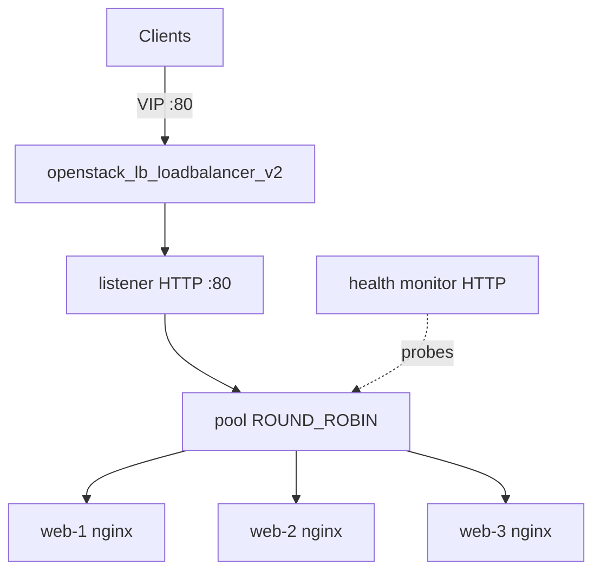

# Load-balanced HA web tier on OpenStack (Octavia)

Stand up a highly available web tier on OpenStack: N backend instances behind an
**Octavia load balancer** with a listener, pool, HTTP health monitor, and one
pool member per instance. Unhealthy backends are pulled from rotation
automatically, and clients reach the tier through a single stable VIP.

> **Primary search phrase:** Terraform OpenStack Octavia load balancer web tier example

## Architecture



The load balancer's VIP sits on the tenant subnet. The listener accepts client
traffic, the pool distributes it across members using `lb_method`, and the health
monitor probes `health_monitor_url` so only healthy members receive requests.

## Usage

```bash
export OS_CLOUD=openstack          # or set `cloud` in terraform.tfvars
cp terraform.tfvars.example terraform.tfvars
terraform init
terraform plan
terraform apply

# Hit the VIP repeatedly and watch the backend hostname rotate:
#   for i in $(seq 5); do curl -s "$(terraform output -raw vip_endpoint)"; done
```

## Inputs

| Name | Description | Type | Default |
|------|-------------|------|---------|
| `cloud` | clouds.yaml entry to use | `string` | `"openstack"` |
| `name_prefix` | Prefix for LB, pool, and instances | `string` | `"web-tier"` |
| `member_count` | Number of backend instances | `number` | `3` |
| `flavor_name` | Flavor (size) | `string` | `"m1.small"` |
| `image_name` | Glance image (Debian/Ubuntu) | `string` | `"ubuntu-22.04"` |
| `network_name` | Tenant network | `string` | `"private"` |
| `subnet_name` | Subnet for VIP + members | `string` | `"private-subnet"` |
| `key_pair_name` | Existing key pair (optional) | `string` | `""` |
| `security_group_names` | Security groups per instance | `list(string)` | `["default"]` |
| `listener_port` | Front-end listener port | `number` | `80` |
| `member_port` | Backend serving port | `number` | `80` |
| `lb_method` | ROUND_ROBIN / LEAST_CONNECTIONS / SOURCE_IP | `string` | `"ROUND_ROBIN"` |
| `health_monitor_url` | HTTP health check path | `string` | `"/"` |
| `tags` | Instance tags | `list(string)` | see `variables.tf` |

## Outputs

| Name | Description |
|------|-------------|
| `loadbalancer_id` | UUID of the load balancer |
| `vip_address` | Virtual IP for clients |
| `vip_endpoint` | `http://vip:listener_port` |
| `pool_id` | UUID of the pool |
| `member_ids` | UUIDs of the pool members |
| `instance_ips` | Backend instance IPs |

## Best practices

- **Why this approach:** Octavia gives a managed (often active/standby) LB with
  built-in health checking, so the entry point itself isn't a single point of
  failure and dead backends are removed automatically.
- **Common mistakes:** Forgetting to open `member_port` from the LB on the
  backends' security group; putting the VIP on the wrong subnet; using `count`
  and then deleting a middle member (use `for_each` keying — done here for members).
- **Scaling considerations:** Combine with
  [`anti-affinity-instances`](../anti-affinity-instances/) so backends also span
  hosts, and [`multi-az-deployment`](../multi-az-deployment/) for zone spread.
- **Cost considerations:** The Octavia amphora(e) bill in addition to the
  backends; consolidate listeners/pools on one LB where possible.

## Security considerations

- Scope the backends' security group so `member_port` is reachable **only** from
  the load balancer subnet, not the whole network or the internet.
- Terminate TLS at the listener (`TERMINATED_HTTPS` with a Barbican secret) for
  production; this example uses plain HTTP for clarity.
- The health monitor path should be a lightweight, unauthenticated endpoint that
  reflects real app health (not a static file that's always 200).

## Troubleshooting

| Symptom | Likely cause | Fix |
|---------|--------------|-----|
| `vip_address` empty / apply slow | Octavia provisioning the amphora | LB creation can take minutes; wait and re-check |
| All members `ERROR`/`offline` | Health monitor failing | Confirm nginx is up, `member_port`/`health_monitor_url` correct, secgroup allows the probe |
| 503 from the VIP | No healthy members in pool | Check backend cloud-init logs; verify member port |
| Members `NO_MONITOR` | Monitor not attached | Ensure `openstack_lb_monitor_v2.pool_id` references the pool |
| `Octavia not available` | LBaaS/Octavia not deployed | Confirm the cloud offers the `load-balancer` service |

## Cleanup

```bash
terraform destroy
```

## Further reading

- [Provider configuration & clouds.yaml](../../../docs/provider-configuration.md)
- [OpenStack Octavia load balancing](https://docs.openstack.org/octavia/latest/)
- [Building HA tiers on OpenStack with Terraform — DevOps AI ToolKit](https://devopsaitoolkit.com/blog/)
