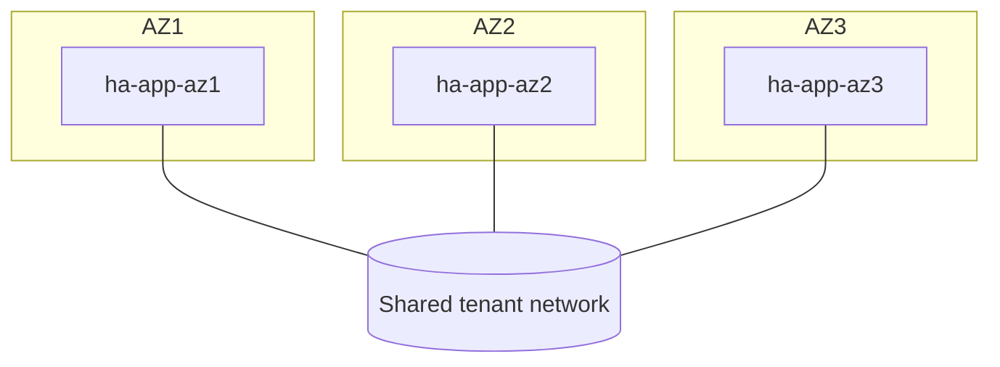

# Multi-AZ deployment on OpenStack

Spread application instances across multiple **Nova availability zones** with
`for_each`, all attached to one shared tenant network. A zone-level failure
(power, network, or hardware domain) then takes out at most the instance in that
zone, leaving the rest serving.

> **Primary search phrase:** Terraform OpenStack multi availability zone deployment example

## Architecture



`for_each = toset(var.availability_zones)` creates one instance per zone, keyed
by zone name so adding or removing a zone never renumbers the others (unlike
`count`). Every instance joins the same network so they can cluster or sit behind
a single load balancer / VIP.

## Usage

```bash
export OS_CLOUD=openstack          # or set `cloud` in terraform.tfvars
openstack availability zone list   # confirm your zone names first
cp terraform.tfvars.example terraform.tfvars
terraform init
terraform plan
terraform apply
```

## Inputs

| Name | Description | Type | Default |
|------|-------------|------|---------|
| `cloud` | clouds.yaml entry to use | `string` | `"openstack"` |
| `instance_name_prefix` | Prefix; instance is `<prefix>-<az>` | `string` | `"ha-app"` |
| `availability_zones` | Zones to spread across (>= 2) | `list(string)` | `["az1","az2","az3"]` |
| `flavor_name` | Flavor (size) | `string` | `"m1.small"` |
| `image_name` | Glance image to boot | `string` | `"ubuntu-22.04"` |
| `network_name` | Single shared tenant network | `string` | `"private"` |
| `key_pair_name` | Existing key pair (optional) | `string` | `""` |
| `security_group_names` | Security groups per instance | `list(string)` | `["default"]` |
| `tags` | Instance tags | `list(string)` | see `variables.tf` |

## Outputs

| Name | Description |
|------|-------------|
| `instance_ids_by_az` | Map of AZ to instance UUID |
| `instance_ips_by_az` | Map of AZ to instance IPv4 |
| `availability_zones` | Zones the deployment spans |
| `network_id` | The shared network ID |

## Best practices

- **Why this approach:** AZ spread protects against correlated, zone-scoped
  failures that host anti-affinity alone cannot. Keying by zone name keeps the
  Terraform state stable as zones come and go.
- **Common mistakes:** Hard-coding zone names that don't exist on the cloud
  (`openstack availability zone list` first); assuming AZs imply separate L2
  networks — here they deliberately share one network for a flat app tier.
- **Scaling considerations:** For more than one instance per zone, combine this
  with [`anti-affinity-instances`](../anti-affinity-instances/) inside each zone,
  and front the whole set with [`lb-backed-web-tier`](../lb-backed-web-tier/).

## Security considerations

- Instances across zones share one network and security groups — apply
  least-privilege groups; AZ spread is about availability, not isolation.
- Ensure Cinder/Nova AZ alignment if you later attach volumes, or attaches fail.
- Inject SSH via a managed key pair rather than passwords.

## Troubleshooting

| Symptom | Likely cause | Fix |
|---------|--------------|-----|
| `No valid host was found` in a zone | Zone has no capacity for the flavor | Use a smaller flavor or drop that zone |
| `Availability zone <x> not found` | Zone name typo / not offered | `openstack availability zone list` and fix `availability_zones` |
| Only one zone available | Cloud is single-AZ | Multi-AZ HA needs a cloud that exposes >= 2 zones |
| Volume attach fails later | Cinder AZ mismatch | Match volume AZ to the instance's Nova AZ |

## Cleanup

```bash
terraform destroy
```

## Further reading

- [Provider configuration & clouds.yaml](../../../docs/provider-configuration.md)
- [Nova availability zones](https://docs.openstack.org/nova/latest/admin/availability-zones.html)
- [Multi-AZ architecture on OpenStack with Terraform — DevOps AI ToolKit](https://devopsaitoolkit.com/blog/)
