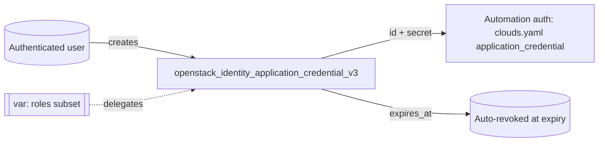

# Create an OpenStack Application Credential with Terraform

Create a Keystone application credential with
`openstack_identity_application_credential_v3` — the recommended way to give
CI/CD and automation access to OpenStack without sharing a user password. The
generated secret is exposed as a `sensitive` output.

> **Primary search phrase:** Terraform OpenStack application credential example

## Architecture



## Usage

```bash
export OS_CLOUD=openstack          # the user the credential is created for
cp terraform.tfvars.example terraform.tfvars
terraform init
terraform plan
terraform apply

# Capture the secret once (it is only available at creation):
terraform output -raw application_credential_secret
```

Then configure automation in `clouds.yaml`:

```yaml
clouds:
  ci:
    auth_type: v3applicationcredential
    auth:
      auth_url: https://keystone.example.com/v3
      application_credential_id: "<application_credential_id output>"
      application_credential_secret: "<secret output>"
```

## Inputs

| Name | Description | Type | Default |
|------|-------------|------|---------|
| `cloud` | clouds.yaml entry of the user to create the credential for | `string` | `"openstack"` |
| `name` | Name of the credential | `string` | `"example-app-cred"` |
| `description` | Description of the credential | `string` | `"Application credential managed by Terraform."` |
| `roles` | Subset of the user's roles to delegate (empty = all) | `list(string)` | `[]` |
| `expires_at` | RFC3339 expiry (empty = never) | `string` | `""` |
| `unrestricted` | Allow creating further creds/trusts (keep false) | `bool` | `false` |

## Outputs

| Name | Description |
|------|-------------|
| `application_credential_id` | UUID of the credential |
| `application_credential_name` | Name of the credential |
| `application_credential_secret` | Generated secret (**sensitive**, creation-time only) |

## Best practices

- **Why application credentials beat passwords:** they are role-scoped to the
  minimum needed, expirable, restricted by default (cannot mint more creds or
  trusts), and revocable independently of the account — revoking one does not
  lock the human user out. A password is a single, long-lived, full-power secret;
  an app credential is purpose-built, least-privilege and disposable.
- **Common mistakes:** Leaving `roles = []` (inherits *all* the user's roles) when
  a narrower set works; setting no `expires_at`; flipping `unrestricted = true`
  (that makes it as powerful as the password).
- **Scaling considerations:** Issue one credential per pipeline/service so you can
  revoke and rotate independently; `for_each` over a map to manage several.

## Security considerations

- The secret is generated server-side and shown **only at creation**. It is
  stored in Terraform state and surfaced as a `sensitive` output — treat state as
  a secret (encrypted, access-controlled backend) and copy the value straight
  into a secrets manager.
- Keep `unrestricted = false`. An unrestricted credential can create further
  credentials and trusts, defeating the point.
- Always set `expires_at` and rotate before it lapses.
- Revoke with `openstack application credential delete <id>` (or
  `terraform destroy`) the moment a pipeline is decommissioned or a key leaks.

## Troubleshooting

| Symptom | Likely cause | Fix |
|---------|--------------|-----|
| `secret` is empty in output | Read across a refresh — secret is only known at create | Re-create the credential; capture the secret immediately |
| `403` creating the credential | The user lacks the requested role in `roles` | Request only roles the user actually holds |
| Auth fails with the new credential | Wrong id/secret, or it expired | Check `expires_at`; verify `clouds.yaml` `v3applicationcredential` block |
| `Conflict ... already exists` | Name already used for this user | Pick a unique name |
| Provider auth errors | Bad/missing `clouds.yaml` or `OS_CLOUD` | See [provider configuration](../../../docs/provider-configuration.md) |

## Cleanup

```bash
terraform destroy
```

Immediately revokes the credential. Any automation still using it will start
failing auth.

## Further reading

- [Provider configuration & clouds.yaml](../../../docs/provider-configuration.md)
- [OpenStack provider — application credential docs](https://registry.terraform.io/providers/terraform-provider-openstack/openstack/latest/docs/resources/identity_application_credential_v3)
- [OpenStack identity guides on DevOps AI ToolKit](https://devopsaitoolkit.com/blog/)
