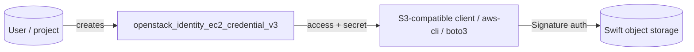

# Create an OpenStack EC2 Credential for S3/Swift Access with Terraform

Issue an AWS-style access/secret key pair with
`openstack_identity_ec2_credential_v3`, for use with S3-compatible tooling
against Swift or any client expecting AWS Signature auth. Both keys are exposed
as `sensitive` outputs.

> **Primary search phrase:** Terraform OpenStack EC2 credential Swift S3 example

## Architecture



## Usage

```bash
export OS_CLOUD=openstack
cp terraform.tfvars.example terraform.tfvars
terraform init
terraform plan
terraform apply

# Capture the keys (sensitive):
terraform output -raw access_key
terraform output -raw secret_key
```

Use with an S3 client against the Swift S3 endpoint:

```bash
export AWS_ACCESS_KEY_ID=$(terraform output -raw access_key)
export AWS_SECRET_ACCESS_KEY=$(terraform output -raw secret_key)
aws --endpoint-url https://swift.example.com s3 ls
```

## Inputs

| Name | Description | Type | Default |
|------|-------------|------|---------|
| `cloud` | clouds.yaml entry to use | `string` | `"openstack"` |
| `user_id` | User to create the credential for (empty = authenticated user) | `string` | `""` |
| `project_id` | Project scope (empty = authenticated project) | `string` | `""` |

## Outputs

| Name | Description |
|------|-------------|
| `ec2_credential_id` | ID of the credential (equals the access key) |
| `access_key` | EC2 access key (**sensitive**) |
| `secret_key` | EC2 secret key (**sensitive**) |
| `project_id` | Project the credential is scoped to |

## Best practices

- **Why this approach:** EC2 credentials bridge OpenStack to the huge ecosystem
  of S3/AWS-Signature tooling (aws-cli, boto3, s3cmd, rclone) without exposing
  your Keystone password.
- **Common mistakes:** Pointing tools at the wrong endpoint (use the Swift S3
  endpoint, not Keystone); assuming the secret can be retrieved later (it cannot
  — capture it at create time).
- **Scaling considerations:** Issue one pair per application so you can rotate or
  revoke independently; `for_each` to manage several.

## Security considerations

- Both the access key and secret are stored in Terraform state and surfaced as
  `sensitive` outputs. Treat state as a secret (encrypted, access-controlled
  backend) and move the keys into a secrets manager immediately.
- The credential carries the full access of the user/project it is scoped to —
  scope it to a dedicated, least-privilege service user where possible.
- Targeting another user's `user_id`/`project_id` requires admin; without those
  args the credential is bound to the caller and needs no elevated rights.
- Rotate periodically; delete promptly when the consumer is retired.

## Troubleshooting

| Symptom | Likely cause | Fix |
|---------|--------------|-----|
| `403 Forbidden` creating for another user | Setting `user_id`/`project_id` without admin | Leave them empty, or use an admin cloud entry |
| S3 client `SignatureDoesNotMatch` | Wrong secret, clock skew, or wrong endpoint | Re-capture secret; sync clock; use the Swift S3 endpoint |
| `secret` empty on re-read | Secret is creation-time only | Re-create and capture immediately |
| `NoSuchBucket` / access denied | Credential scoped to a different project | Check `project_id` output vs. the data's project |
| Provider auth errors | Bad/missing `clouds.yaml` or `OS_CLOUD` | See [provider configuration](../../../docs/provider-configuration.md) |

## Cleanup

```bash
terraform destroy
```

Revokes the key pair; any S3/Swift client still using it will fail auth.

## Further reading

- [Provider configuration & clouds.yaml](../../../docs/provider-configuration.md)
- [OpenStack provider — EC2 credential docs](https://registry.terraform.io/providers/terraform-provider-openstack/openstack/latest/docs/resources/identity_ec2_credential_v3)
- [OpenStack identity guides on DevOps AI ToolKit](https://devopsaitoolkit.com/blog/)
