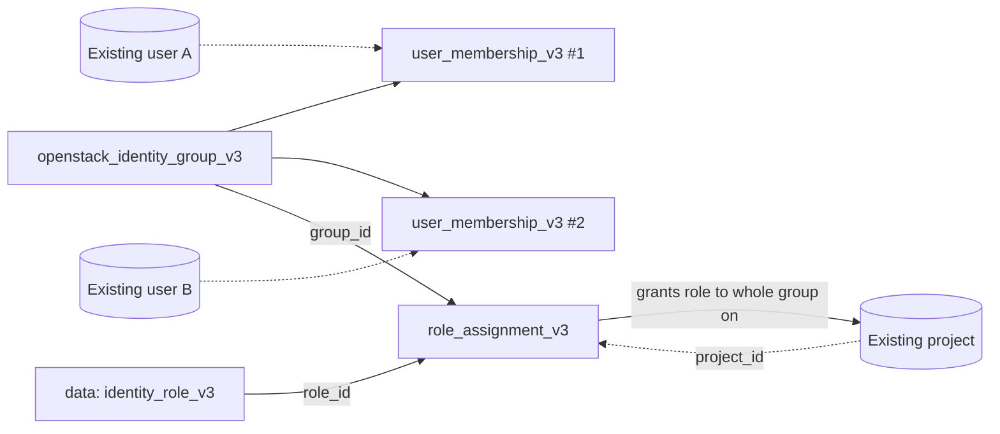

# OpenStack Group with Members and a Role with Terraform

Create a Keystone group, add existing users to it, and grant the group a role on
a project — using `openstack_identity_group_v3`,
`openstack_identity_user_membership_v3` and
`openstack_identity_role_assignment_v3`. Group-based access is the scalable,
auditable alternative to per-user role grants.

> **Primary search phrase:** Terraform OpenStack identity group members example

## Architecture



Grant the role once to the group; every member — current and future — inherits
it.

## Usage

```bash
export OS_CLOUD=openstack          # must be admin-scoped
cp terraform.tfvars.example terraform.tfvars
# fill in project_id and member_user_ids
terraform init
terraform plan
terraform apply
```

## Inputs

| Name | Description | Type | Default |
|------|-------------|------|---------|
| `cloud` | clouds.yaml entry to use (admin-scoped) | `string` | `"openstack"` |
| `group_name` | Name of the group | `string` | `"example-group"` |
| `group_description` | Description of the group | `string` | `"Example group managed by Terraform."` |
| `domain_id` | Pre-existing domain ID | `string` | `"default"` |
| `member_user_ids` | Existing user UUIDs to add | `list(string)` | `[]` |
| `role_name` | Role to grant the group (looked up by name) | `string` | `"member"` |
| `project_id` | Project to scope the role to (required) | `string` | n/a |

## Outputs

| Name | Description |
|------|-------------|
| `group_id` | UUID of the group |
| `group_name` | Name of the group |
| `member_user_ids` | User UUIDs in the group |
| `role_assignment_id` | Composite ID of the group's role assignment |

## Best practices

- **Why this approach:** Grant roles to groups, not individuals. Off-boarding a
  user is a single membership removal; access reviews look at group membership
  instead of a sprawl of per-user grants.
- **Common mistakes:** Using `count` instead of `for_each` for memberships (a
  reorder then re-creates unrelated memberships); putting users from different
  domains in one group (membership is within a domain).
- **Scaling considerations:** Map groups to teams/roles and feed
  `member_user_ids` from your IdP or an HR system of record.

## Security considerations

- Group and membership management require an admin (or domain-admin) role.
- A role granted to a group applies to **every** member immediately — review
  membership before granting powerful roles like `admin`.
- Audit effective access with `openstack role assignment list --names
  --group <group>`.
- Removing a user from the group revokes the group-derived access at the next
  token issuance; existing tokens may remain valid until they expire.

## Troubleshooting

| Symptom | Likely cause | Fix |
|---------|--------------|-----|
| `Could not find role <name>` | Role name typo / not on this cloud | `openstack role list` |
| `403 Forbidden` on apply | Credentials not admin-scoped | Use an admin cloud entry |
| `Could not find user <id>` | Bad UUID in `member_user_ids` | `openstack user show <name>` |
| Member added but still no access | Role assigned to group not effective until re-auth | Re-authenticate; check `openstack role assignment list` |
| Cross-domain membership error | User and group in different domains | Keep users and group in the same domain |
| Provider auth errors | Bad/missing `clouds.yaml` or `OS_CLOUD` | See [provider configuration](../../../docs/provider-configuration.md) |

## Cleanup

```bash
terraform destroy
```

Removes the memberships, the group's role assignment and the group. The users,
project and role definition remain.

## Further reading

- [Provider configuration & clouds.yaml](../../../docs/provider-configuration.md)
- [OpenStack provider — identity group docs](https://registry.terraform.io/providers/terraform-provider-openstack/openstack/latest/docs/resources/identity_group_v3)
- [OpenStack identity guides on DevOps AI ToolKit](https://devopsaitoolkit.com/blog/)
