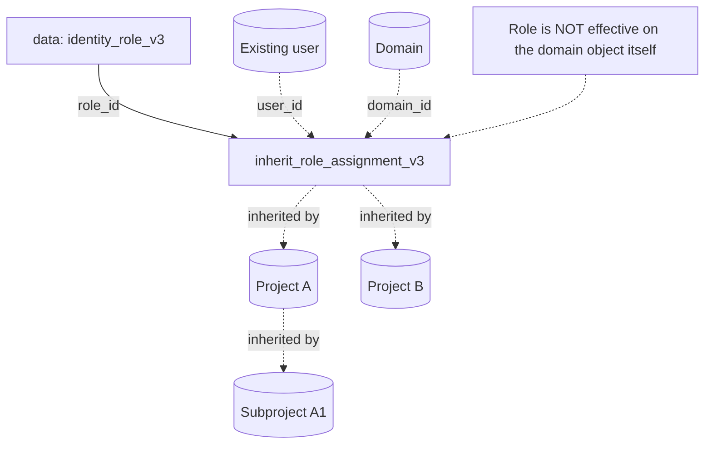

# OpenStack Inherited Role Assignment (Domain to Subprojects) with Terraform

Grant a role on a domain that is **inherited** by every project inside it —
present and future — using a `data.openstack_identity_role_v3` lookup and
`openstack_identity_inherit_role_assignment_v3`. Ideal for an org-wide auditor or
a platform team that must operate all projects without a grant-per-project sprawl.

> **Primary search phrase:** Terraform OpenStack inherited role assignment example

## Architecture



## How inheritance works

- A **normal** role assignment on a domain only grants the role on the domain
  object. A project nested in that domain gets nothing.
- An **inherited** assignment (`OS-INHERIT`) on a domain grants the role on
  **every project within the domain** — including projects created later and
  nested subprojects — but is *not* effective on the domain itself.
- The same mechanism works on a parent project: an inherited assignment there
  flows down to its subprojects.

So you grant once and access tracks the project tree automatically.

## Usage

```bash
export OS_CLOUD=openstack          # must be admin / domain-admin
cp terraform.tfvars.example terraform.tfvars
# fill in user_id
terraform init
terraform plan
terraform apply
```

## Inputs

| Name | Description | Type | Default |
|------|-------------|------|---------|
| `cloud` | clouds.yaml entry to use (admin-scoped) | `string` | `"openstack"` |
| `domain_id` | Domain whose child projects inherit the role | `string` | `"default"` |
| `user_id` | UUID of the user receiving the inherited role (required) | `string` | n/a |
| `role_name` | Role to inherit (looked up by name) | `string` | `"reader"` |

## Outputs

| Name | Description |
|------|-------------|
| `role_id` | UUID of the inherited role |
| `role_name` | Name of the inherited role |
| `domain_id` | Domain whose child projects inherit the role |
| `assignment_id` | Composite ID of the inherited assignment |

## Best practices

- **Why this approach:** One inherited grant replaces N per-project grants and
  auto-covers new projects — far less drift than re-running a grant whenever a
  project is added.
- **Common mistakes:** Expecting the role to work **on the domain** (it does not
  — that needs a normal assignment); using inheritance with a powerful role like
  `admin` and unintentionally granting domain-wide admin.
- **Scaling considerations:** Prefer inheriting to a **group**
  (`group_id` instead of `user_id`) so you manage people via group membership and
  reach via one inherited grant.

## Security considerations

- Inherited assignments require an admin (or domain-admin) role.
- Inheritance is powerful and easy to under-estimate: a single grant can hand a
  user access to dozens of projects. Default to the least-privileged role
  (`reader`) and reserve broader roles for deliberate, reviewed cases.
- New projects in the domain silently pick up inherited roles — factor this into
  onboarding/audit. List effective access with
  `openstack role assignment list --names --inherited`.
- The role is *not* effective on the domain object, so this cannot be used to
  grant domain-level administration by itself.

## Troubleshooting

| Symptom | Likely cause | Fix |
|---------|--------------|-----|
| User has access on the domain but not its projects | Used a normal assignment, not inherited | Use this inherited resource |
| User has no access on the domain object | Expected — inheritance targets child projects only | Add a normal `role_assignment_v3` if domain-level access is needed |
| `Could not find role <name>` | Role typo / not on this cloud | `openstack role list` |
| `403 Forbidden` on apply | Credentials not admin-scoped | Use an admin / domain-admin cloud entry |
| New project still denied | Token issued before re-auth | Re-authenticate to pick up inherited roles |
| Provider auth errors | Bad/missing `clouds.yaml` or `OS_CLOUD` | See [provider configuration](../../../docs/provider-configuration.md) |

## Cleanup

```bash
terraform destroy
```

Revokes the inherited assignment across all child projects at once. The user,
domain and role definition remain.

## Further reading

- [Provider configuration & clouds.yaml](../../../docs/provider-configuration.md)
- [OpenStack provider — inherit role assignment docs](https://registry.terraform.io/providers/terraform-provider-openstack/openstack/latest/docs/resources/identity_inherit_role_assignment_v3)
- [OpenStack identity guides on DevOps AI ToolKit](https://devopsaitoolkit.com/blog/)
