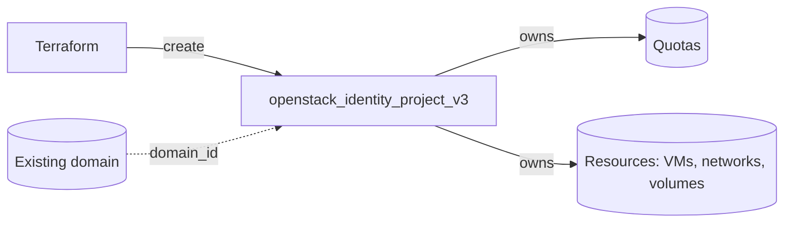

# Create an OpenStack Project with Terraform

Create a Keystone project (tenant) in an existing domain using
`openstack_identity_project_v3`. A project is the container that owns quotas,
instances, networks and volumes — it is the first building block for any
multi-tenant OpenStack setup.

> **Primary search phrase:** Terraform OpenStack identity project example

## Architecture



Domains are not managed by Terraform (there is no `openstack_identity_domain`
resource), so the project references a pre-existing domain by ID.

## Usage

```bash
export OS_CLOUD=openstack          # must be admin-scoped
cp terraform.tfvars.example terraform.tfvars
terraform init
terraform plan
terraform apply
```

## Inputs

| Name | Description | Type | Default |
|------|-------------|------|---------|
| `cloud` | clouds.yaml entry to use (admin-scoped) | `string` | `"openstack"` |
| `project_name` | Name of the project | `string` | `"example-project"` |
| `project_description` | Description of the project | `string` | `"Example project managed by Terraform."` |
| `domain_id` | Pre-existing domain ID | `string` | `"default"` |
| `enabled` | Whether the project is enabled | `bool` | `true` |
| `tags` | Project tags | `list(string)` | see `variables.tf` |

## Outputs

| Name | Description |
|------|-------------|
| `project_id` | UUID of the project |
| `project_name` | Name of the project |
| `domain_id` | Domain the project belongs to |

## Best practices

- **Why this approach:** Projects are cheap and free; create one per team,
  environment or blast-radius boundary rather than sharing a single project.
- **Common mistakes:** Trying to create the domain in Terraform (not supported);
  reusing project names across domains (names are only unique within a domain).
- **Scaling considerations:** Use `for_each` over a map of teams to stamp out
  many projects from one config; feed `project_id` into
  [`role-assignment`](../role-assignment/) and
  [`project-with-quotas`](../project-with-quotas/).
- **Cost considerations:** Tag every project (done here) so chargeback/showback
  can attribute spend per team.

## Security considerations

- Creating projects requires an **admin** (or domain-admin) role; scope the
  Terraform credentials to the smallest domain you control.
- A disabled project (`enabled = false`) immediately blocks token issuance for
  all its users — useful for off-boarding, dangerous if flipped by accident.
- Keep project hierarchies shallow; nested projects inherit assignments (see
  [`inherited-role-assignment`](../inherited-role-assignment/)).

## Troubleshooting

| Symptom | Likely cause | Fix |
|---------|--------------|-----|
| `403 Forbidden` / `You are not authorized` | Credentials are not admin-scoped | Use an admin cloud entry; check your role assignment |
| Provider auth errors | Bad/missing `clouds.yaml` or `OS_CLOUD` | See [provider configuration](../../../docs/provider-configuration.md) |
| `Conflict ... already exists` | Project name already used in that domain | Pick a unique name or import the existing project |
| `Could not find domain` | Wrong `domain_id` | `openstack domain list`; use the ID, not the name |

## Cleanup

```bash
terraform destroy
```

Destroying a project fails if it still owns resources (instances, volumes,
networks). Delete or move those first.

## Further reading

- [Provider configuration & clouds.yaml](../../../docs/provider-configuration.md)
- [OpenStack provider — identity project docs](https://registry.terraform.io/providers/terraform-provider-openstack/openstack/latest/docs/resources/identity_project_v3)
- [OpenStack identity guides on DevOps AI ToolKit](https://devopsaitoolkit.com/blog/)
