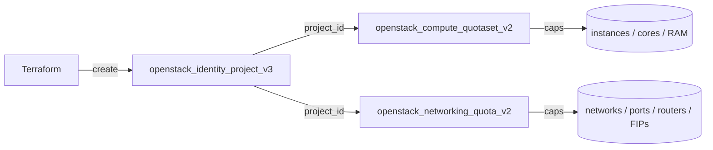

# Create an OpenStack Project with Compute and Network Quotas in Terraform

Provision a Keystone project and pin its Nova (compute) and Neutron (network)
quotas in one config, using `openstack_identity_project_v3`,
`openstack_compute_quotaset_v2` and `openstack_networking_quota_v2`. This caps a
tenant's blast radius at creation time.

> **Primary search phrase:** Terraform OpenStack project quotas example

## Architecture



The quota resources reference the project's `id`, so they are created after the
project and destroyed with it.

## Usage

```bash
export OS_CLOUD=openstack          # must be admin-scoped
cp terraform.tfvars.example terraform.tfvars
terraform init
terraform plan
terraform apply
```

## Inputs

| Name | Description | Type | Default |
|------|-------------|------|---------|
| `cloud` | clouds.yaml entry to use (admin-scoped) | `string` | `"openstack"` |
| `project_name` | Name of the project | `string` | `"example-quota-project"` |
| `project_description` | Description of the project | `string` | see `variables.tf` |
| `domain_id` | Pre-existing domain ID | `string` | `"default"` |
| `compute_instances` | Max instances | `number` | `10` |
| `compute_cores` | Max vCPUs | `number` | `20` |
| `compute_ram_mb` | Max RAM (MB) | `number` | `51200` |
| `compute_key_pairs` | Max key pairs | `number` | `50` |
| `network_count` | Max networks | `number` | `5` |
| `subnet_count` | Max subnets | `number` | `10` |
| `port_count` | Max ports | `number` | `100` |
| `router_count` | Max routers | `number` | `3` |
| `floatingip_count` | Max floating IPs | `number` | `10` |
| `security_group_count` | Max security groups | `number` | `10` |

## Outputs

| Name | Description |
|------|-------------|
| `project_id` | UUID of the project |
| `project_name` | Name of the project |
| `compute_quota` | Effective compute quota map |
| `network_quota` | Effective network quota map |

## Best practices

- **Why this approach:** Co-locating the project and its quotas keeps the tenant
  definition self-describing and capped from day one — no manual `openstack quota
  set` drift.
- **Common mistakes:** Forgetting RAM is in **megabytes**; setting ports too low
  (every instance NIC, router interface and DHCP agent consumes a port); leaving
  block-storage quota out (add `openstack_blockstorage_quotaset_v3` if the tenant
  uses volumes).
- **Scaling considerations:** Drive the numbers from a per-tier `locals` map
  (small/medium/large) and `for_each` projects to standardise sizing.

## Security considerations

- Setting quotas requires an **admin** role — scope the Terraform credentials
  accordingly.
- Quotas are a guardrail, not a security boundary: they limit resource count, not
  who can act. Pair with [`role-assignment`](../role-assignment/) for access
  control.
- Right-size to contain runaway automation or compromised credentials; an
  over-generous quota turns a leaked credential into a much larger incident.

## Troubleshooting

| Symptom | Likely cause | Fix |
|---------|--------------|-----|
| `403 Forbidden` setting quota | Credentials not admin-scoped | Use an admin cloud entry |
| `Quota exceeded` after apply | Existing usage already above the new cap | Raise the value or reduce usage first |
| Ports exhaust early | Routers/DHCP/instances each consume ports | Increase `port_count` |
| Quota "reverts" | Another tool/operator overwrote it | Make Terraform the single source of truth |
| Provider auth errors | Bad/missing `clouds.yaml` or `OS_CLOUD` | See [provider configuration](../../../docs/provider-configuration.md) |

## Cleanup

```bash
terraform destroy
```

Destroying removes the quota overrides and the project. The project must own no
resources for the delete to succeed.

## Further reading

- [Provider configuration & clouds.yaml](../../../docs/provider-configuration.md)
- [OpenStack provider — compute quotaset docs](https://registry.terraform.io/providers/terraform-provider-openstack/openstack/latest/docs/resources/compute_quotaset_v2)
- [OpenStack identity guides on DevOps AI ToolKit](https://devopsaitoolkit.com/blog/)
