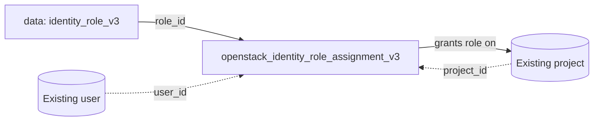

# Assign an OpenStack Role to a User on a Project with Terraform

Grant an existing user a role (such as `member`) scoped to a project, using a
`data.openstack_identity_role_v3` lookup plus
`openstack_identity_role_assignment_v3`. This is how you actually give a user
access to a project — creating the user alone does nothing.

> **Primary search phrase:** Terraform OpenStack role assignment example

## Architecture



The role is looked up by name so no cloud-specific role UUID is hard-coded.

## Usage

```bash
export OS_CLOUD=openstack          # must be admin-scoped
cp terraform.tfvars.example terraform.tfvars
# fill in user_id and project_id
terraform init
terraform plan
terraform apply
```

## Inputs

| Name | Description | Type | Default |
|------|-------------|------|---------|
| `cloud` | clouds.yaml entry to use (admin-scoped) | `string` | `"openstack"` |
| `role_name` | Existing role to grant (looked up by name) | `string` | `"member"` |
| `user_id` | UUID of the user (required) | `string` | n/a |
| `project_id` | UUID of the project to scope the role to (required) | `string` | n/a |

## Outputs

| Name | Description |
|------|-------------|
| `role_id` | UUID of the looked-up role |
| `role_name` | Name of the granted role |
| `assignment_id` | Composite ID of the assignment |

## Best practices

- **Why this approach:** Looking the role up by name keeps the config portable;
  role UUIDs differ per cloud. Prefer the least-privileged role that works
  (`reader` < `member` < `admin`).
- **Common mistakes:** Granting `admin` when `member` suffices; assigning roles
  to individual users instead of to a group (see
  [`group-with-members`](../group-with-members/) — far easier to audit and
  off-board).
- **Scaling considerations:** Use `for_each` over a map of `{user_id => role}`
  to manage many assignments declaratively, or grant the role to a group once.

## Security considerations

- Role assignment is a privileged operation requiring an admin (or
  project-admin) role.
- Role grants are additive across projects, groups and domains — audit the
  effective set with `openstack role assignment list --names`.
- For automation, grant the role to a service account and issue it an
  [application credential](../application-credential/) rather than sharing
  passwords.
- Prefer domain/group-level grants only when you intend wide reach; for a single
  project keep the scope to that project.

## Troubleshooting

| Symptom | Likely cause | Fix |
|---------|--------------|-----|
| `Could not find role <name>` | Role name typo or not defined on this cloud | `openstack role list`; fix `role_name` |
| `403 Forbidden` on apply | Credentials not admin-scoped | Use an admin cloud entry |
| `Could not find user/project` | Wrong `user_id`/`project_id` | `openstack user show` / `openstack project show` |
| Assignment "succeeds" but user still denied | User scoped to a different project, or token not re-issued | Re-authenticate; confirm scope with `openstack role assignment list` |
| Provider auth errors | Bad/missing `clouds.yaml` or `OS_CLOUD` | See [provider configuration](../../../docs/provider-configuration.md) |

## Cleanup

```bash
terraform destroy
```

This revokes the role assignment only; the user, project and role definition
remain.

## Further reading

- [Provider configuration & clouds.yaml](../../../docs/provider-configuration.md)
- [OpenStack provider — role assignment docs](https://registry.terraform.io/providers/terraform-provider-openstack/openstack/latest/docs/resources/identity_role_assignment_v3)
- [OpenStack identity guides on DevOps AI ToolKit](https://devopsaitoolkit.com/blog/)
