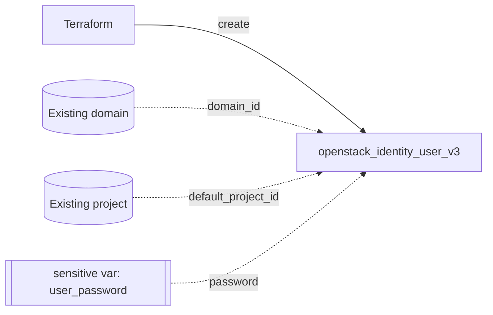

# Create an OpenStack User with Terraform

Create a Keystone user in an existing domain using `openstack_identity_user_v3`,
with the password supplied through a sensitive variable and an optional default
project. This is the human-account counterpart to the
[application-credential](../application-credential/) example.

> **Primary search phrase:** Terraform OpenStack identity user example

## Architecture



## Usage

```bash
export OS_CLOUD=openstack                 # must be admin-scoped
export TF_VAR_user_password='choose-a-strong-one'
cp terraform.tfvars.example terraform.tfvars
terraform init
terraform plan
terraform apply
```

## Inputs

| Name | Description | Type | Default |
|------|-------------|------|---------|
| `cloud` | clouds.yaml entry to use (admin-scoped) | `string` | `"openstack"` |
| `user_name` | Login name of the user | `string` | `"example-user"` |
| `user_password` | Initial password (sensitive; prefer app creds) | `string` | `""` |
| `default_project_id` | Default project scope (optional) | `string` | `""` |
| `domain_id` | Pre-existing domain ID | `string` | `"default"` |
| `description` | Description of the user | `string` | `"Example user managed by Terraform."` |
| `enabled` | Whether the account is enabled | `bool` | `true` |
| `ignore_change_password_upon_first_use` | Skip forced password change on first login | `bool` | `false` |

## Outputs

| Name | Description |
|------|-------------|
| `user_id` | UUID of the user |
| `user_name` | Login name of the user |
| `domain_id` | Domain the user belongs to |

The password is intentionally **not** an output (see `outputs.tf`).

## Best practices

- **Prefer application credentials over passwords.** A password is a long-lived,
  full-power secret that lands in Terraform state, logs and CI. An
  [application credential](../application-credential/) is per-purpose, role-scoped,
  expirable and revocable without touching the account — ideal for automation.
  Use this user resource for humans (who log in interactively) or to bootstrap an
  account whose password is rotated out-of-band immediately.
- **Common mistakes:** Committing the password to VCS; setting `password = ""`
  (handled here by passing `null`); forgetting that the password persists in
  state.
- **Scaling considerations:** Add users to groups
  ([`group-with-members`](../group-with-members/)) and grant roles to the group,
  not to each user individually.

## Security considerations

- The password is stored in Terraform **state**. Treat state as a secret:
  encrypt the backend, restrict access, and never commit `terraform.tfvars`.
- Pass the password via `TF_VAR_user_password` or a separate, gitignored
  `-var-file` rather than `terraform.tfvars`.
- Rotate bootstrap passwords immediately and switch automation to application
  credentials.
- Creating users requires an admin (or domain-admin) role.

## Troubleshooting

| Symptom | Likely cause | Fix |
|---------|--------------|-----|
| `403 Forbidden` / not authorized | Credentials not admin-scoped | Use an admin cloud entry |
| Provider auth errors | Bad/missing `clouds.yaml` or `OS_CLOUD` | See [provider configuration](../../../docs/provider-configuration.md) |
| User created but cannot log in | No role assignment on any project | Grant a role — see [`role-assignment`](../role-assignment/) |
| `Password does not meet requirements` | Domain password policy | Choose a compliant password |
| `Conflict ... already exists` | Name already used in that domain | Pick a unique name or import |

## Cleanup

```bash
terraform destroy
```

## Further reading

- [Provider configuration & clouds.yaml](../../../docs/provider-configuration.md)
- [OpenStack provider — identity user docs](https://registry.terraform.io/providers/terraform-provider-openstack/openstack/latest/docs/resources/identity_user_v3)
- [OpenStack identity guides on DevOps AI ToolKit](https://devopsaitoolkit.com/blog/)
