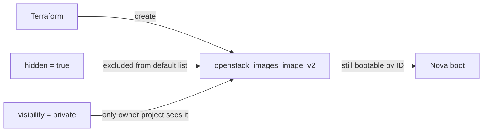

# Hidden Private OpenStack Glance Image with Terraform

Create a Glance image with `hidden = true` and `visibility = "private"`. A hidden
image disappears from the default image list (and Horizon picker) but stays
bootable by ID — the standard pattern for **retiring** an image without breaking
instances that still reference it.

> **Primary search phrase:** Terraform OpenStack hidden image visibility

## Architecture



## Hidden vs. visibility (and community images)

- **`hidden`** controls *listing*: `true` removes the image from
  `openstack image list` defaults; it is still returned by `--hidden` or when
  fetched by ID.
- **`visibility`** controls *who can see it at all*: `private` (owner only),
  `shared` (owner + explicit members), `community` (any project, but only when
  asked for), `public` (everyone, admin-only on most clouds).
- A **community** image behaves a bit like a hidden public image: it does not
  clutter every project's default list, but any project can boot it by ID. Use
  `community` to publish broadly-but-quietly; use `hidden` + `private` to retire
  an image within your own project.

## Usage

```bash
export OS_CLOUD=openstack          # or set `cloud` in terraform.tfvars
cp terraform.tfvars.example terraform.tfvars
terraform init
terraform plan
terraform apply

# It will not appear here:
openstack image list
# But it is still visible by ID / with --hidden:
openstack image list --hidden
openstack image show <image-id>
```

## Inputs

| Name | Description | Type | Default |
|------|-------------|------|---------|
| `cloud` | clouds.yaml entry to use | `string` | `"openstack"` |
| `image_name` | Name of the Glance image | `string` | `"ubuntu-22.04-hidden"` |
| `image_source_url` | URL of the cloud image to upload | `string` | Ubuntu 22.04 cloud image |
| `disk_format` | Disk format of the source image | `string` | `"qcow2"` |
| `container_format` | Container format | `string` | `"bare"` |
| `web_download` | Let Glance fetch the URL server-side | `bool` | `true` |
| `hidden` | Exclude from default image listings | `bool` | `true` |
| `visibility` | Image visibility scope | `string` | `"private"` |
| `min_disk_gb` | Minimum root disk (GB) required to boot | `number` | `8` |
| `min_ram_mb` | Minimum RAM (MB) required to boot | `number` | `512` |
| `tags` | Image tags | `list(string)` | see `variables.tf` |

## Outputs

| Name | Description |
|------|-------------|
| `image_id` | UUID of the image (use to boot while hidden) |
| `image_name` | Name of the image |
| `image_hidden` | Whether the image is hidden |
| `image_visibility` | Visibility scope of the image |

## Best practices

- **Why this approach:** Hiding rather than deleting lets you sunset an image
  gracefully — new launches stop choosing it while in-flight references keep
  working. Combine with a deprecation tag so operators know it is on the way out.
- **Common mistakes:** Assuming hidden == private (it does not change who *can*
  see it); deleting instead of hiding and breaking running references.
- **Scaling considerations:** Maintain a small set of visible "current" images
  and hide every superseded build to keep the picker clean.
- **Cost considerations:** Hidden images still occupy Glance store — schedule a
  later cleanup once no instances reference them.

## Security considerations

- `hidden` is a UX convenience, not a security boundary. Use `visibility` and
  project membership to actually restrict who can boot the image.
- Keep `visibility = "private"` here so the retiring image is never exposed to
  other projects.
- Audit who can list hidden images (`--hidden` requires the image be in scope)
  so retired images are not silently relaunched.

## Troubleshooting

| Symptom | Likely cause | Fix |
|---------|--------------|-----|
| `Image not found` in a launch UI | Image is hidden (expected) | Boot by `image_id`, or set `hidden = false` to relist |
| Image missing from `openstack image list` | `hidden = true` (expected) | Use `openstack image list --hidden` |
| Other projects can still see it | `visibility` not `private` | Set `visibility = "private"` |
| `Quota exceeded` | Glance store/image-count quota hit | Delete stale images or raise quota |
| Provider auth errors | Bad/missing `clouds.yaml` or `OS_CLOUD` | See [provider configuration](../../../docs/provider-configuration.md) |

## Cleanup

```bash
terraform destroy
```

## Further reading

- [Provider configuration & clouds.yaml](../../../docs/provider-configuration.md)
- [OpenStack provider — images_image_v2 docs](https://registry.terraform.io/providers/terraform-provider-openstack/openstack/latest/docs/resources/images_image_v2)
- [Advanced OpenStack guides on DevOps AI ToolKit](https://devopsaitoolkit.com/blog/)
