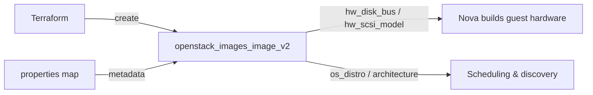

# OpenStack Glance Image with Metadata Properties in Terraform

Upload a Glance image and attach metadata **properties** (`os_distro`,
`architecture`, `hw_disk_bus`, `hw_scsi_model`) that control the guest's virtual
hardware and inform scheduling. Properties are how you tune how images boot
without touching flavors.

> **Primary search phrase:** Terraform OpenStack Glance image properties hw_disk_bus

## Architecture



## Usage

```bash
export OS_CLOUD=openstack          # or set `cloud` in terraform.tfvars
cp terraform.tfvars.example terraform.tfvars
terraform init
terraform plan
terraform apply
```

## Inputs

| Name | Description | Type | Default |
|------|-------------|------|---------|
| `cloud` | clouds.yaml entry to use | `string` | `"openstack"` |
| `image_name` | Name of the Glance image | `string` | `"ubuntu-22.04-tuned"` |
| `image_source_url` | URL of the cloud image to upload | `string` | Ubuntu 22.04 cloud image |
| `disk_format` | Disk format of the source image | `string` | `"qcow2"` |
| `container_format` | Container format | `string` | `"bare"` |
| `web_download` | Let Glance fetch the URL server-side | `bool` | `true` |
| `properties` | Map of Glance metadata properties | `map(string)` | see `variables.tf` |
| `min_disk_gb` | Minimum root disk (GB) required to boot | `number` | `8` |
| `min_ram_mb` | Minimum RAM (MB) required to boot | `number` | `512` |
| `tags` | Image tags | `list(string)` | see `variables.tf` |

## Outputs

| Name | Description |
|------|-------------|
| `image_id` | UUID of the image |
| `image_name` | Name of the image |
| `image_properties` | Effective properties (includes Glance-injected keys) |
| `image_status` | Image status (active when ready) |

## Best practices

- **Why this approach:** Encoding hardware hints as image properties keeps the
  same flavor reusable across many images while each image still boots with the
  right disk bus / SCSI model. `virtio-scsi` (via `hw_disk_bus = scsi` +
  `hw_scsi_model = virtio-scsi`) gives better queueing and discard/TRIM support
  than the legacy `virtio-blk` bus.
- **Common mistakes:** Setting a property your cloud's metadefs reject; fighting
  Glance-injected read-only properties (handled here with `ignore_changes`);
  assuming a property changes a *running* instance — properties take effect at
  next boot from the image.
- **Performance considerations:** `virtio-scsi` scales to many disks and supports
  discard; pair with `hw_disk_bus = scsi`. Set `architecture` correctly so the
  scheduler never lands the image on an incompatible host.
- **Cost considerations:** Properties are free metadata; the only cost is the
  image store itself.

## Security considerations

- Properties are visible to anyone who can see the image — do not store secrets
  or licensing keys in them.
- Restrict who can set protected/admin-only properties via Glance property
  protection policy; standard projects should only set guest-hardware keys.
- Keep `visibility` private unless the tuned image is meant to be shared.

## Troubleshooting

| Symptom | Likely cause | Fix |
|---------|--------------|-----|
| `Image not found` | Image still saving or wrong project | `openstack image show <name>`; wait for `active` |
| `Quota exceeded` | Glance store/image-count quota hit | Delete stale images or raise quota |
| Perpetual property diff on apply | Glance injects read-only properties | Add the key to `ignore_changes` (already done for common ones) |
| `403 Forbidden` setting a property | Property protected by policy | Use an allowed key or have an admin set it |
| Guest fails to find root disk | `hw_disk_bus` unsupported by the image's drivers | Use `virtio` or ensure virtio-scsi drivers exist in the image |
| Provider auth errors | Bad/missing `clouds.yaml` or `OS_CLOUD` | See [provider configuration](../../../docs/provider-configuration.md) |

## Cleanup

```bash
terraform destroy
```

## Further reading

- [Provider configuration & clouds.yaml](../../../docs/provider-configuration.md)
- [OpenStack provider — images_image_v2 docs](https://registry.terraform.io/providers/terraform-provider-openstack/openstack/latest/docs/resources/images_image_v2)
- [Advanced OpenStack guides on DevOps AI ToolKit](https://devopsaitoolkit.com/blog/)
