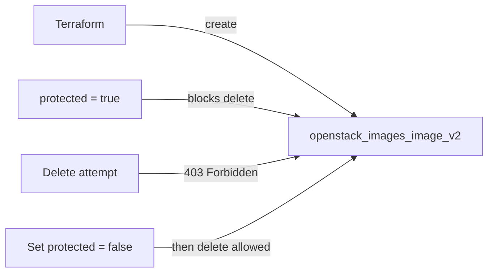

# Protected OpenStack Glance Image with Terraform

Create a Glance image with `protected = true` so it cannot be deleted until the
flag is explicitly removed. Use this for golden/base images that many running
instances depend on, where an accidental `openstack image delete` would be a
major incident.

> **Primary search phrase:** Terraform OpenStack protected image prevent deletion

## Architecture



## Usage

```bash
export OS_CLOUD=openstack          # or set `cloud` in terraform.tfvars
cp terraform.tfvars.example terraform.tfvars
terraform init
terraform plan
terraform apply
```

### Deleting a protected image

A protected image cannot be destroyed directly — Glance returns `403`. Remove
the protection first, then delete:

```bash
# Terraform-managed: flip protected to false, apply, then destroy
sed -i 's/protected  = true/protected  = false/' terraform.tfvars
terraform apply
terraform destroy

# Or with the CLI:
openstack image set --unprotected <image-id>
openstack image delete <image-id>
```

## Inputs

| Name | Description | Type | Default |
|------|-------------|------|---------|
| `cloud` | clouds.yaml entry to use | `string` | `"openstack"` |
| `image_name` | Name of the Glance image | `string` | `"golden-base-protected"` |
| `image_source_url` | URL of the cloud image to upload | `string` | Ubuntu 22.04 cloud image |
| `disk_format` | Disk format of the source image | `string` | `"qcow2"` |
| `container_format` | Container format | `string` | `"bare"` |
| `web_download` | Let Glance fetch the URL server-side | `bool` | `true` |
| `protected` | Block deletion while true | `bool` | `true` |
| `visibility` | Image visibility | `string` | `"private"` |
| `min_disk_gb` | Minimum root disk (GB) required to boot | `number` | `8` |
| `min_ram_mb` | Minimum RAM (MB) required to boot | `number` | `512` |
| `tags` | Image tags | `list(string)` | see `variables.tf` |

## Outputs

| Name | Description |
|------|-------------|
| `image_id` | UUID of the image |
| `image_name` | Name of the image |
| `image_protected` | Whether deletion is blocked |
| `image_status` | Image status (active when ready) |

## Best practices

- **Why this approach:** Protection is the cheapest possible guardrail for base
  images. Combine it with tags and naming conventions so operators immediately
  understand why an image refuses to delete.
- **Common mistakes:** Running `terraform destroy` and being surprised by a 403 —
  remember protection must be lifted *and applied* first. Forgetting to
  re-protect after maintenance.
- **Scaling considerations:** Keep one protected "current" image per OS/release
  and let unprotected dated snapshots churn beneath it.
- **Cost considerations:** Protection does not add cost, but it does keep store
  space pinned — clean up superseded protected images deliberately.

## Security considerations

- Protection prevents *deletion*, not *use* — it is not an access control. Pair
  it with `visibility` to control who can boot the image.
- Only image owners and admins can toggle protection; review who holds those
  roles so the guardrail cannot be trivially bypassed.
- Audit unset-protection events; an attacker unprotecting then deleting a golden
  image is a realistic denial-of-service path.

## Troubleshooting

| Symptom | Likely cause | Fix |
|---------|--------------|-----|
| `Image not found` | Image still saving or wrong project | `openstack image show <name>`; wait for `active` |
| `destroy` fails with `403`/`Image is protected` | `protected = true` still set | Set `protected = false`, `terraform apply`, then `terraform destroy` |
| `Quota exceeded` | Glance store/image-count quota hit | Delete stale (unprotected) images or raise quota |
| Cannot toggle protection | Not the owner/admin | Use the owning project or have an admin run `openstack image set --unprotected` |
| Provider auth errors | Bad/missing `clouds.yaml` or `OS_CLOUD` | See [provider configuration](../../../docs/provider-configuration.md) |

## Cleanup

```bash
# protection must be removed first (see "Deleting a protected image")
terraform apply   # with protected = false
terraform destroy
```

## Further reading

- [Provider configuration & clouds.yaml](../../../docs/provider-configuration.md)
- [OpenStack provider — images_image_v2 docs](https://registry.terraform.io/providers/terraform-provider-openstack/openstack/latest/docs/resources/images_image_v2)
- [Advanced OpenStack guides on DevOps AI ToolKit](https://devopsaitoolkit.com/blog/)
