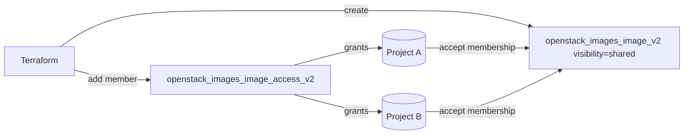

# Share an OpenStack Glance Image Between Projects with Terraform

Create a Glance image with `visibility = "shared"` and grant specific projects
access using `openstack_images_image_access_v2`. This is how you publish a golden
image to a few partner projects without making it public to the whole cloud.

> **Primary search phrase:** Terraform OpenStack shared image between projects

## Architecture



A shared image is invisible to other projects until the owner adds them as
**members** and each member **accepts** the membership.

## Usage

```bash
export OS_CLOUD=openstack          # or set `cloud` in terraform.tfvars
cp terraform.tfvars.example terraform.tfvars
# fill member_project_ids with real project UUIDs: openstack project list
terraform init
terraform plan
terraform apply
```

If you set `member_status = "pending"` (the stricter default behavior), each
member project accepts the image itself:

```bash
openstack image set --accept <image-id>     # run as the member project
```

## Inputs

| Name | Description | Type | Default |
|------|-------------|------|---------|
| `cloud` | clouds.yaml entry to use | `string` | `"openstack"` |
| `image_name` | Name of the Glance image | `string` | `"ubuntu-22.04-shared"` |
| `image_source_url` | URL of the cloud image to upload | `string` | Ubuntu 22.04 cloud image |
| `disk_format` | Disk format of the source image | `string` | `"qcow2"` |
| `container_format` | Container format | `string` | `"bare"` |
| `web_download` | Let Glance fetch the URL server-side | `bool` | `true` |
| `min_disk_gb` | Minimum root disk (GB) required to boot | `number` | `8` |
| `min_ram_mb` | Minimum RAM (MB) required to boot | `number` | `512` |
| `member_project_ids` | Project UUIDs to share the image with | `list(string)` | `[]` |
| `member_status` | Initial membership status | `string` | `"accepted"` |
| `tags` | Image tags | `list(string)` | see `variables.tf` |

## Outputs

| Name | Description |
|------|-------------|
| `image_id` | UUID of the image |
| `image_name` | Name of the image |
| `image_visibility` | Visibility of the image (shared) |
| `member_ids` | Project UUIDs the image is shared with |
| `member_statuses` | Map of member UUID to membership status |

## Best practices

- **Why this approach:** Sharing to named projects keeps a golden image
  centrally owned and patched, while consumers boot it read-only — far better
  than copying the image into every project.
- **Common mistakes:** Forgetting that the member must *accept* the membership;
  using project *names* instead of UUIDs; sharing a `private` image (visibility
  must be `shared`).
- **Scaling considerations:** Manage `member_project_ids` as a list so adding a
  project is a one-line change; `for_each` keeps memberships stable on edits.
- **Cost considerations:** One stored image serves many projects — sharing avoids
  duplicating store space per tenant.

## Security considerations

- Share only with projects that should boot the image; review the member list in
  code review since it is effectively a cross-tenant grant.
- Members get read/boot access, not ownership — they cannot modify or delete the
  image. Keep the owning project's credentials tightly controlled.
- Prefer `shared` over `public`; public exposes the image to every project on the
  cloud and usually requires admin.

## Troubleshooting

| Symptom | Likely cause | Fix |
|---------|--------------|-----|
| `Image not found` in a member project | Membership not accepted, or wrong project UUID | `openstack image set --accept <id>` as the member; verify UUIDs |
| `Image is not shared` / 403 adding member | Image `visibility` is not `shared` | Ensure `visibility = "shared"` (set here) |
| `Quota exceeded` | Glance store/image-count quota hit | Delete stale images or raise quota |
| Member added but image still hidden | Status is `pending`/`rejected` | Set `member_status = "accepted"` or have the member accept |
| `404` on member UUID | Project does not exist / not visible | `openstack project list` for correct UUIDs |
| Provider auth errors | Bad/missing `clouds.yaml` or `OS_CLOUD` | See [provider configuration](../../../docs/provider-configuration.md) |

## Cleanup

```bash
terraform destroy
```

## Further reading

- [Provider configuration & clouds.yaml](../../../docs/provider-configuration.md)
- [OpenStack provider — images_image_access_v2 docs](https://registry.terraform.io/providers/terraform-provider-openstack/openstack/latest/docs/resources/images_image_access_v2)
- [Advanced OpenStack guides on DevOps AI ToolKit](https://devopsaitoolkit.com/blog/)
