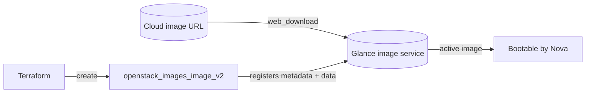

# Upload an OpenStack Glance Image from a URL with Terraform

Create an OpenStack Glance image by uploading an Ubuntu cloud image from a remote
URL, with `disk_format = "qcow2"` and `container_format = "bare"`. This is the
foundational image example every other image recipe in this directory builds on.

> **Primary search phrase:** Terraform OpenStack upload Glance image from URL

## Architecture



With `web_download = true`, Glance fetches the URL server-side. With it set to
`false`, Terraform downloads the image locally and streams the bytes to Glance.

## Usage

```bash
export OS_CLOUD=openstack          # or set `cloud` in terraform.tfvars
cp terraform.tfvars.example terraform.tfvars
terraform init
terraform plan
terraform apply
```

## Inputs

| Name | Description | Type | Default |
|------|-------------|------|---------|
| `cloud` | clouds.yaml entry to use | `string` | `"openstack"` |
| `image_name` | Name of the Glance image | `string` | `"ubuntu-22.04-jammy"` |
| `image_source_url` | URL of the cloud image to upload | `string` | Ubuntu 22.04 cloud image |
| `disk_format` | Disk format of the source image | `string` | `"qcow2"` |
| `container_format` | Container format | `string` | `"bare"` |
| `min_disk_gb` | Minimum root disk (GB) required to boot | `number` | `0` |
| `min_ram_mb` | Minimum RAM (MB) required to boot | `number` | `0` |
| `visibility` | Image visibility | `string` | `"private"` |
| `web_download` | Let Glance fetch the URL server-side | `bool` | `true` |
| `tags` | Image tags | `list(string)` | see `variables.tf` |

## Outputs

| Name | Description |
|------|-------------|
| `image_id` | UUID of the image |
| `image_name` | Name of the image |
| `image_status` | Image status (active when ready) |
| `image_size_bytes` | Uploaded size in bytes |
| `image_checksum` | MD5 checksum computed by Glance |

## Best practices

- **Why this approach:** Uploading from a canonical URL keeps your images
  reproducible and auditable — the source of every image is in code. Prefer
  `web_download = true` so the (potentially large) image never round-trips
  through the machine running Terraform.
- **Common mistakes:** Mismatching `disk_format` to the actual file (e.g.
  declaring `qcow2` for a `raw` image); using `container_format` values other
  than `bare` for plain disk images.
- **Performance considerations:** Convert frequently-booted images to `raw` on
  Ceph-backed clouds to enable copy-on-write clones; qcow2 is best for portability.
- **Cost considerations:** Images consume Glance store quota. Delete stale image
  versions and pin to `current` releases rather than hoarding dailies.

## Security considerations

- Verify integrity by comparing `image_checksum` against the publisher's
  published checksum; consider `verify_checksum` for stricter validation.
- Always pull images over HTTPS from a trusted mirror to prevent tampering.
- Keep `visibility = "private"` unless you intend to share; promoting to `public`
  exposes the image to every project and usually requires admin rights.

## Troubleshooting

| Symptom | Likely cause | Fix |
|---------|--------------|-----|
| `Image not found` after apply | Image still saving/queued, or wrong project context | `openstack image show <name>`; wait for `active` status |
| `Quota exceeded` | Glance store or image-count quota hit | Delete stale images or raise the image quota |
| Stuck in `queued`/`importing` | `web_download` import method not enabled | Set `web_download = false` to stream locally, or enable the import method |
| `400 Bad Request` on upload | `disk_format`/`container_format` mismatch | Match formats to the real file (`qemu-img info <file>`) |
| Checksum mismatch | Corrupt or tampered download | Re-download; verify against publisher checksum |
| Provider auth errors | Bad/missing `clouds.yaml` or `OS_CLOUD` | See [provider configuration](../../../docs/provider-configuration.md) |

## Cleanup

```bash
terraform destroy
```

## Further reading

- [Provider configuration & clouds.yaml](../../../docs/provider-configuration.md)
- [OpenStack provider — images_image_v2 docs](https://registry.terraform.io/providers/terraform-provider-openstack/openstack/latest/docs/resources/images_image_v2)
- [Advanced OpenStack guides on DevOps AI ToolKit](https://devopsaitoolkit.com/blog/)
