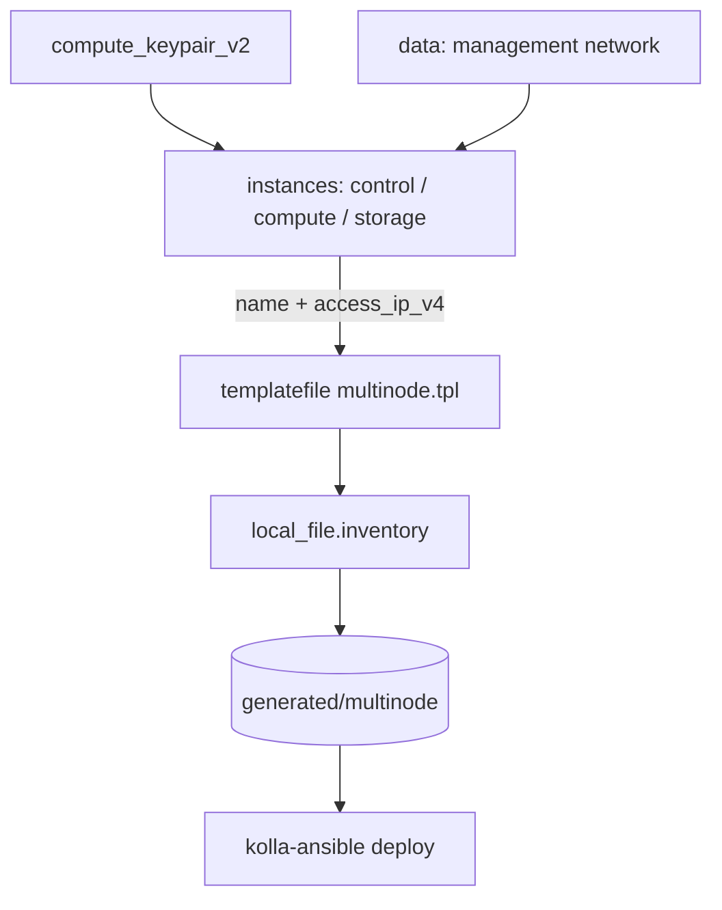

# Terraform-Generated Kolla-Ansible Inventory on OpenStack

Provision the cluster nodes **and** render a ready-to-use Kolla-Ansible inventory
file from their IPs in one apply. Terraform creates control, compute, and
(optional) storage instances, then uses the `hashicorp/local` provider with
`templatefile()` to write a `multinode` inventory with the
`[control]`/`[network]`/`[compute]`/`[storage]`/`[monitoring]` groups Kolla
expects — no copy-pasting IPs by hand.

> **Primary search phrase:** Terraform generate Kolla-Ansible inventory

## Architecture



Each instance group is collected into a list of `{name, ip}` objects and passed
to `templatefile()`. The template loops over each group to emit one inventory
line per host, then writes the standard Kolla group/children mappings.

## Usage

```bash
cp terraform.tfvars.example terraform.tfvars   # set counts, flavors, public_key
terraform init
terraform plan
terraform apply

# The inventory is written to the inventory_output_path (default generated/multinode):
kolla-ansible -i generated/multinode bootstrap-servers
kolla-ansible -i generated/multinode deploy
```

## Inputs

| Name | Description | Type | Default |
|------|-------------|------|---------|
| `cloud` | clouds.yaml entry | `string` | `"openstack"` |
| `name_prefix` | Prefix for node names | `string` | `"kolla"` |
| `network_name` | Existing management network | `string` | `"kolla-mgmt-net"` |
| `control_count` | Control-plane node count | `number` | `3` |
| `compute_count` | Compute node count | `number` | `2` |
| `storage_count` | Storage node count (0 disables group) | `number` | `0` |
| `control_flavor` | Control node flavor | `string` | `"m1.large"` |
| `compute_flavor` | Compute node flavor | `string` | `"m1.xlarge"` |
| `storage_flavor` | Storage node flavor | `string` | `"m1.large"` |
| `image_name` | Glance image for all nodes | `string` | `"ubuntu-22.04"` |
| `public_key` | SSH public key injected into nodes | `string` | (required) |
| `security_group_names` | Security groups per node | `list(string)` | `["default"]` |
| `ansible_user` | SSH user rendered into the inventory | `string` | `"ubuntu"` |
| `inventory_output_path` | Where to write the inventory | `string` | `"generated/multinode"` |
| `tags` | Base tags | `list(string)` | see `variables.tf` |

## Outputs

| Name | Description |
|------|-------------|
| `control_ips` | Control-plane node IPs |
| `compute_ips` | Compute node IPs |
| `storage_ips` | Storage node IPs (empty if `storage_count` is 0) |
| `inventory_path` | Path to the rendered inventory file |
| `keypair_name` | Name of the injected key pair |

## Best practices

- **Render config from real state.** Deriving the inventory from
  `access_ip_v4` keeps it in lockstep with the instances — re-applying after a
  scale change rewrites the inventory automatically.
- **Keep the template in version control, the output generated.** Commit
  `templates/multinode.tpl`; treat `generated/multinode` as a build artifact.
- **Co-locate small groups.** This layout maps `network` and `monitoring` onto
  the control nodes, which is fine for labs/small clusters; split them out for
  larger production deployments by adding dedicated node pools.
- **Use `access_ip_v4`, not a hard-coded NIC.** It reflects the management IP the
  instance actually came up with.

## Security considerations

- The rendered inventory contains node IPs and the SSH user — treat
  `generated/multinode` as sensitive and keep it out of public repos.
- Inject access with the managed key pair only; store the private key in a
  secrets manager and restrict the security groups to your bastion/admin CIDR.
- `local_file` writes to the machine running Terraform — run applies from a
  trusted host, not a shared CI worker with broad read access.

## Troubleshooting

| Symptom | Likely cause | Fix |
|---------|--------------|-----|
| `Error: Invalid function argument` on `templatefile` | Template/variable mismatch | Ensure `templates/multinode.tpl` exists and its vars match `main.tf` |
| Inventory has blank IP lines | Instances had no `access_ip_v4` yet | Re-run apply after instances reach ACTIVE |
| `local_file` not written | Output directory not writable | Point `inventory_output_path` at a writable path |
| `Network <name> not found` | Wrong `network_name` | Create it (kolla-network-prereqs) or fix the name |
| Kolla cannot SSH to hosts | Wrong `ansible_user`/key/security group | Match `ansible_user` to the image and open SSH to your host |

## Cleanup

```bash
terraform destroy
```

`terraform destroy` also removes the generated inventory file managed by
`local_file`.

## Further reading

- [Provider configuration & clouds.yaml](../../../docs/provider-configuration.md)
- [Terraform `templatefile` function](https://developer.hashicorp.com/terraform/language/functions/templatefile)
- [Generating Ansible inventories from Terraform — DevOps AI ToolKit](https://devopsaitoolkit.com/blog/)
