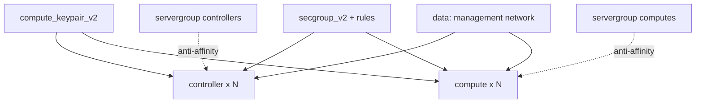

# Terraform Kolla-Ansible Multinode Cluster Infrastructure on OpenStack

Provision the compute fleet a multinode Kolla-Ansible deployment runs on: **N
controller nodes** and **N compute nodes**, spread across hypervisors with Nova
server groups, a shared key pair for Ansible, and a cluster security group. The
nodes attach to an existing management network (for example one created by
[`kolla-network-prereqs`](../kolla-network-prereqs/)).

> **Primary search phrase:** Terraform Kolla-Ansible multinode cluster infrastructure

## Architecture



Every node gets the same key pair and security group. Controllers and computes
each have their own server group so Nova spreads them across hosts. All nodes sit
on the management network; the security group permits SSH/ICMP from outside and
all traffic between cluster members.

## Usage

```bash
cp terraform.tfvars.example terraform.tfvars   # set counts, flavors, public_key
terraform init
terraform plan
terraform apply
```

Use the `controller_ips`/`compute_ips` outputs to build your Kolla inventory (or
see [`kolla-inventory-output`](../kolla-inventory-output/), which renders it
automatically).

## Inputs

| Name | Description | Type | Default |
|------|-------------|------|---------|
| `cloud` | clouds.yaml entry | `string` | `"openstack"` |
| `name_prefix` | Prefix for all resources | `string` | `"kolla"` |
| `network_name` | Existing management network to attach to | `string` | `"kolla-mgmt-net"` |
| `controller_count` | Number of controller nodes | `number` | `3` |
| `compute_count` | Number of compute nodes | `number` | `2` |
| `controller_flavor` | Controller flavor | `string` | `"m1.large"` |
| `compute_flavor` | Compute flavor | `string` | `"m1.xlarge"` |
| `image_name` | Glance image for all nodes | `string` | `"ubuntu-22.04"` |
| `public_key` | SSH public key injected into every node | `string` | (required) |
| `server_group_policy` | `anti-affinity` or `soft-anti-affinity` | `string` | `"soft-anti-affinity"` |
| `tags` | Base tags | `list(string)` | see `variables.tf` |

## Outputs

| Name | Description |
|------|-------------|
| `controller_ids` / `controller_ips` | Controller node UUIDs / IPs |
| `compute_ids` / `compute_ips` | Compute node UUIDs / IPs |
| `keypair_name` | Name of the injected key pair |
| `security_group_id` | Cluster security group UUID |
| `controller_server_group_id` / `compute_server_group_id` | Server group UUIDs |

## Best practices

- **Use server groups for spread.** Anti-affinity keeps controllers (and
  computes) on separate hypervisors so a single host failure does not take the
  control plane down. Prefer `soft-anti-affinity` unless you have guaranteed
  capacity — hard `anti-affinity` fails the boot when hosts run short.
- **Run an odd number of controllers** (3 or 5) so quorum-based services
  (MariaDB Galera, RabbitMQ) tolerate a node loss.
- **Right-size flavors.** Controllers are memory-heavy (databases, message
  queue, APIs); computes need CPU/RAM headroom for guest workloads.
- **Pin the base image with `ignore_changes`.** A rebuilt base image elsewhere
  should not force-replace running cluster nodes (handled here).

## Security considerations

- The SSH rule defaults to `0.0.0.0/0`; tighten `remote_ip_prefix` to your bastion
  or admin CIDR before any real deployment.
- The intra-cluster rule allows *all* traffic between members via
  `remote_group_id`. Keep cluster membership tight — only Kolla nodes should hold
  this security group.
- Inject access with a managed key pair (done here), never passwords. Store the
  matching private key in a secrets manager, not in version control.

## Troubleshooting

| Symptom | Likely cause | Fix |
|---------|--------------|-----|
| `No valid host was found` with anti-affinity | Not enough hosts for hard anti-affinity | Switch to `soft-anti-affinity` or add hosts |
| Nodes cannot reach each other | Cluster security group not effective | Confirm all nodes hold `<prefix>-cluster` and the `remote_group_id` rule exists |
| `Network <name> not found` | Wrong `network_name` | Run kolla-network-prereqs first or fix the name (`openstack network list`) |
| `Quota exceeded` | Instance/core/RAM quota hit | Raise quota or reduce counts |
| Ansible SSH fails | Wrong `public_key` or restricted SSH rule | Verify key material and `remote_ip_prefix` |

## Cleanup

```bash
terraform destroy
```

## Further reading

- [Provider configuration & clouds.yaml](../../../docs/provider-configuration.md)
- [Kolla-Ansible multinode deployment](https://docs.openstack.org/kolla-ansible/latest/user/multinode.html)
- [Building OpenStack clusters with Kolla-Ansible — DevOps AI ToolKit](https://devopsaitoolkit.com/blog/)
