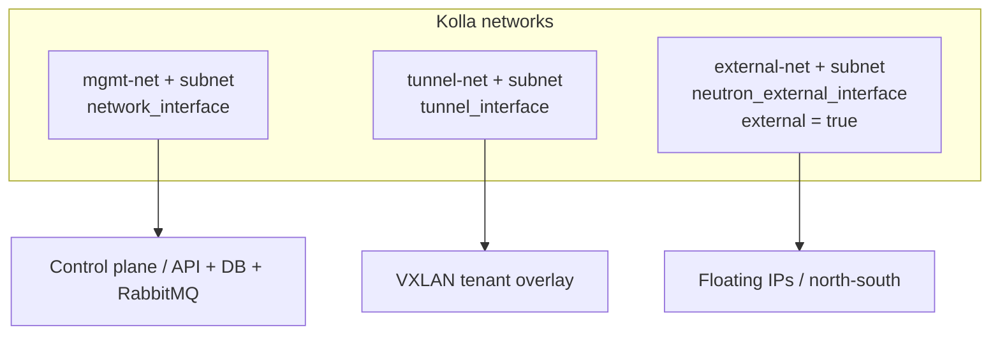

# Terraform Kolla-Ansible Network Prerequisites on OpenStack

Provision the three networks a Kolla-Ansible deployment expects — **management**
(control plane / API), **tunnel** (VXLAN overlay), and **external/provider**
(floating IPs / north-south) — each with a subnet, on an existing OpenStack
cloud. Run this when you are deploying Kolla *on top of* an OpenStack tenant
(nested) and need the underlay networks created as code.

> **Primary search phrase:** Terraform Kolla-Ansible network prerequisites

## Architecture



The management and tunnel networks are ordinary tenant networks with DHCP. The
external network is marked `external = true` and carries Neutron provider
attributes (`provider:network_type`, `provider:physical_network`) via
`value_specs`, plus an allocation pool for floating IPs.

## Usage

```bash
cp terraform.tfvars.example terraform.tfvars   # set CIDRs + provider mapping
terraform init
terraform plan
terraform apply
```

Feed the resulting subnet CIDRs into your Kolla `globals.yml`
(`network_interface`, `tunnel_interface`, `neutron_external_interface`) and node
NIC layout.

## Inputs

| Name | Description | Type | Default |
|------|-------------|------|---------|
| `cloud` | clouds.yaml entry | `string` | `"openstack"` |
| `name_prefix` | Prefix for all resources | `string` | `"kolla"` |
| `management_cidr` | Management/control-plane CIDR | `string` | `"10.10.0.0/24"` |
| `tunnel_cidr` | Tunnel/overlay CIDR | `string` | `"10.10.1.0/24"` |
| `external_cidr` | External/provider CIDR | `string` | `"203.0.113.0/24"` |
| `external_gateway_ip` | External subnet gateway | `string` | `"203.0.113.1"` |
| `external_allocation_start` | Floating-IP pool start | `string` | `"203.0.113.10"` |
| `external_allocation_end` | Floating-IP pool end | `string` | `"203.0.113.250"` |
| `external_physical_network` | `provider:physical_network` | `string` | `"physnet1"` |
| `external_network_type` | `provider:network_type` | `string` | `"flat"` |
| `dns_nameservers` | DHCP DNS resolvers (mgmt subnet) | `list(string)` | `["1.1.1.1","8.8.8.8"]` |
| `tags` | Tags on all resources | `list(string)` | see `variables.tf` |

## Outputs

| Name | Description |
|------|-------------|
| `management_network_id` / `management_subnet_id` | Management network + subnet UUIDs |
| `tunnel_network_id` / `tunnel_subnet_id` | Tunnel network + subnet UUIDs |
| `external_network_id` / `external_subnet_id` | External network + subnet UUIDs |

## Best practices

- **Separate the three planes.** Keeping management, tunnel, and external traffic
  on distinct networks mirrors Kolla's interface model and avoids overlay/control
  contention.
- **Match provider attributes to your fabric.** `external_physical_network` and
  `external_network_type` must line up with the ML2/Open vSwitch bridge mappings
  on your network nodes, or floating IPs will not route.
- **No DHCP on the external network.** Floating IPs are managed by Neutron from
  the allocation pool, not handed out by DHCP — hence `enable_dhcp = false`.
- **Size CIDRs for growth.** Pick management/tunnel ranges large enough for every
  current and future control/compute node.

## Security considerations

- Treat the management network as sensitive: it carries database, RabbitMQ, and
  API traffic. Restrict it to Kolla hosts and never expose it publicly.
- Keep the tunnel network isolated from the management network so tenant overlay
  traffic cannot reach control-plane services.
- The external network is internet-facing; control ingress with Neutron security
  groups and upstream firewalling, not by widening this subnet.

## Troubleshooting

| Symptom | Likely cause | Fix |
|---------|--------------|-----|
| `Unable to create network ... provider` | `value_specs` provider attrs not allowed for your tenant | Create the external network as admin, or have the operator pre-create it |
| Floating IPs do not route | `external_physical_network`/type mismatch | Align with ML2 bridge mappings on network nodes |
| `Invalid input for allocation_pool` | Pool outside the subnet CIDR | Keep start/end within `external_cidr` |
| DHCP not assigning on mgmt/tunnel | `enable_dhcp` false or pool exhausted | Ensure DHCP enabled and CIDR large enough |
| `Quota exceeded` for networks/subnets | Neutron quota hit | Raise quota or reuse existing networks |

## Cleanup

```bash
terraform destroy
```

## Further reading

- [Provider configuration & clouds.yaml](../../../docs/provider-configuration.md)
- [Kolla-Ansible network configuration](https://docs.openstack.org/kolla-ansible/latest/admin/production-architecture-guide.html)
- [Deploying OpenStack with Kolla-Ansible — DevOps AI ToolKit](https://devopsaitoolkit.com/blog/)
