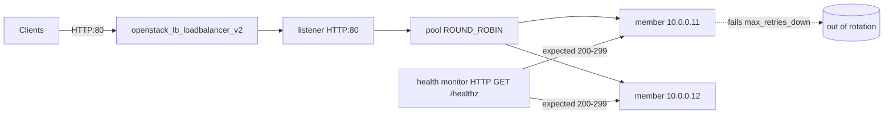

# Octavia HTTP Health Monitor

Attach an HTTP health monitor to an Octavia pool with Terraform, tuned with a
dedicated `url_path`, `expected_codes`, and probe timing. The monitor decides
which members are healthy enough to receive traffic, so getting it right is the
difference between a load balancer that hides a dead backend and one that
silently serves errors.

> **Primary search phrase:** Terraform OpenStack Octavia health monitor example

## Architecture



Every `delay` seconds the monitor issues `monitor_http_method` against
`monitor_url_path` on each member. A response whose code matches
`monitor_expected_codes` counts as healthy. After `monitor_max_retries_down`
consecutive failures a member is taken out of rotation; after
`monitor_max_retries` consecutive successes it is put back.

## Usage

```bash
export OS_CLOUD=openstack          # or set `cloud` in terraform.tfvars
cp terraform.tfvars.example terraform.tfvars
terraform init
terraform plan
terraform apply
```

## Inputs

| Name | Description | Type | Default |
|------|-------------|------|---------|
| `cloud` | clouds.yaml entry to use | `string` | `"openstack"` |
| `lb_name` | Load balancer name (prefix for children) | `string` | `"example-health-monitor"` |
| `subnet_name` | Subnet for the VIP and members | `string` | `"private-subnet"` |
| `listener_port` | Front-end HTTP port | `number` | `80` |
| `member_port` | Backend listening port | `number` | `80` |
| `backend_members` | Backend member IPs | `list(string)` | `["10.0.0.11","10.0.0.12"]` |
| `monitor_url_path` | Health check path | `string` | `"/healthz"` |
| `monitor_http_method` | Probe HTTP method | `string` | `"GET"` |
| `monitor_expected_codes` | Healthy status code(s)/range | `string` | `"200"` |
| `monitor_delay` | Seconds between probes | `number` | `5` |
| `monitor_timeout` | Probe response timeout (< delay) | `number` | `3` |
| `monitor_max_retries` | Good probes to mark healthy | `number` | `3` |
| `monitor_max_retries_down` | Bad probes to mark down | `number` | `3` |

## Outputs

| Name | Description |
|------|-------------|
| `loadbalancer_id` | UUID of the load balancer |
| `vip_address` | VIP clients connect to |
| `pool_id` | UUID of the backend pool |
| `monitor_id` | UUID of the health monitor |

## Best practices

- **Why this approach:** A dedicated `/healthz` endpoint that checks
  dependencies (DB, cache) and returns a cheap 200 gives accurate health without
  loading the application path or tripping on cached responses.
- **Common mistakes:** `timeout` greater than or equal to `delay` (invalid);
  probing `/` and getting a redirect (301/302) that falls outside
  `expected_codes`; setting `max_retries_down` so high that dead backends keep
  receiving traffic for minutes.
- **Scaling considerations:** Lower `delay` reacts faster but multiplies probe
  load across many members; balance responsiveness against backend overhead.
- **Performance considerations:** Use `HEAD` instead of `GET` when the endpoint
  supports it to avoid generating response bodies; keep the health handler
  free of heavy work.
- **Cost considerations:** Monitors are free, but tighter probing keeps unhealthy
  members from wasting capacity that would otherwise need scaling out.

## Security considerations

- Do not expose privileged diagnostics on `monitor_url_path`; it should reveal
  only liveness/readiness, never secrets or internal topology.
- Ensure members accept the probe source (the load balancer) in their security
  groups, but no broader than necessary.
- Pair with [`tls-termination`](../tls-termination/) for public listeners; the
  monitor itself can stay HTTP on the internal member port.

## Troubleshooting

| Symptom | Likely cause | Fix |
|---------|--------------|-----|
| All members `OFFLINE` immediately | Wrong `monitor_url_path` or `expected_codes` | Curl the path on a member; widen `expected_codes` (e.g. `200-299`) |
| `timeout must be less than delay` | Bad probe timing | Set `monitor_timeout` < `monitor_delay` |
| Flapping members | Backend slow or `timeout` too tight | Raise `monitor_timeout` or `max_retries_down` |
| Healthy backend marked down | Probe hits a redirect | Use the final path, or include the redirect code |
| Dead backend still served briefly | High `max_retries_down` x `delay` | Lower one or both |
| Provider auth errors | Bad/missing `clouds.yaml` or `OS_CLOUD` | See [provider configuration](../../../docs/provider-configuration.md) |

## Cleanup

```bash
terraform destroy
```

## Further reading

- [Provider configuration & clouds.yaml](../../../docs/provider-configuration.md)
- [OpenStack provider — lb_monitor_v2 docs](https://registry.terraform.io/providers/terraform-provider-openstack/openstack/latest/docs/resources/lb_monitor_v2)
- [Advanced OpenStack guides on DevOps AI ToolKit](https://devopsaitoolkit.com/blog/)
