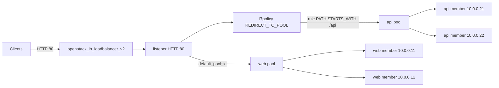

# Octavia L7 Path-Based Routing

Route HTTP requests to different backend pools by URL path using an Octavia L7
policy and rule in Terraform. One listener fronts two pools: anything starting
with `/api` goes to the API pool, everything else falls through to the default
web pool.

> **Primary search phrase:** Terraform OpenStack Octavia L7 policy routing example

## Architecture



The listener's `default_pool_id` is the web pool. The L7 policy
(`REDIRECT_TO_POOL`) carries one L7 rule: `PATH STARTS_WITH /api`. Requests that
match the rule are sent to the API pool; everything else uses the default pool.
Policies are evaluated by `position` (lowest first).

## Usage

```bash
export OS_CLOUD=openstack          # or set `cloud` in terraform.tfvars
cp terraform.tfvars.example terraform.tfvars
terraform init
terraform plan
terraform apply
```

## Inputs

| Name | Description | Type | Default |
|------|-------------|------|---------|
| `cloud` | clouds.yaml entry to use | `string` | `"openstack"` |
| `lb_name` | Load balancer name (prefix for children) | `string` | `"example-l7-routing"` |
| `subnet_name` | Subnet for the VIP and members | `string` | `"private-subnet"` |
| `listener_port` | Front-end HTTP port | `number` | `80` |
| `member_port` | Backend listening port | `number` | `80` |
| `web_members` | Default pool backend IPs | `list(string)` | `["10.0.0.11","10.0.0.12"]` |
| `api_members` | API pool backend IPs | `list(string)` | `["10.0.0.21","10.0.0.22"]` |
| `api_path_prefix` | Path prefix routed to the API pool | `string` | `"/api"` |

## Outputs

| Name | Description |
|------|-------------|
| `loadbalancer_id` | UUID of the load balancer |
| `vip_address` | VIP clients connect to |
| `web_pool_id` | UUID of the default (web) pool |
| `api_pool_id` | UUID of the API pool |
| `l7policy_id` | UUID of the L7 routing policy |

## Best practices

- **Why this approach:** Keeping the web pool as the listener default and routing
  only matched traffic to the API pool means an unmatched or misconfigured rule
  degrades gracefully to the web tier instead of dropping requests.
- **Common mistakes:** Forgetting that all rules in one policy are ANDed (use
  separate policies for OR logic); overlapping `position` values; pointing the
  API monitor at a path the API pool does not serve.
- **Scaling considerations:** Add more policies for more routes; assign explicit
  `position` numbers so evaluation order is deterministic as the set grows.
- **Performance considerations:** L7 inspection adds a small per-request cost
  versus L4; keep the rule set tight and order the most common match first.
- **Cost considerations:** Two pools share one load balancer (one set of
  amphorae), which is cheaper than running a separate LB per service.

## Security considerations

- L7 rules route but do not authenticate; protect the API pool with its own
  authentication and security groups.
- `HOST_NAME` and `HEADER` rules can also gate routing — avoid trusting
  client-supplied headers for security decisions.
- Terminate TLS at the listener for public traffic so paths and headers are not
  inspected in cleartext — see [`tls-termination`](../tls-termination/).

## Troubleshooting

| Symptom | Likely cause | Fix |
|---------|--------------|-----|
| `/api` traffic hits the web pool | Rule value/compare_type wrong | Confirm `PATH` + `STARTS_WITH` and the exact prefix |
| Everything hits the API pool | Rule too broad (e.g. value `/`) | Narrow `api_path_prefix` |
| Policy never matches | Higher-priority policy wins | Check `position` ordering |
| API members `OFFLINE` | Monitor path not served by API | Point the API monitor at a real health path |
| `Subnet <name> not found` | Wrong `subnet_name` | `openstack subnet list` |
| Provider auth errors | Bad/missing `clouds.yaml` or `OS_CLOUD` | See [provider configuration](../../../docs/provider-configuration.md) |

## Cleanup

```bash
terraform destroy
```

## Further reading

- [Provider configuration & clouds.yaml](../../../docs/provider-configuration.md)
- [OpenStack provider — lb_l7policy_v2 docs](https://registry.terraform.io/providers/terraform-provider-openstack/openstack/latest/docs/resources/lb_l7policy_v2)
- [Advanced OpenStack guides on DevOps AI ToolKit](https://devopsaitoolkit.com/blog/)
