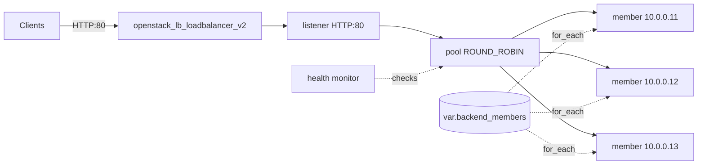

# Octavia Pool Members with for_each

Drive Octavia pool members from a Terraform variable list using `for_each`, so a
load balancer's backend fleet is a single list you edit. Adding or removing an IP
creates or destroys exactly one member instead of re-indexing the whole pool the
way `count` would.

> **Primary search phrase:** Terraform OpenStack lb member for_each example

## Architecture



`openstack_lb_member_v2` uses `for_each = toset(var.backend_members)`, keying each
member by its IP address. The pool, listener, and monitor are created once; only
the member set scales with the list.

## Usage

```bash
export OS_CLOUD=openstack          # or set `cloud` in terraform.tfvars
cp terraform.tfvars.example terraform.tfvars
terraform init
terraform plan
terraform apply
```

## Inputs

| Name | Description | Type | Default |
|------|-------------|------|---------|
| `cloud` | clouds.yaml entry to use | `string` | `"openstack"` |
| `lb_name` | Load balancer name (prefix for children) | `string` | `"example-listener-pool-members"` |
| `subnet_name` | Subnet for the VIP and members | `string` | `"private-subnet"` |
| `listener_port` | Front-end HTTP port | `number` | `80` |
| `member_port` | Backend listening port | `number` | `8080` |
| `backend_members` | Backend member IP addresses | `list(string)` | `["10.0.0.11","10.0.0.12","10.0.0.13"]` |

## Outputs

| Name | Description |
|------|-------------|
| `loadbalancer_id` | UUID of the load balancer |
| `vip_address` | VIP clients connect to |
| `pool_id` | UUID of the backend pool |
| `member_ids` | Map of member IP to member UUID |

## Best practices

- **Why this approach:** `for_each` over a set keys members by a stable value
  (the IP), so changing the list never forces unrelated members to be replaced.
  Prefer it over `count` for any collection whose middle entries can change.
- **Common mistakes:** Using `count` and then deleting a middle IP (every later
  member is destroyed and recreated); passing duplicate IPs (a set silently
  de-dupes them); forgetting `toset()` when the source is a list.
- **Scaling considerations:** This pattern handles dozens of members cleanly. For
  members that should track an autoscaling group, generate the list from a data
  source or another resource's output instead of hard-coding it.
- **Performance considerations:** Give heterogeneous backends different `weight`
  values (extend the variable to a `map(object)`); switch `lb_method` to
  `LEAST_CONNECTIONS` for long-lived connections.
- **Cost considerations:** Members themselves are free metadata, but the load
  balancer and its members consume amphora capacity — destroy idle LBs.

## Security considerations

- Members should only accept traffic from the load balancer subnet; scope the
  member instances' security groups to the VIP subnet CIDR.
- A plain HTTP listener is cleartext; use [`tls-termination`](../tls-termination/)
  for public traffic.
- Validate that every IP in `backend_members` is one you control — a typo can
  send live traffic to an unintended host.

## Troubleshooting

| Symptom | Likely cause | Fix |
|---------|--------------|-----|
| Whole pool re-created after editing list | Migrated from `count` | This example uses `for_each`; keep IPs as the key |
| `Inconsistent conditional result types` | Mixed list/set handling | Wrap the list in `toset()` (done here) |
| Member `OFFLINE` | Health check failing or wrong `member_port` | Confirm the backend answers 2xx on the monitor path/port |
| Duplicate member error | Same IP twice in the list | A set de-dupes; remove duplicates if you also vary ports |
| `Subnet <name> not found` | Wrong `subnet_name` | `openstack subnet list` |
| Provider auth errors | Bad/missing `clouds.yaml` or `OS_CLOUD` | See [provider configuration](../../../docs/provider-configuration.md) |

## Cleanup

```bash
terraform destroy
```

## Further reading

- [Provider configuration & clouds.yaml](../../../docs/provider-configuration.md)
- [OpenStack provider — lb_member_v2 docs](https://registry.terraform.io/providers/terraform-provider-openstack/openstack/latest/docs/resources/lb_member_v2)
- [Advanced OpenStack guides on DevOps AI ToolKit](https://devopsaitoolkit.com/blog/)
